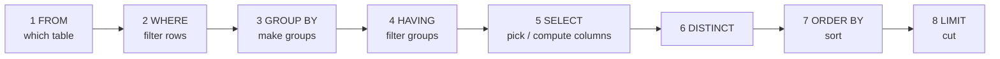

# SELECT & WHERE

> **Definition:** `SELECT` reads rows from tables. `WHERE` keeps only the rows whose condition is **true**. You write SQL in one order, but PostgreSQL runs it in another. Learn the run order and most errors make sense.

## 1. Written order vs execution order



| You write | PostgreSQL runs | Consequence |
|---|---|---|
| `SELECT price * 2 AS p` | step 5 | alias `p` exists **from step 5 on** |
| `WHERE p > 100` | step 2 | ❌ `p` doesn't exist yet |
| `ORDER BY p` | step 7 | ✅ `p` exists |

Measured:
```sql
SELECT price * 2 AS p FROM products WHERE p > 100;
-- ERROR:  column "p" does not exist

SELECT id, price * 2 AS p FROM products ORDER BY p DESC LIMIT 3;
--   id  |   p
-- ------+--------
--  2895 | 998.82
--  1693 | 998.48
--  3855 | 998.48
```
✅ Fix: repeat the expression → `WHERE price * 2 > 100`.

## 2. A full query, step by step

**Question:** the 5 most expensive electronics under 100.

```sql
SELECT id, name, price          -- 5. keep 3 columns
FROM products                   -- 1. 5,000 rows
WHERE category = 'electronics'  -- 2. 1,000 rows
  AND price < 100               --    181 rows
ORDER BY price DESC             -- 7. sort the 181
LIMIT 5;                        -- 8. first 5
```
```text
  id  |     name     | price
------+--------------+-------
 2426 | Product 2426 | 99.70
 4226 | Product 4226 | 98.88
 4926 | Product 4926 | 98.54
 3476 | Product 3476 | 97.03
 3956 | Product 3956 | 96.28
```

> Prices and order dates in the shop dataset are random → your exact numbers will differ. Counts on `users` are fixed.

## 3. WHERE operators

| Operator | Definition | Example | Result (shop) |
|---|---|---|---|
| `=` `<>` `<` `>` `<=` `>=` | compare | `status <> 'paid'` | 750,467 orders |
| `AND` / `OR` / `NOT` | combine conditions | see [section 4](#4-and-before-or--use-parentheses) | |
| `IN (…)` | equal to any value in a list | `country IN ('JO','PS')` | JO 16,666 · PS 16,667 |
| `BETWEEN a AND b` | `>= a AND <= b` (**both ends included**) | `price BETWEEN 10 AND 20` | 98 products |
| `LIKE` | pattern, case-sensitive. `%` = any text, `_` = one char | `email LIKE 'user1%@shop.test'` | 11,112 users |
| `ILIKE` | same, case-insensitive | `name ILIKE 'product 1%'` | |
| `IS NULL` / `IS NOT NULL` | test for missing value | `body IS NULL` | |
| date math | intervals | `created_at >= now() - interval '7 days'` | 18,888 orders |

`LIKE` examples:
```sql
SELECT email FROM users WHERE email LIKE 'user1%@shop.test' ORDER BY id LIMIT 3;
-- user1@shop.test
-- user10@shop.test     ← % matched "0"
-- user11@shop.test
```

| Pattern | Matches | Doesn't match |
|---|---|---|
| `'user1%'` | `user1@…`, `user10@…`, `user1999@…` | `xuser1@…` |
| `'%@shop.test'` | every shop email | `a@gmail.com` |
| `'user_@%'` | `user1@…` … `user9@…` (one char) | `user10@…` |

## 4. AND before OR — use parentheses

`AND` binds tighter than `OR`, like `×` before `+`.

```sql
-- ❌ means: books  OR  (toys AND price > 400)
SELECT count(*) FROM products WHERE category = 'books' OR category = 'toys' AND price > 400;
-- 1210

-- ✅ means: (books OR toys)  AND  price > 400
SELECT count(*) FROM products WHERE (category = 'books' OR category = 'toys') AND price > 400;
-- 418
```

Same words, different answer: 1,210 vs 418.

## 5. NULL = "unknown"

**Definition:** `NULL` is not zero and not empty text. It means **unknown**. Anything compared or computed with unknown is unknown.

```sql
SELECT NULL = NULL       AS eq,
       NULL IS NULL      AS is_null,
       COALESCE(NULL, 0) AS coalesce,
       NULL + 1          AS plus,
       'a' || NULL       AS concat;
--  eq | is_null | coalesce | plus | concat
-- ----+---------+----------+------+--------
--     | t       |        0 |      |          ← empty = NULL
```

| Expression | Result | Why |
|---|---|---|
| `NULL = NULL` | `NULL` | unknown = unknown → unknown |
| `NULL IS NULL` | `true` | the only correct test |
| `NULL + 1` | `NULL` | unknown + 1 = unknown |
| `COALESCE(NULL, 0)` | `0` | first non-NULL value |
| `WHERE x = NULL` | **0 rows**, always | `WHERE` keeps only `true`, not `NULL` |

## 6. DISTINCT and pagination

```sql
SELECT DISTINCT category FROM products ORDER BY 1;
-- books · electronics · fashion · home · toys
```

```sql
-- OFFSET style: skip 10 rows, take 3 → reads and throws away the first 10
SELECT id FROM orders ORDER BY id LIMIT 3 OFFSET 10;    -- 11, 12, 13

-- keyset style: jumps straight to id > 10 via the PK index → fast on page 10,000 too
SELECT id FROM orders WHERE id > 10 ORDER BY id LIMIT 3; -- 11, 12, 13
```

## Key Points
- Execution order: `FROM → WHERE → GROUP BY → HAVING → SELECT → ORDER BY → LIMIT`
- Aliases work in `ORDER BY`, not in `WHERE`
- `AND` before `OR` → always add parentheses when mixing
- `NULL` needs `IS NULL`, never `= NULL`
- `LIMIT` without `ORDER BY` = any rows, in any order

Lab → [labs/02-sql-basics.sql](../../labs/02-sql-basics.sql)

Next → [02-crud](02-crud.md)
