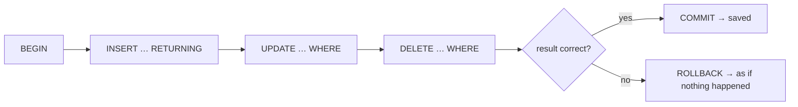
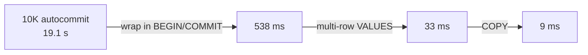

# CRUD — INSERT / UPDATE / DELETE

> **Definition:** CRUD = **C**reate (`INSERT`), **R**ead (`SELECT`), **U**pdate (`UPDATE`), **D**elete (`DELETE`). The last three change data. `RETURNING` sends back the changed rows in the same statement, so you don't need a second `SELECT`.



## 1. A safe playground: `BEGIN … ROLLBACK`

Everything between `BEGIN` and `ROLLBACK` is undone. Use it to experiment on real data. Measured on the shop DB:

```sql
BEGIN;

INSERT INTO products (name, category, price, stock)
VALUES ('Keyboard', 'electronics', 49.90, 20)
RETURNING id, name, stock;
--   id  |   name   | stock
--  5001 | Keyboard |    20          ← id generated by IDENTITY

UPDATE products SET stock = stock - 1
WHERE name = 'Keyboard'
RETURNING id, stock;
--  5001 |    19

DELETE FROM products WHERE name = 'Keyboard' RETURNING id;
--  5001

ROLLBACK;

SELECT count(*) FROM products WHERE name = 'Keyboard';
--  0                                  ← nothing was saved
```

## 2. INSERT

**Definition:** adds new rows. Columns you omit get their `DEFAULT` (or `NULL`).

```sql
-- one row, named columns (always name them → safe if the table gets new columns)
INSERT INTO users (email, name, country) VALUES ('a@x.io', 'A', 'JO');

-- many rows in one statement
INSERT INTO users (email, name, country)
VALUES ('b@x.io', 'B', 'SA'),
       ('c@x.io', 'C', 'EG');

-- from a query
INSERT INTO products (name, category, price)
SELECT name || ' (refurbished)', category, price * 0.7
FROM products WHERE category = 'electronics' AND stock = 0;
```

Constraints reject bad rows ([03-data-modeling/02-constraints](../03-data-modeling/02-constraints.md)):
```sql
INSERT INTO products (name, category, price) VALUES ('Free', 'toys', 0);
-- ERROR:  new row for relation "products" violates check constraint "products_price_check"
-- DETAIL:  Failing row contains (5002, Free, toys, 0.00, 0, {}).
```

## 3. UPDATE

**Definition:** changes columns of the rows matching `WHERE`. The response `UPDATE n` = how many rows changed.

```sql
UPDATE products SET price = price * 1.10
WHERE category = 'books' AND stock > 0;
-- UPDATE 1000

UPDATE products SET stock = stock - 1, price = 45.00
WHERE id = 7
RETURNING id, stock, price;
```

`stock = stock - 1` is computed **by the database** on the current value → safe when two users buy at once ([isolation levels](../06-transactions-mvcc/02-isolation-levels.md#44-lost-update)).

## 4. DELETE

**Definition:** removes the rows matching `WHERE`.

```sql
DELETE FROM orders WHERE status = 'cancelled' AND created_at < now() - interval '1 year'
RETURNING id;
```

| Command | Removes | Speed | Can roll back? |
|---|---|---|---|
| `DELETE FROM t WHERE …` | matching rows | row by row | ✅ |
| `DELETE FROM t` | all rows | slow on big tables (1 dead version per row) | ✅ |
| `TRUNCATE t` | all rows | instant (new empty file) | ✅ inside a transaction |

## 5. Forgetting `WHERE`

```sql
BEGIN;
UPDATE products SET price = 1;
-- UPDATE 5000        ← every product now costs 1
ROLLBACK;             ← saved by BEGIN
```

✅ Habit: run `SELECT count(*) … WHERE <same condition>` first, then the `UPDATE`/`DELETE` with the same `WHERE`, and check that `UPDATE n` matches.

## 6. Bulk loading — measured

Insert 10,000 rows into a normal table, 4 ways:

| Method | Time | Why |
|---|---|---|
| 10,000 × `INSERT` (autocommit) | **19,123 ms** | each statement = its own transaction = 1 WAL flush (fsync) to disk |
| 10,000 × `INSERT` inside one `BEGIN … COMMIT` | 538 ms | 1 flush, but still 10,000 statements to parse |
| 1 × `INSERT … VALUES (…), (…), …` | 33 ms | 1 statement, 1 flush |
| `COPY` | **9 ms** | streaming format, no SQL parsing per row |



```sql
-- export then re-import (file path is on the DB server / container)
COPY (SELECT name, category, price FROM products) TO '/tmp/products.csv' WITH (FORMAT csv, HEADER);
COPY products (name, category, price) FROM '/tmp/products.csv' WITH (FORMAT csv, HEADER);

-- file on YOUR machine → psql meta-command \copy (same syntax)
\copy products (name, category, price) FROM 'products.csv' WITH (FORMAT csv, HEADER)
```

## Key Points
- Experiment inside `BEGIN … ROLLBACK`
- `RETURNING` = changed rows back without a second query
- Always check `UPDATE n` / `DELETE n`
- Many rows → one transaction, multi-row `VALUES`, or `COPY` (2,000× faster than autocommit loops)

How it works on disk → [00-introduction/05-crud-internals](../00-introduction/05-crud-internals.md)

Next → [03-joins](03-joins.md)
