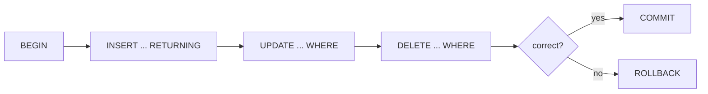

# CRUD — INSERT / UPDATE / DELETE

> Change data. `RETURNING` gives back the changed row without a second query.



## Example

```sql
BEGIN;

INSERT INTO products (name, category, price, stock)
VALUES ('Keyboard', 'electronics', 49.90, 20)
RETURNING id;                       -- → 5001

UPDATE products
SET stock = stock - 1
WHERE id = 5001
RETURNING stock;                    -- → 19

DELETE FROM products WHERE id = 5001;

ROLLBACK;                           -- as if nothing happened
```

Bulk insert:
```sql
INSERT INTO users (email, name, country)
VALUES ('a@x.io', 'A', 'JO'),
       ('b@x.io', 'B', 'SA');
```

## Numbers (illustrative)

| Method | 10K rows |
|---|---|
| 10K separate `INSERT`s (autocommit) | ~3 s |
| 1 × `INSERT ... VALUES (...), (...)` | ~60 ms |
| `COPY` | ~25 ms |

## Key Points
- Experiment inside `BEGIN ... ROLLBACK`
- `RETURNING` saves a round-trip
- Bulk beats loops

## Pitfall
❌ `UPDATE products SET price = 0;` (whole table!)
✅ Always `WHERE` — run a `SELECT` with the same `WHERE` first

How it works on disk → [00-introduction/05-crud-internals](../00-introduction/05-crud-internals.md)

Next → [03-joins](03-joins.md)
