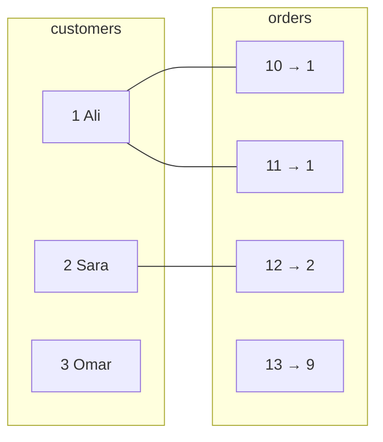

# JOINs

> **Definition:** a `JOIN` combines rows from two tables into one result row when a condition (usually "this key = that key") is true. The join **type** decides what happens to rows that have **no match**.

## 1. Tiny example tables

Small enough to check every result by hand:

```sql
CREATE TEMP TABLE c (id int, name text);                    -- customers
CREATE TEMP TABLE o (id int, customer_id int, total int);   -- orders
INSERT INTO c VALUES (1,'Ali'), (2,'Sara'), (3,'Omar');
INSERT INTO o VALUES (10,1,50), (11,1,30), (12,2,20), (13,9,99);
```

| c.id | c.name | | o.id | o.customer_id | o.total |
|---|---|---|---|---|---|
| 1 | Ali | | 10 | 1 | 50 |
| 2 | Sara | | 11 | 1 | 30 |
| 3 | Omar ← no orders | | 12 | 2 | 20 |
| | | | 13 | 9 ← no such customer | 99 |



## 2. The join types (measured outputs)

All queries: `SELECT c.name, o.id AS order_id, o.total FROM c <JOIN> o ON o.customer_id = c.id`.

### INNER JOIN — only matches

**Definition:** keep a row only when **both** sides match. `JOIN` alone = `INNER JOIN`.

```text
 name | order_id | total
------+----------+-------
 Ali  |       10 |    50
 Ali  |       11 |    30      ← Ali appears twice: one row per matching order
 Sara |       12 |    20
```
Omar (no orders) and order 13 (no customer) disappear.

### LEFT JOIN — all of the left side

**Definition:** every row of the **left** table, plus the match from the right, or `NULL`s if none.

```text
 name | order_id | total
------+----------+-------
 Ali  |       10 |    50
 Ali  |       11 |    30
 Sara |       12 |    20
 Omar |          |            ← kept, right side = NULL
```

### RIGHT JOIN — all of the right side

Mirror of LEFT. Rarely used: swap the tables and write LEFT.
```text
 Ali  |       10 |    50
 Ali  |       11 |    30
 Sara |       12 |    20
      |       13 |    99      ← order with unknown customer
```

### FULL JOIN — everything from both

```text
 Ali  |       10 |    50
 Ali  |       11 |    30
 Sara |       12 |    20
 Omar |          |
      |       13 |    99
```
Use case: compare two lists ("in the old system but not the new one, and vice versa").

### CROSS JOIN — every combination

`c CROSS JOIN o` = 3 × 4 = **12** rows. Use case: build a grid (every product × every size).

### Semi-join and anti-join — "has any?" / "has none?"

**Definition:** filter the left table by whether a match **exists**, without adding columns or duplicating rows.

```sql
-- semi-join: customers WITH orders  → Ali, Sara (Ali once, not twice)
SELECT name FROM c WHERE EXISTS (SELECT 1 FROM o WHERE o.customer_id = c.id);

-- anti-join: customers WITHOUT orders  → Omar
SELECT name FROM c WHERE NOT EXISTS (SELECT 1 FROM o WHERE o.customer_id = c.id);
```

| Type | Rows from `c` (3) + `o` (4) | Who is dropped |
|---|---|---|
| INNER | 3 | Omar, order 13 |
| LEFT | 4 | order 13 |
| RIGHT | 4 | Omar |
| FULL | 5 | nobody |
| CROSS | 12 | nobody (no condition) |
| EXISTS | 2 | Omar |
| NOT EXISTS | 1 | Ali, Sara |

## 3. On the shop dataset

```sql
-- every order with its product name
SELECT o.id, p.name, o.qty
FROM orders o
JOIN products p ON p.id = o.product_id
ORDER BY o.id LIMIT 3;
--  id |     name     | qty
--   1 | Product 1057 |   2
--   2 | Product 201  |   1
--   3 | Product 3623 |   3

-- users who never ordered
SELECT count(*) FROM users u
WHERE NOT EXISTS (SELECT 1 FROM orders o WHERE o.user_id = u.id);
--  5
```

| Join | Rows (measured) | Why |
|---|---|---|
| `orders JOIN products` | 1,000,000 | every order has exactly 1 product (FK) |
| `users LEFT JOIN orders` | 1,000,005 | 1M order rows + 5 users with no order (1 NULL row each) |

## 4. Traps (measured)

### ❌ `count(*)` with LEFT JOIN

```sql
SELECT c.name, count(o.id) AS cnt_oid, count(*) AS cnt_star
FROM c LEFT JOIN o ON o.customer_id = c.id
GROUP BY c.id, c.name;
--  name | cnt_oid | cnt_star
--  Ali  |       2 |        2
--  Sara |       1 |        1
--  Omar |       0 |        1     ← count(*) counts the NULL row → wrong
```
✅ count a column from the right table: `count(o.id)`.

### ❌ Filter on the right table in `WHERE` → LEFT becomes INNER

```sql
-- ❌ "customers and their orders over 25" — Sara and Omar vanish
SELECT c.name, o.total FROM c LEFT JOIN o ON o.customer_id = c.id
WHERE o.total > 25;
--  Ali | 30
--  Ali | 50

-- ✅ put the condition in ON → every customer kept
SELECT c.name, o.total FROM c LEFT JOIN o ON o.customer_id = c.id AND o.total > 25;
--  Ali  | 50
--  Ali  | 30
--  Sara |
--  Omar |
```
Why: `WHERE` runs **after** the join; `NULL > 25` is not true → those rows are removed.

### ❌ `NOT IN` with a NULL

```sql
INSERT INTO o VALUES (14, NULL, 5);      -- one order with no customer_id

SELECT name FROM c WHERE id NOT IN (SELECT customer_id FROM o);
-- (0 rows)      ← Omar should be here!

SELECT name FROM c WHERE NOT EXISTS (SELECT 1 FROM o WHERE o.customer_id = c.id);
-- Omar  ✅
```
Why: `3 NOT IN (1, 1, 2, 9, NULL)` = `3<>1 AND … AND 3<>NULL` = `… AND NULL` = `NULL` → not true → row dropped.

### ⚠️ Fan-out: joining multiplies rows

Ali has 2 orders → Ali appears in 2 rows. Join a third table that also has 2 rows per customer (e.g. addresses) → 2 × 2 = **4** rows for Ali, and `sum(o.total)` is doubled. Aggregate each side in a subquery/CTE first, then join.

## Key Points
- INNER = matches only · LEFT = all left + NULLs · FULL = all of both
- "Has none" → `NOT EXISTS`, never `NOT IN` on a nullable column
- With LEFT JOIN: `count(right.col)`, and right-table filters go in `ON`
- One row per match → joins can multiply rows
- Short aliases (`o`, `p`, `u`) on every column once 2+ tables are involved

Next → [04-group-by](04-group-by.md)
