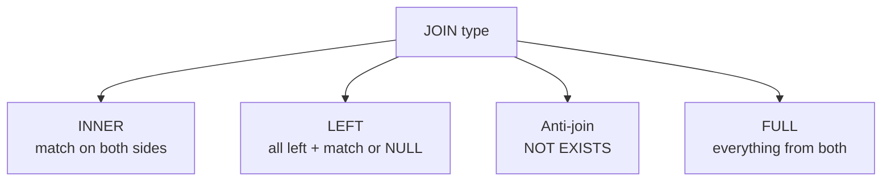

# JOINs

> Combine tables through a shared key.



## Example

```sql
-- INNER: every order with its product name
SELECT o.id, p.name, o.qty
FROM orders o
JOIN products p ON p.id = o.product_id
LIMIT 5;

-- LEFT: every user with order count (0 if none)
SELECT u.id, count(o.id) AS orders
FROM users u
LEFT JOIN orders o ON o.user_id = u.id
GROUP BY u.id
ORDER BY orders
LIMIT 5;

-- Anti-join: users who never ordered
SELECT u.id, u.email
FROM users u
WHERE NOT EXISTS (SELECT 1 FROM orders o WHERE o.user_id = u.id);
```

## Numbers

| Join | Rows (shop) |
|---|---|
| `orders JOIN products` | 1,000,000 |
| `users LEFT JOIN orders` | ~1,000,000 (+1 row per user without orders) |

## Key Points
- Always use short aliases (`o`, `p`)
- `NOT EXISTS` is safer than `NOT IN`
- With LEFT JOIN count `o.id`, not `*`

## Pitfall
❌ `WHERE id NOT IN (SELECT user_id ...)` → one NULL = zero results
✅ `NOT EXISTS (...)`

Next → [04-group-by](04-group-by.md)
