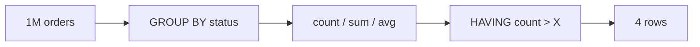

# GROUP BY & Aggregates

> Collapse many rows into one row per group.



## Example

```sql
-- orders and revenue per status
SELECT o.status,
       count(*)                AS orders,
       sum(o.qty * p.price)    AS revenue
FROM orders o
JOIN products p ON p.id = o.product_id
GROUP BY o.status
ORDER BY revenue DESC;
--  cancelled | 249702 | 189392456.20   (measured)

-- countries with more than 16,000 users
SELECT country, count(*)
FROM users
GROUP BY country
HAVING count(*) > 16000;

-- FILTER: several counts in one scan
SELECT count(*) FILTER (WHERE status = 'paid')      AS paid,
       count(*) FILTER (WHERE status = 'cancelled') AS cancelled
FROM orders;
```

## WHERE vs HAVING

| | Filters | Before/after grouping |
|---|---|---|
| `WHERE` | rows | before |
| `HAVING` | groups | after |

## Key Points
- Every SELECT column: in GROUP BY or aggregated
- `FILTER` is cleaner than `CASE`
- Filter in `WHERE` when possible (faster)

## Pitfall
❌ `SELECT country, name, count(*) FROM users GROUP BY country;`
✅ drop `name` or add it to `GROUP BY`

Next → [03-data-modeling/01-data-types](../03-data-modeling/01-data-types.md)
