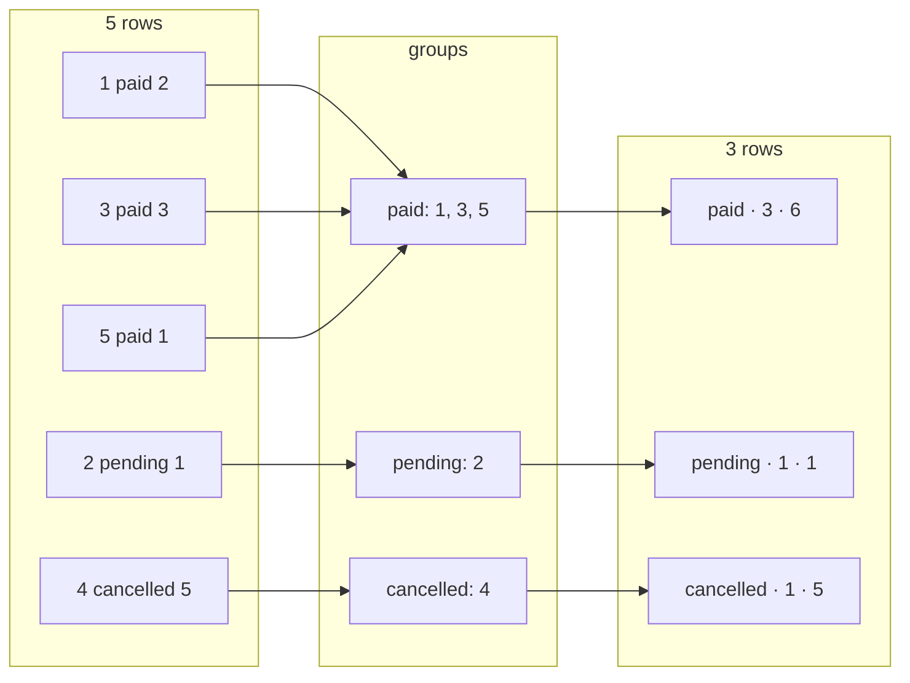

# GROUP BY & Aggregates

> **Definition:** an **aggregate** function turns many values into one (`count`, `sum`, `avg`, `min`, `max`). `GROUP BY` splits the rows into groups by a column's value and runs the aggregate **once per group**. You get one output row per group.

## 1. What GROUP BY does, by hand

5 orders:

| id | status | qty |
|---|---|---|
| 1 | paid | 2 |
| 2 | pending | 1 |
| 3 | paid | 3 |
| 4 | cancelled | 5 |
| 5 | paid | 1 |

```sql
SELECT status, count(*) AS orders, sum(qty) AS items
FROM orders GROUP BY status;
```



## 2. Aggregate functions (measured on 1M orders)

```sql
SELECT count(*), count(DISTINCT user_id), round(avg(qty), 2) AS avg_qty,
       min(qty), max(qty), sum(qty)
FROM orders;
--   count  | count | avg_qty | min | max |   sum
--  1000000 | 99995 |    3.00 |   1 |   5 | 3001585
```

| Function | Definition | NULLs |
|---|---|---|
| `count(*)` | number of rows | counted |
| `count(col)` | number of **non-NULL** values | skipped |
| `count(DISTINCT col)` | number of different values | skipped |
| `sum` / `avg` | total / average | skipped |
| `min` / `max` | smallest / largest | skipped |
| `string_agg(col, ', ')` | join texts | skipped |
| `array_agg(col)` | collect into an array | kept |

No `GROUP BY` → the whole table is **one** group → one row.

## 3. GROUP BY on the shop

```sql
-- price stats per category
SELECT category, count(*), round(avg(price), 2) AS avg_price, min(price), max(price)
FROM products
GROUP BY category
ORDER BY category;
--   category   | count | avg_price | min  |  max
--  books       |  1000 |    253.69 | 5.60 | 499.41
--  electronics |  1000 |    259.27 | 5.51 | 498.52
--  fashion     |  1000 |    254.67 | 5.23 | 497.82
--  home        |  1000 |    252.27 | 5.09 | 499.24
--  toys        |  1000 |    256.16 | 5.21 | 498.32
```

```sql
-- orders and revenue per status (join, then group)
SELECT o.status, count(*) AS orders, sum(o.qty * p.price) AS revenue
FROM orders o
JOIN products p ON p.id = o.product_id
GROUP BY o.status
ORDER BY revenue DESC;
--   status   | orders |   revenue
--  shipped   | 250564 | 192129516.04
--  cancelled | 249959 | 191587779.24
--  pending   | 249944 | 191552170.44
--  paid      | 249533 | 190621227.67
```

```sql
-- orders per month: group by a computed value
SELECT date_trunc('month', created_at)::date AS month, count(*)
FROM orders
WHERE created_at >= '2026-01-01'
GROUP BY 1                 -- 1 = first SELECT column
ORDER BY 1;
--    month    | count
--  2026-01-01 | 84725
--  2026-02-01 | 76834
--  2026-03-01 | 85363
```

> Order dates/prices are random → your numbers differ slightly.

## 4. HAVING — filter the groups

**Definition:** `WHERE` filters **rows before** grouping. `HAVING` filters **groups after** grouping, so it can use aggregates.

```sql
SELECT country, count(*) FROM users GROUP BY country;
-- AE 16667 · EG 16667 · JO 16666 · LB 16666 · PS 16667 · SA 16667

SELECT country, count(*) FROM users
GROUP BY country
HAVING count(*) > 16666;
-- AE 16667 · EG 16667 · PS 16667 · SA 16667      (JO, LB removed)
```

| | Filters | Runs | Can use `count(*)`? | Example |
|---|---|---|---|---|
| `WHERE` | rows | before `GROUP BY` | ❌ | `WHERE status = 'paid'` |
| `HAVING` | groups | after `GROUP BY` | ✅ | `HAVING count(*) > 100` |

Condition on a plain column → write it in `WHERE`. It's clearer, and fewer rows reach the grouping step.

## 5. FILTER — several counts in one pass

```sql
SELECT count(*) FILTER (WHERE status = 'paid')      AS paid,
       count(*) FILTER (WHERE status = 'cancelled') AS cancelled,
       count(*)                                     AS total
FROM orders;
--   paid  | cancelled |  total
--  249533 |    249959 | 1000000
```
One table scan instead of three queries. Old style (same result): `sum(CASE WHEN status = 'paid' THEN 1 ELSE 0 END)`.

## 6. Subtotals with ROLLUP

```sql
SELECT category, status, count(*)
FROM orders o JOIN products p ON p.id = o.product_id
WHERE category IN ('books', 'toys')
GROUP BY ROLLUP (category, status)
ORDER BY 1, 2 NULLS LAST;
--  category |  status   | count
--  books    | cancelled |  49919
--  books    | paid      |  49884
--  books    | pending   |  49649
--  books    | shipped   |  50228
--  books    |           | 199680    ← subtotal books
--  toys     | …         |  …
--  toys     |           | 199738    ← subtotal toys
--           |           | 399418    ← grand total
```

## 7. The classic error

```sql
SELECT country, name, count(*) FROM users GROUP BY country;
-- ERROR:  column "users.name" must appear in the GROUP BY clause or be used in an aggregate function
```
Why: the JO group has 16,666 users. Which `name` should the single JO row show? PostgreSQL refuses to guess.

| ✅ Fix | Meaning |
|---|---|
| drop `name` | just count per country |
| `GROUP BY country, name` | one row per (country, name) pair |
| `min(name)` / `string_agg(name, ', ')` | pick one / list them all |

Exception: grouping by a table's **primary key** lets you select its other columns (`GROUP BY u.id` → `u.email` allowed).

## Key Points
- Every `SELECT` column is either in `GROUP BY` or inside an aggregate
- `count(*)` counts rows, `count(col)` skips NULLs
- `WHERE` = rows before grouping · `HAVING` = groups after
- `FILTER (WHERE …)` = many conditional counts in one scan
- `ROLLUP` = subtotals + grand total

Next → [03-data-modeling/01-data-types](../03-data-modeling/01-data-types.md)
