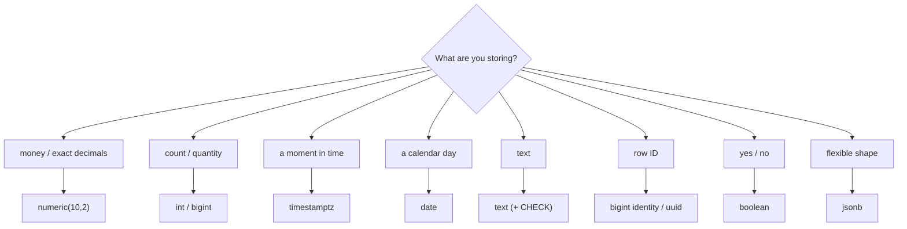
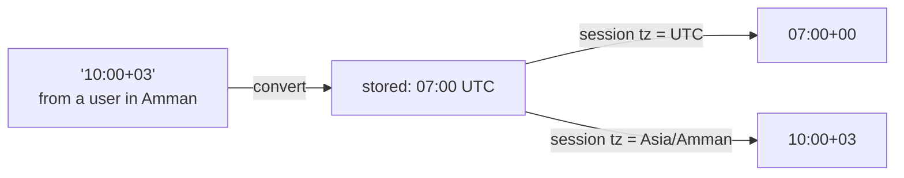

# Data Types

> **Definition:** a column's **type** decides which values it accepts, how many bytes each value takes, and which operations and indexes work on it. The right type gives correct data, less space and faster indexes.



## 1. Cheatsheet

| Use | ✅ Type | Bytes | ❌ Avoid | Why |
|---|---|---|---|---|
| Money | `numeric(10,2)` | ~10 | `float`, `real` | rounding errors |
| Quantity | `int` | 4 | `numeric` | slower, larger |
| Big counter / PK | `bigint` | 8 | `int` | `int` max = 2,147,483,647 |
| Moment in time | `timestamptz` | 8 | `timestamp` | no time zone → ambiguous |
| Birthday, due date | `date` | 4 | `timestamptz` | no time part needed |
| String | `text` | 1 + length | `varchar(255)` by habit | same speed, arbitrary limit |
| PK | `bigint GENERATED ALWAYS AS IDENTITY` | 8 | `serial` | legacy, odd permissions |
| Public ID | `uuid` | 16 | exposed sequential ids | ids are guessable |
| Flag | `boolean` | 1 | `int` 0/1 | `2` is also accepted |
| Semi-structured | `jsonb` | varies | `json` | stored as text, re-parsed on every read |

Sizes measured with `pg_column_size`:
```sql
SELECT pg_column_size(1::smallint), pg_column_size(1::int), pg_column_size(1::bigint),
       pg_column_size(1.5::numeric(10,2)), pg_column_size(gen_random_uuid()),
       pg_column_size(now()), pg_column_size(true), pg_column_size('abc'::text);
--  2 | 4 | 8 | 10 | 16 | 8 | 1 | 7
```

## 2. Numbers: `float` vs `numeric`

**Definition:** `float8`/`real` = binary floating point. Fast, but most decimals (0.1, 0.2…) can't be stored exactly. `numeric` = exact decimal digits.

```sql
SELECT 0.1::float8 + 0.2::float8 AS float, 0.1::numeric + 0.2::numeric AS numeric;
--         float        | numeric
--  0.30000000000000004 |     0.3

-- add 0.10 one million times (an invoice line, a million times)
SELECT sum(0.1::float8), sum(0.1::numeric) FROM generate_series(1, 1000000);
--      float_sum      | numeric_sum
--  100000.00000133288 |    100000.0
```

Integer pitfalls:
```sql
SELECT 10/3 AS int_div, 10/3.0 AS num_div;
--  3 | 3.3333333333333333       ← int / int = int (truncated)

SELECT 2147483647::int + 1;
-- ERROR:  integer out of range  ← int is full at 2.1 billion → use bigint for ids

SELECT round(2.5::numeric), round(2.5::float8);
--  3 | 2                        ← different rounding rules
```

## 3. Time: `timestamptz` vs `timestamp`

**Definition:**
- `timestamptz` = an **absolute moment**. Input is converted to UTC and stored, then shown in the session's time zone.
- `timestamp` = a wall-clock reading with **no zone**. "10:00", but 10:00 where?

```sql
SET timezone = 'UTC';
SELECT '2026-01-01 10:00'::timestamp AS ts, '2026-01-01 10:00+03'::timestamptz AS tstz;
--          ts          |          tstz
--  2026-01-01 10:00:00 | 2026-01-01 07:00:00+00    ← 10:00 in +03 = 07:00 UTC

SET timezone = 'Asia/Amman';
SELECT '2026-01-01 10:00+00'::timestamptz;
--  2026-01-01 13:00:00+03      ← same moment, shown in Amman time

SELECT '2026-01-01 10:00+00'::timestamptz AT TIME ZONE 'Asia/Riyadh';
--  2026-01-01 13:00:00         ← local wall-clock in Riyadh
```



Dates are validated:
```sql
SELECT '2026-02-30'::date;                       -- ERROR: date/time field value out of range
SELECT date '2026-01-31' + interval '1 month';   -- 2026-02-28 00:00:00 (clamped to month end)
```

## 4. Text: `text`, `varchar(n)`, `char(n)`

| Type | Definition | Behaviour |
|---|---|---|
| `text` | any length | ✅ default choice |
| `varchar(n)` | at most n characters | same storage/speed as `text`. Longer value → error |
| `char(n)` | exactly n, **padded with spaces** | ❌ avoid: `'ab'::char(5) = 'ab   '` is true |

```sql
INSERT INTO v (s) VALUES ('abc');          -- s varchar(2)
-- ERROR:  value too long for type character varying(2)
```

✅ Prefer `text` + `CHECK`. Changing the limit later is then just a constraint change:
```sql
CREATE TABLE v (t text CHECK (length(t) <= 2));
INSERT INTO v VALUES ('abc');
-- ERROR:  new row for relation "v" violates check constraint "v_t_check"
```

## 5. IDs: `bigint` vs `uuid` (measured, 1M rows)

```sql
CREATE TABLE k_big  (id bigint PRIMARY KEY);
CREATE TABLE k_uuid (id uuid   PRIMARY KEY);
INSERT INTO k_big  SELECT g                 FROM generate_series(1, 1000000) g;
INSERT INTO k_uuid SELECT gen_random_uuid() FROM generate_series(1, 1000000);
```

| PK | Insert 1M | PK index size | Why |
|---|---|---|---|
| `bigint` (sequential) | 2.2 s | **21 MB** | always appends to the right-most index page |
| `uuid` v4 (random) | 5.8 s | **37 MB** | random position → page splits, half-empty pages, 16 B keys |

Best of both: `bigint` PK inside the DB + a `uuid` column for public URLs. Or **UUIDv7** (time-ordered): `uuidv7()` is built in from PostgreSQL 18. In PG 17 (this repo) it doesn't exist yet:
```sql
SELECT uuidv7();   -- ERROR: function uuidv7() does not exist   (PG 17)
```

## 6. `json` vs `jsonb`

```sql
SELECT '{"b":1,"a":2,"a":3}'::json AS json, '{"b":1,"a":2,"a":3}'::jsonb AS jsonb;
--          json         |      jsonb
--  {"b":1,"a":2,"a":3}  | {"a": 3, "b": 1}
```

| | `json` | `jsonb` |
|---|---|---|
| Stored as | the original text | parsed binary |
| Duplicate keys | kept | last one wins |
| Key order | kept | sorted |
| GIN index, `@>` | ❌ | ✅ |

Details: [04-advanced-sql/03-jsonb](../04-advanced-sql/03-jsonb.md).

## 7. boolean

```sql
SELECT 'yes'::boolean, 'off'::boolean;   -- t | f   (also accepts true/false, 1/0, on/off)
```

## Key Points
- Money → `numeric`, never `float` (0.1 + 0.2 ≠ 0.3)
- Time → `timestamptz` (stored as UTC, shown in the session zone)
- Text → `text` + `CHECK`; `varchar(n)` is not faster
- IDs → `bigint` identity; random `uuid` = bigger index + slower inserts
- `int / int` truncates; `int` overflows at 2.1 billion

Next → [02-constraints](02-constraints.md)
