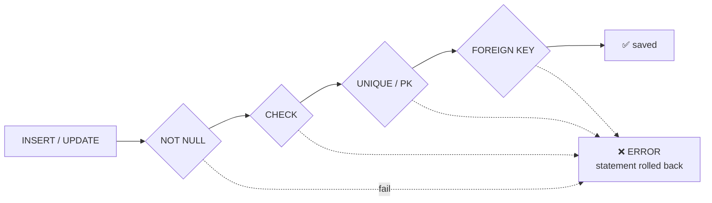
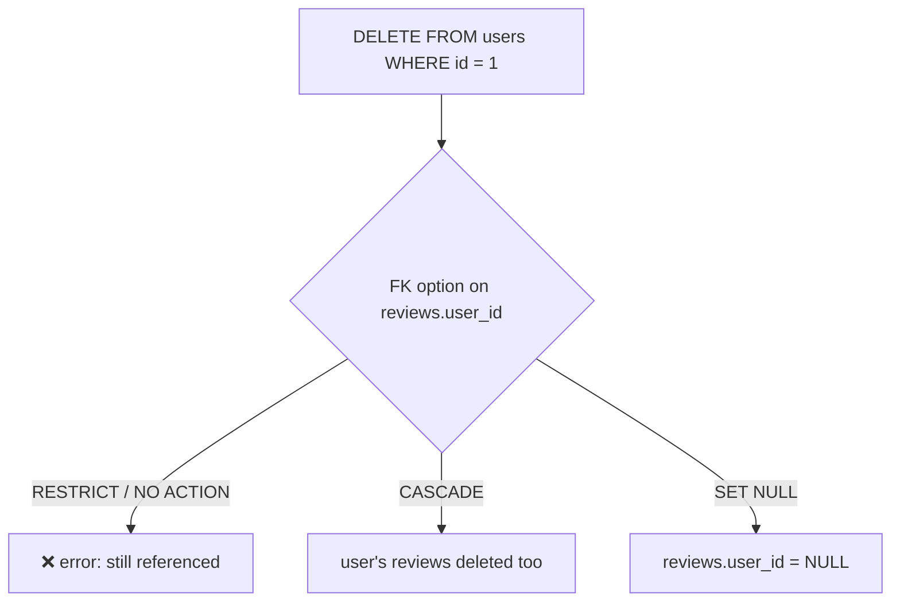

# Constraints

> **Definition:** a constraint is a **rule stored in the table** that every `INSERT`/`UPDATE`/`DELETE` must pass. If one fails, the statement errors out and changes nothing. It's the last line of defence: it holds even when the app has a bug, a script runs by hand, or a second app writes to the same DB.



## 1. Example table

```sql
CREATE TABLE reviews (
    id          bigint GENERATED ALWAYS AS IDENTITY PRIMARY KEY,
    user_id     bigint NOT NULL REFERENCES users(id) ON DELETE CASCADE,
    product_id  bigint NOT NULL REFERENCES products(id) ON DELETE RESTRICT,
    rating      int    NOT NULL CHECK (rating BETWEEN 1 AND 5),
    body        text   CHECK (length(body) <= 2000),
    UNIQUE (user_id, product_id)          -- one review per user per product
);
```

`\d reviews` shows the names PostgreSQL generated (`<table>_<column>_<kind>`):
```text
Indexes:
    "reviews_pkey" PRIMARY KEY, btree (id)
    "reviews_user_id_product_id_key" UNIQUE CONSTRAINT, btree (user_id, product_id)
Check constraints:
    "reviews_body_check" CHECK (length(body) <= 2000)
    "reviews_rating_check" CHECK (rating >= 1 AND rating <= 5)
Foreign-key constraints:
    "reviews_product_id_fkey" FOREIGN KEY (product_id) REFERENCES products(id) ON DELETE RESTRICT
    "reviews_user_id_fkey" FOREIGN KEY (user_id) REFERENCES users(id) ON DELETE CASCADE
```

## 2. Each constraint, with its real error

### NOT NULL — value is required

```sql
INSERT INTO reviews (user_id, product_id) VALUES (1, 1);          -- no rating
-- ERROR:  null value in column "rating" of relation "reviews" violates not-null constraint
-- DETAIL:  Failing row contains (2, 1, 1, null, null).
```

### CHECK — any true/false rule on the row

```sql
INSERT INTO reviews (user_id, product_id, rating) VALUES (1, 1, 9);
-- ERROR:  new row for relation "reviews" violates check constraint "reviews_rating_check"
-- DETAIL:  Failing row contains (1, 1, 1, 9, null).
```
More CHECK ideas: `price > 0`, `ends_at > starts_at`, `status IN ('pending','paid')`, `code = upper(code)`.
⚠️ A CHECK passes when the expression is `NULL`. `body` is NULL → `length(NULL) <= 2000` is NULL → accepted. Add `NOT NULL` if the value is required.

### UNIQUE / PRIMARY KEY — no duplicates

**Definition:** `UNIQUE` = no two rows with the same value(s). `PRIMARY KEY` = `UNIQUE` + `NOT NULL`, one per table. Both create a B-Tree index automatically.

```sql
INSERT INTO reviews (user_id, product_id, rating) VALUES (1, 1, 5);   -- ok
INSERT INTO reviews (user_id, product_id, rating) VALUES (1, 1, 4);   -- same pair
-- ERROR:  duplicate key value violates unique constraint "reviews_user_id_product_id_key"
-- DETAIL:  Key (user_id, product_id)=(1, 1) already exists.
```

### FOREIGN KEY — the parent must exist

**Definition:** a value in the child column must exist in the parent's key (or be NULL).

```sql
INSERT INTO reviews (user_id, product_id, rating) VALUES (999999, 1, 5);
-- ERROR:  insert or update on table "reviews" violates foreign key constraint "reviews_user_id_fkey"
-- DETAIL:  Key (user_id)=(999999) is not present in table "users".
```

## 3. `ON DELETE` — what happens to children



| Option | Parent deleted → | Shop example |
|---|---|---|
| `NO ACTION` (default) / `RESTRICT` | error | can't delete a product that has orders |
| `CASCADE` | children deleted too | delete a user → their reviews go |
| `SET NULL` | child column = NULL | delete a coupon → orders keep, `coupon_id = NULL` |

Measured:
```sql
DELETE FROM products WHERE id = 1;
-- ERROR:  update or delete on table "products" violates foreign key constraint "orders_product_fk" on table "orders"
-- DETAIL:  Key (id)=(1) is still referenced from table "orders".

DELETE FROM users WHERE id = 1;          -- reviews.user_id is ON DELETE CASCADE
SELECT count(*) FROM reviews;            -- 0  ← the review was deleted with the user
```

## 4. FK columns get no index (measured)

PostgreSQL indexes the **parent** key automatically (it's a PK), **not** the child column. Deleting a parent must check the child table for references:

```sql
-- orders.product_id has no index → each product DELETE scans 1M orders
DELETE FROM products WHERE id = :id;     -- 73.3 ms

CREATE INDEX ON orders (product_id);
DELETE FROM products WHERE id = :id;     -- 0.4 ms   (~180× faster)
```
Delete 1,000 products → 73 s vs 0.4 s.

## 5. SQLSTATE codes → app messages

| SQLSTATE | Constraint | Message to the user |
|---|---|---|
| `23502` | NOT NULL | "rating is required" |
| `23503` | FOREIGN KEY | "unknown product" / "can't delete, still in use" |
| `23505` | UNIQUE / PK | "you already reviewed this product" |
| `23514` | CHECK | "rating must be 1–5" |

.NET: `catch (PostgresException e) when (e.SqlState == PostgresErrorCodes.UniqueViolation)` and use `e.ConstraintName` to pick the message ([11-dotnet/03](../11-dotnet/03-npgsql-basics.md)).

## 6. Name your constraints

```sql
CREATE TABLE coupons (code text, CONSTRAINT coupons_code_upper CHECK (code = upper(code)));
INSERT INTO coupons VALUES ('sale10');
-- ERROR:  new row for relation "coupons" violates check constraint "coupons_code_upper"
```
A clear name shows up in the error and in the app log.

## 7. Adding a constraint to a table that already has data

```sql
ALTER TABLE orders ADD CONSTRAINT qty_max CHECK (qty <= 3);
-- ERROR:  check constraint "qty_max" of relation "orders" is violated by some row

-- NOT VALID: enforce for new rows now, fix old rows later
ALTER TABLE orders ADD CONSTRAINT qty_max CHECK (qty <= 3) NOT VALID;
INSERT INTO orders (user_id, product_id, qty) VALUES (1, 1, 4);
-- ERROR:  new row for relation "orders" violates check constraint "qty_max"
-- … clean up old rows, then:
ALTER TABLE orders VALIDATE CONSTRAINT qty_max;
```

## Key Points
- Constraints hold even when app code is wrong
- `PRIMARY KEY` = `UNIQUE` + `NOT NULL`; both create an index
- CHECK accepts `NULL` → combine with `NOT NULL`
- **Index every FK column** (measured: 73 ms → 0.4 ms per parent delete)
- Map SQLSTATE `23xxx` to user-friendly messages
- Big tables: `NOT VALID` then `VALIDATE`

Next → [03-normalization](03-normalization.md)
