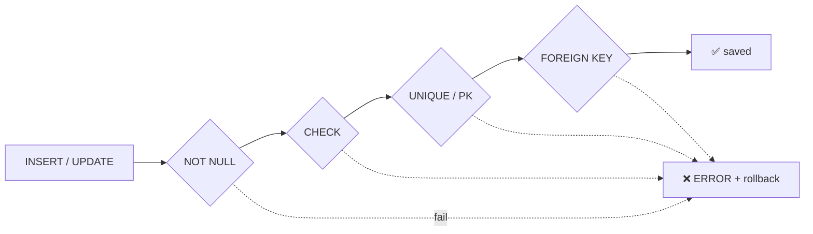

# Constraints

> Rules inside the database = the last line of defence against app bugs.



## Example

```sql
CREATE TABLE reviews (
    id          bigint GENERATED ALWAYS AS IDENTITY PRIMARY KEY,
    user_id     bigint NOT NULL REFERENCES users(id) ON DELETE CASCADE,
    product_id  bigint NOT NULL REFERENCES products(id) ON DELETE RESTRICT,
    rating      int    NOT NULL CHECK (rating BETWEEN 1 AND 5),
    body        text   CHECK (length(body) <= 2000),
    UNIQUE (user_id, product_id)          -- one review per user/product
);

INSERT INTO reviews (user_id, product_id, rating) VALUES (1, 1, 9);
-- ERROR: new row for relation "reviews" violates check constraint "reviews_rating_check"
```

## Error codes

| SQLSTATE | Constraint |
|---|---|
| `23502` | NOT NULL |
| `23503` | FOREIGN KEY |
| `23505` | UNIQUE / PK |
| `23514` | CHECK |

## ON DELETE

| Option | When the parent is deleted |
|---|---|
| `RESTRICT` / `NO ACTION` | blocked |
| `CASCADE` | delete children |
| `SET NULL` | children → NULL |

## Key Points
- App catches `23505` → "email already taken"
- FK columns get **no automatic index**
- `CHECK` is almost free

## Pitfall
❌ FK without index → `DELETE FROM users` seq-scans orders per row
✅ `CREATE INDEX ON orders (user_id);`

Next → [03-normalization](03-normalization.md)
