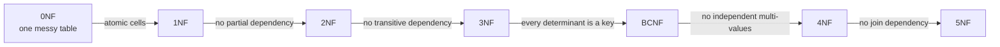
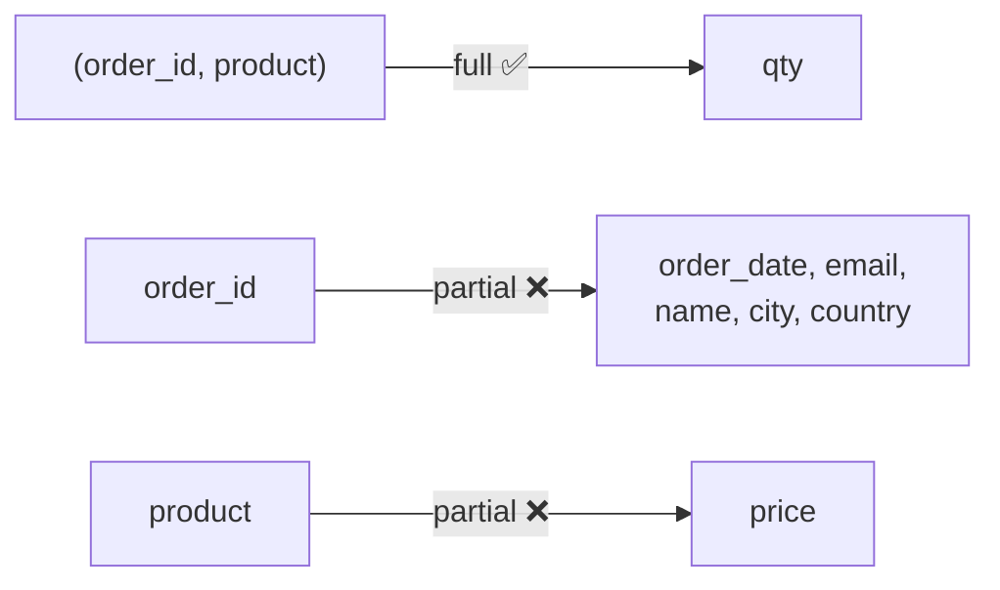
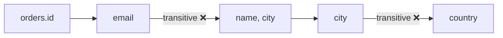
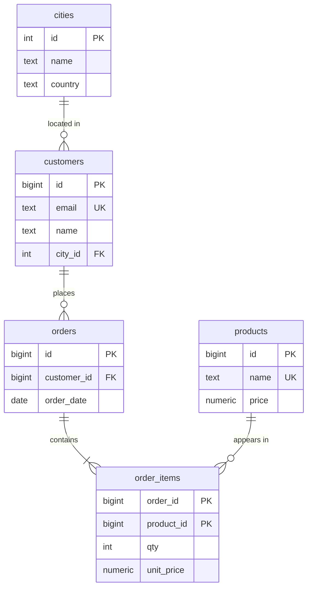
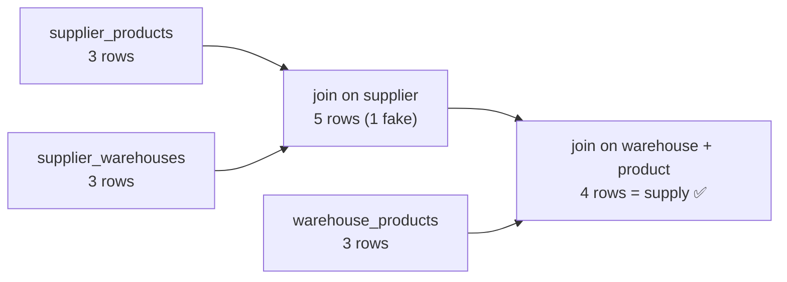

# Normalization — one shop, 1NF → 5NF

> **Definition:** normalization = splitting tables so that **every fact is stored exactly once**. Then a change touches one row, and the data cannot contradict itself.

One running example: an online shop. We start with one messy table and fix it one normal form at a time.



## 0. Vocabulary first

| Term | Definition | Shop example |
|---|---|---|
| **Functional dependency** `A → B` | knowing A gives exactly one B | `product_id → price` |
| **Candidate key** | minimal set of columns that identifies one row | `(order_id, product_id)` in `order_items` |
| **Prime column** | column that is part of some candidate key | `order_id` |
| **Partial dependency** | column depends on **part** of a composite key | `order_date` depends only on `order_id` |
| **Transitive dependency** | key → X → column (through a non-key) | `order_id → customer_id → customer_name` |
| **Multi-valued dependency** `A →→ B` | A has a **set** of B values, independent of other columns | product →→ colors, product →→ sizes |
| **Join dependency** | table equals the join of its smaller projections | supplier × product × warehouse |

### The 3 anomalies normalization removes

| Anomaly | Definition | Example in the messy table |
|---|---|---|
| **Update** | the same fact is in many rows; you update one and forget the others | Ali moves city, 1 of 3 rows is updated |
| **Insert** | you can't store a fact without an unrelated fact | can't add a product until someone orders it |
| **Delete** | deleting one fact deletes another | delete Sara's only order → Sara is gone |

---

## 0NF — the starting point

`orders_raw`, as a spreadsheet export might look:

| order_id | order_date | email | name | city | country | items |
|---|---|---|---|---|---|---|
| 1 | 2026-10-01 | a@x.io | Ali | Damascus | Syria | `Keyboard 49.90 x1, Mouse 15.00 x2` |
| 2 | 2026-10-02 | s@x.io | Sara | Berlin | Germany | `Keyboard 49.90 x1` |
| 3 | 2026-10-03 | a@x.io | Ali | Damascus | Syria | `Monitor 199.00 x1` |

Problem: "how many Mouse sold?" needs string parsing. You can't put a FK or a `CHECK` on text inside `items`.

---

## 1NF — atomic values

**Definition:** every cell holds **one** value: no lists, no repeating groups. Every row is identified by a key.

**Violation:** `items = 'Keyboard 49.90 x1, Mouse 15.00 x2'`.

**Fix:** one row per product in an order. Key = `(order_id, product)`.

`order_lines` (1NF):

| order_id | product | price | qty | order_date | email | name | city | country |
|---|---|---|---|---|---|---|---|---|
| 1 | Keyboard | 49.90 | 1 | 2026-10-01 | a@x.io | Ali | Damascus | Syria |
| 1 | Mouse | 15.00 | 2 | 2026-10-01 | a@x.io | Ali | Damascus | Syria |
| 2 | Keyboard | 49.90 | 1 | 2026-10-02 | s@x.io | Sara | Berlin | Germany |
| 3 | Monitor | 199.00 | 1 | 2026-10-03 | a@x.io | Ali | Damascus | Syria |

Now `SELECT sum(qty) FROM order_lines WHERE product = 'Mouse'` works.
But **Ali × 3 rows** and **Keyboard price × 2 rows** → update anomalies.

---

## 2NF — no partial dependency

**Definition:** 1NF **+** every non-key column depends on the **whole** key, not on part of it. (Only matters when the key is composite.)

Dependencies in `order_lines`, key = `(order_id, product)`:



**Anomaly:** change Keyboard's price to 45.00 in row 1 only → Keyboard has two prices.

**Fix:** each partial dependency gets its own table.

| Table | Key | Columns |
|---|---|---|
| `products` | `id` | name, price |
| `orders` | `id` | order_date, email, name, city, country |
| `order_items` | `(order_id, product_id)` | qty, unit_price |

`unit_price` stays in `order_items` on purpose: it is the **price at the moment of the order** (depends on the full key). `products.price` is today's price. Not duplication, a historical snapshot.

---

## 3NF — no transitive dependency

**Definition:** 2NF **+** no non-key column depends on **another non-key column**.
Short form: every column depends on *the key, the whole key, and nothing but the key*.

Dependencies in `orders`:



**Anomalies:**
- Ali moves to Aleppo → update 2 rows (orders 1 and 3); miss one → Ali lives in two cities.
- Delete order 2 → we lose that Sara and Berlin exist.

**Fix:** move customers and cities to their own tables.

| Table | Rows |
|---|---|
| `cities` | (1, Damascus, Syria), (2, Berlin, Germany) |
| `customers` | (1, a@x.io, Ali, city 1), (2, s@x.io, Sara, city 2) |
| `orders` | (1, customer 1, 2026-10-01), (2, customer 2, …), (3, customer 1, …) |

Ali moves → `UPDATE customers SET city_id = 3 WHERE id = 1` → **1 row**.



> Most real schemas stop here. BCNF/4NF/5NF fix rarer patterns — shown below on new shop features.

---

## BCNF — every determinant is a key

**Definition:** for every dependency `X → Y`, **X must be a candidate key** (Boyce–Codd Normal Form). Stricter than 3NF: 3NF allows `X → Y` when Y is part of a key; BCNF doesn't.

**New feature:** account managers for vendors. Rules:
1. Each vendor has **one** manager per category.
2. Each manager handles **one** category only.
3. A category can have several managers.

`vendor_managers` (3NF but not BCNF):

| vendor | category | manager |
|---|---|---|
| Acme | Electronics | Omar |
| Globex | Electronics | Omar |
| Initech | Electronics | Hadi |
| Acme | Office | Lina |

- Candidate keys: `(vendor, category)` and `(vendor, manager)` → all columns are prime → **3NF passes**.
- But `manager → category`, and `manager` alone is **not** a key → **BCNF fails**.

**Anomalies:**
- Omar moves to Office → 2 rows to update; miss one → Omar is in two categories.
- New manager Rami for Furniture → can't insert until a vendor is assigned to him.

**Fix:**

| `managers` (manager PK → category) | `vendor_assignments` (vendor, manager) PK |
|---|---|
| Omar → Electronics | Acme – Omar |
| Hadi → Electronics | Globex – Omar |
| Lina → Office | Initech – Hadi |
| Rami → Furniture ✅ | Acme – Lina |

Omar moves → **1 row**.
Trade-off: rule 1 ("one manager per vendor+category") now spans two tables → enforce it with a trigger or in the app.

---

## 4NF — no independent multi-valued facts

**Definition:** BCNF **+** a table must not store **two independent lists** about the same thing (two multi-valued dependencies).

**New feature:** product options. A Hoodie comes in colors {Black, Grey} and sizes {M, L, XL}, and **every color comes in every size**.

`product_options` (BCNF but not 4NF) — key is all 3 columns:

| product | color | size |
|---|---|---|
| Hoodie | Black | M |
| Hoodie | Black | L |
| Hoodie | Black | XL |
| Hoodie | Grey | M |
| Hoodie | Grey | L |
| Hoodie | Grey | XL |

`product →→ color` and `product →→ size` are independent → the table stores their **cartesian product**.

**Anomaly:** add color Red → must insert **3** rows. Forget `Red/XL` → the data says "no Red XL", which is false.

**Fix:**

| `product_colors` | `product_sizes` |
|---|---|
| Hoodie – Black | Hoodie – M |
| Hoodie – Grey | Hoodie – L |
| | Hoodie – XL |

| Scale | One table | Two tables |
|---|---|---|
| 2 colors × 3 sizes | 6 rows | 5 rows |
| 10 colors × 6 sizes | 60 rows | 16 rows |
| Add 1 color | +6 rows | +1 row |

⚠️ If combinations really differ (Red/XL sold out, each combo has its own SKU and stock), the combo **is** a fact → a `product_variants` table is correct, not a 4NF violation.

---

## 5NF — no join dependency

**Definition:** 4NF **+** the table can't be split into **3+ smaller tables** that join back to exactly the same rows. If it can, store the smaller tables. (Also called PJNF — project-join normal form.)

**New feature:** supply. Business rule:
> If supplier **S** sells product **P**, and S delivers to warehouse **W**, and W stocks P → then S delivers P to W.

`supply` (4NF but not 5NF):

| supplier | product | warehouse |
|---|---|---|
| Acme | Keyboard | Riyadh |
| Acme | Mouse | Riyadh |
| Acme | Keyboard | Dubai |
| Globex | Keyboard | Dubai |

Every row is **derived** from three independent pair facts:

| `supplier_products` | `supplier_warehouses` | `warehouse_products` |
|---|---|---|
| Acme – Keyboard | Acme – Riyadh | Riyadh – Keyboard |
| Acme – Mouse | Acme – Dubai | Riyadh – Mouse |
| Globex – Keyboard | Globex – Dubai | Dubai – Keyboard |



- Join only 2 tables → 5 rows, including **Acme–Mouse–Dubai** — fake, Dubai doesn't stock Mouse.
- Join all 3 → exactly the 4 real rows. That's the join dependency.

**Anomaly in the 3-column table:** Dubai starts stocking Mouse → you must work out which suppliers serve Dubai **and** sell Mouse and insert those rows by hand (here: Acme). Miss one → rule broken.
**With 3 tables:** `INSERT INTO warehouse_products VALUES ('Dubai','Mouse')` → **1 row**, the join derives the rest.

⚠️ Without that business rule (suppliers pick products per warehouse freely), the 3-column table is already 5NF. 5NF is decided by **business rules**, not by the data.

---

## Final schema (SQL)

```sql
-- 3NF core
CREATE TABLE cities (
    id      int  PRIMARY KEY,
    name    text NOT NULL,
    country text NOT NULL
);
CREATE TABLE customers (
    id      bigint PRIMARY KEY,
    email   text   NOT NULL UNIQUE,
    name    text   NOT NULL,
    city_id int    NOT NULL REFERENCES cities(id)
);
CREATE TABLE products (
    id    bigint  PRIMARY KEY,
    name  text    NOT NULL UNIQUE,
    price numeric(10,2) NOT NULL CHECK (price >= 0)
);
CREATE TABLE orders (
    id          bigint PRIMARY KEY,
    customer_id bigint NOT NULL REFERENCES customers(id),
    order_date  date   NOT NULL
);
CREATE TABLE order_items (
    order_id   bigint REFERENCES orders(id),
    product_id bigint REFERENCES products(id),
    qty        int    NOT NULL CHECK (qty > 0),
    unit_price numeric(10,2) NOT NULL,          -- price snapshot at order time
    PRIMARY KEY (order_id, product_id)
);

-- BCNF
CREATE TABLE managers (
    name     text PRIMARY KEY,
    category text NOT NULL
);
CREATE TABLE vendor_assignments (
    vendor  text,
    manager text REFERENCES managers(name),
    PRIMARY KEY (vendor, manager)
);

-- 4NF
CREATE TABLE product_colors (
    product_id bigint REFERENCES products(id),
    color      text,
    PRIMARY KEY (product_id, color)
);
CREATE TABLE product_sizes (
    product_id bigint REFERENCES products(id),
    size       text,
    PRIMARY KEY (product_id, size)
);

-- 5NF
CREATE TABLE supplier_products   (supplier  text, product text, PRIMARY KEY (supplier, product));
CREATE TABLE supplier_warehouses (supplier  text, warehouse text, PRIMARY KEY (supplier, warehouse));
CREATE TABLE warehouse_products  (warehouse text, product text, PRIMARY KEY (warehouse, product));

CREATE VIEW supply AS
SELECT sp.supplier, sp.product, sw.warehouse
FROM supplier_products sp
JOIN supplier_warehouses sw ON sw.supplier = sp.supplier
JOIN warehouse_products wp ON wp.warehouse = sw.warehouse AND wp.product = sp.product;
```

Rebuild the old flat view from the 3NF tables — normalization loses nothing:

```sql
SELECT o.id AS order_id, o.order_date, c.email, c.name, ci.name AS city, ci.country,
       p.name AS product, oi.unit_price, oi.qty
FROM orders o
JOIN customers c    ON c.id  = o.customer_id
JOIN cities ci      ON ci.id = c.city_id
JOIN order_items oi ON oi.order_id = o.id
JOIN products p     ON p.id  = oi.product_id;
```

## Summary

| Form | Rule | Removes | Shop split |
|---|---|---|---|
| 1NF | one value per cell | lists in a cell | `items` text → one row per product |
| 2NF | depend on the **whole** key | partial dependency | `orders`, `products`, `order_items` |
| 3NF | depend on **nothing but** the key | transitive dependency | `customers`, `cities` |
| BCNF | every determinant is a key | `manager → category` | `managers` + `vendor_assignments` |
| 4NF | no 2 independent lists in one table | color × size product | `product_colors` + `product_sizes` |
| 5NF | no table rebuildable from 3+ parts | derived 3-way facts | 3 pair tables + `supply` view |

## Key Points
- Normalize to 3NF by default; check BCNF; use 4NF/5NF only when those exact patterns appear
- `unit_price` on the order = historical snapshot, not duplication
- Denormalize only with measurements; heavy reports → materialized view ([09](../09-ecosystem/02-views-matviews.md))
- Many-to-many (e.g. tags) → junction table, never `'sale,new'` in one column

Lab → [labs/03-data-modeling.sql](../../labs/03-data-modeling.sql)

Next → [04-advanced-sql/01-cte](../04-advanced-sql/01-cte.md)
