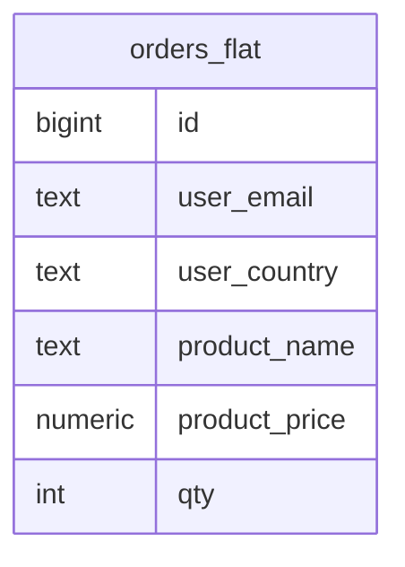
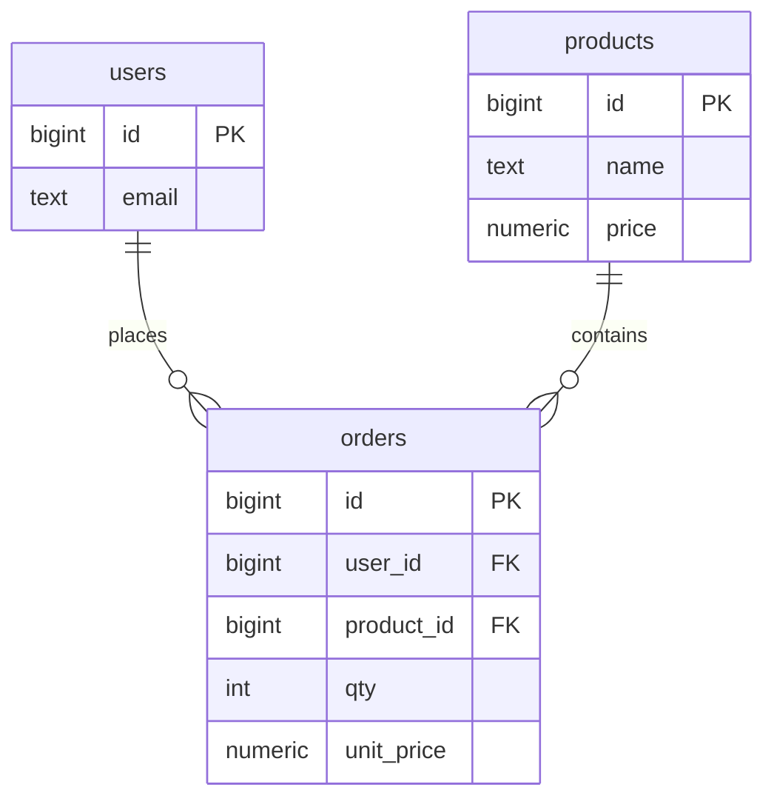

# Normalization

> Store every fact once → no contradictions when it changes.

## Before — one flat table



| id | user_email | product_name | product_price |
|---|---|---|---|
| 1 | a@x.io | Keyboard | 49.90 |
| 2 | a@x.io | Keyboard | **45.00** ← contradiction |

## After — 3NF



## Rules

| Form | Rule | Violation example |
|---|---|---|
| 1NF | atomic value per cell | `tags = 'a,b,c'` |
| 2NF | every column depends on the **whole** PK | `product_name` in `(order_id, product_id)` table |
| 3NF | no column depends on a non-key column | `country_name` next to `country_code` |

## Example — split many-to-many

```sql
-- ❌ products.tags = 'sale,new'
CREATE TABLE tags (id int PRIMARY KEY, name text UNIQUE);
CREATE TABLE product_tags (
    product_id bigint REFERENCES products(id),
    tag_id     int    REFERENCES tags(id),
    PRIMARY KEY (product_id, tag_id)
);
```

## Key Points
- Normalize first, denormalize with measurements
- `unit_price` on the order = historical snapshot, not duplication
- Heavy reports → materialized view ([09](../09-ecosystem/02-views-matviews.md))

Lab → [labs/03-data-modeling.sql](../../labs/03-data-modeling.sql)

Next → [04-advanced-sql/01-cte](../04-advanced-sql/01-cte.md)
