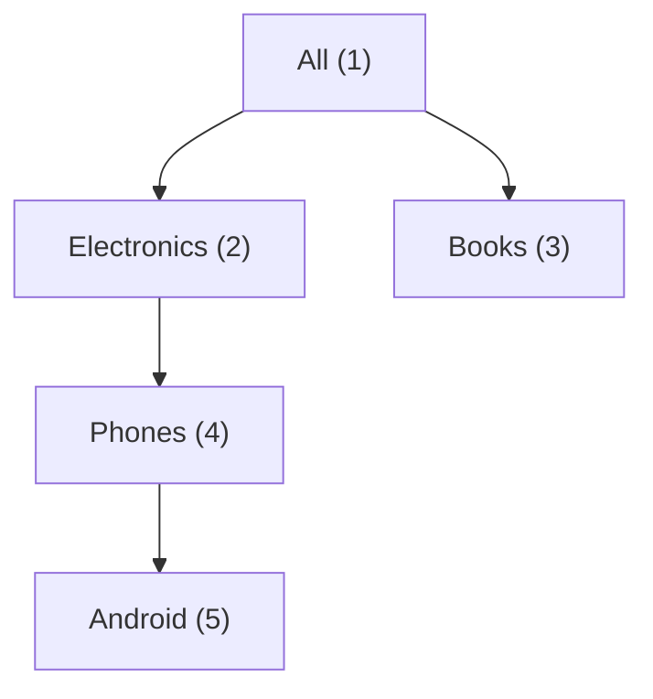

# CTE & Recursive CTE

> `WITH` names the steps of a query → readable. `RECURSIVE` loops over trees.


## Example — plain CTE

```sql
WITH recent AS (
    SELECT user_id, sum(qty) AS items
    FROM orders
    WHERE created_at >= now() - interval '30 days'
    GROUP BY user_id
),
top AS (
    SELECT * FROM recent ORDER BY items DESC LIMIT 5
)
SELECT u.email, t.items
FROM top t JOIN users u ON u.id = t.user_id;
```

## Recursive — category tree



```sql
CREATE TEMP TABLE categories (id int, parent_id int, name text);
INSERT INTO categories VALUES
  (1, NULL, 'All'), (2, 1, 'Electronics'), (3, 1, 'Books'),
  (4, 2, 'Phones'), (5, 4, 'Android');

WITH RECURSIVE tree AS (
    SELECT id, name, 0 AS depth, name AS path
    FROM categories WHERE parent_id IS NULL               -- anchor
  UNION ALL
    SELECT c.id, c.name, t.depth + 1, t.path || ' > ' || c.name
    FROM categories c JOIN tree t ON c.parent_id = t.id   -- step
)
SELECT depth, path FROM tree ORDER BY path;
--  3 | All > Electronics > Phones > Android   (measured)
```

## Key Points
- Since PG12 CTEs are inlined (same speed)
- `MATERIALIZED` forces one evaluation
- Recursive = anchor + `UNION ALL` + step

## Pitfall
❌ Recursive query on a graph with a cycle → infinite loop
✅ `CYCLE id SET is_cycle USING path_ids` (PG14+)

Next → [02-window-functions](02-window-functions.md)
