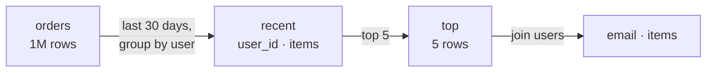
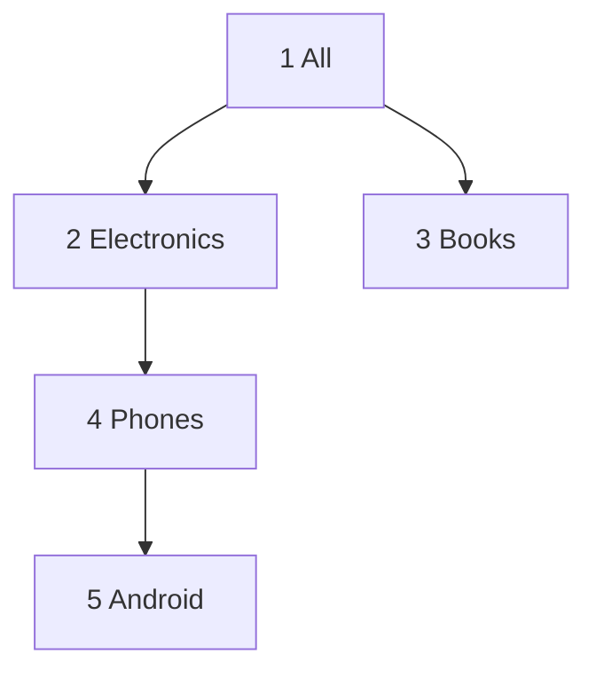

# CTE & Recursive CTE

> **Definition:** a CTE (Common Table Expression) is a **named sub-query** written with `WITH name AS (…)` at the top of a statement. Later parts of the query use it like a table. It turns one big nested query into readable, named steps. `WITH RECURSIVE` lets a CTE refer to **itself**, to walk trees and graphs.

## 1. Plain CTE — name the steps

**Question:** the 5 users who bought the most items in the last 30 days, with their email.



```sql
WITH recent AS (                          -- step 1
    SELECT user_id, sum(qty) AS items
    FROM orders
    WHERE created_at >= now() - interval '30 days'
    GROUP BY user_id
),
top AS (                                  -- step 2 uses step 1
    SELECT * FROM recent ORDER BY items DESC LIMIT 5
)
SELECT u.email, t.items                   -- final step
FROM top t JOIN users u ON u.id = t.user_id
ORDER BY t.items DESC;
--         email        | items
--  user86253@shop.test |    29
--  user91417@shop.test |    25
--  user99374@shop.test |    23
--  user20352@shop.test |    22
--  user9791@shop.test  |    22
```

Same query without CTE = sub-query inside sub-query, read from the inside out.

### Reuse a step

```sql
-- products priced above their category's average
WITH stats AS (
    SELECT category, avg(price) AS avg_price FROM products GROUP BY category
)
SELECT p.category, count(*) AS above_avg
FROM products p JOIN stats s USING (category)
WHERE p.price > s.avg_price
GROUP BY 1 ORDER BY 1;
--   category   | above_avg
--  books       |       501
--  electronics |       506
--  …
```

## 2. Inlined vs `MATERIALIZED` (measured)

**Definition:** since PG 12, the planner **inlines** a CTE (merges it into the main query) when it's used once. `MATERIALIZED` forces it to run **first and fully** and store the result.

```sql
WITH o AS (SELECT * FROM orders)              SELECT * FROM o WHERE id = 42;
WITH o AS MATERIALIZED (SELECT * FROM orders) SELECT * FROM o WHERE id = 42;
```

| Version | Plan | Time |
|---|---|---|
| inlined (default) | `Index Scan using orders_pkey` → `id = 42` pushed inside | **0.26 ms** |
| `MATERIALIZED` | `Seq Scan on orders` (all 1M rows) → `CTE Scan` → `Filter: id = 42` | **182 ms** |

Use `MATERIALIZED` only when an expensive CTE is referenced several times, or to fence off a bad plan.

## 3. Data-modifying CTE

`INSERT/UPDATE/DELETE … RETURNING` inside `WITH`. Do something and use its result in one statement:

```sql
-- archive old cancelled orders: delete + insert into archive in one atomic step
WITH moved AS (
    DELETE FROM orders
    WHERE status = 'cancelled' AND created_at < now() - interval '360 days'
    RETURNING *
)
INSERT INTO orders_archive SELECT * FROM moved;
-- (measured: 3,477 rows moved)
```

## 4. Recursive CTE

**Definition:** `WITH RECURSIVE` has two parts joined by `UNION ALL`:
1. **anchor**: the starting rows, runs once.
2. **recursive step**: joins the table to the rows found in the **previous** round.

It repeats the step until a round returns **no new rows**.

### 4.1 Counting (the simplest one)

```sql
WITH RECURSIVE n AS (
    SELECT 1 AS i                 -- anchor
  UNION ALL
    SELECT i + 1 FROM n WHERE i < 5   -- step: stops when i = 5
)
SELECT array_agg(i) FROM n;
-- {1,2,3,4,5}
```

### 4.2 Category tree, top → down



```sql
CREATE TEMP TABLE categories (id int, parent_id int, name text);
INSERT INTO categories VALUES
  (1, NULL, 'All'), (2, 1, 'Electronics'), (3, 1, 'Books'),
  (4, 2, 'Phones'), (5, 4, 'Android');

WITH RECURSIVE tree AS (
    SELECT id, name, 0 AS depth, name AS path
    FROM categories WHERE parent_id IS NULL               -- anchor: the root
  UNION ALL
    SELECT c.id, c.name, t.depth + 1, t.path || ' > ' || c.name
    FROM categories c JOIN tree t ON c.parent_id = t.id   -- step: children of last round
)
SELECT depth, id, path FROM tree ORDER BY path;
--  depth | id |                 path
--      0 |  1 | All
--      1 |  3 | All > Books
--      1 |  2 | All > Electronics
--      2 |  4 | All > Electronics > Phones
--      3 |  5 | All > Electronics > Phones > Android
```

How it runs, round by round:

| Round | Input rows (previous round) | New rows found |
|---|---|---|
| anchor | — | 1 All |
| 1 | All | 2 Electronics, 3 Books |
| 2 | Electronics, Books | 4 Phones |
| 3 | Phones | 5 Android |
| 4 | Android | none → **stop** |

### 4.3 Breadcrumb, bottom → up

```sql
WITH RECURSIVE up AS (
    SELECT id, parent_id, name FROM categories WHERE id = 5   -- start at Android
  UNION ALL
    SELECT c.id, c.parent_id, c.name
    FROM categories c JOIN up ON c.id = up.parent_id           -- go to the parent
)
SELECT string_agg(name, ' < ') FROM up;
-- Android < Phones < Electronics < All
```

## 5. Cycles → infinite loop (measured)

Bad data: Electronics' parent becomes Android → 2 → 4 → 5 → 2 → …

```sql
UPDATE categories SET parent_id = 5 WHERE id = 2;

-- same recursive query, starting at Electronics
-- ERROR:  canceling statement due to statement timeout     ← never ends on its own
```

✅ `CYCLE` clause (PG 14+) marks the repeat and stops there:
```sql
WITH RECURSIVE tree AS (
    SELECT id, name, 0 AS depth FROM categories WHERE id = 2
  UNION ALL
    SELECT c.id, c.name, t.depth + 1 FROM categories c JOIN tree t ON c.parent_id = t.id
) CYCLE id SET is_cycle USING path_ids
SELECT id, name, depth, is_cycle, path_ids FROM tree;
--  id |    name     | depth | is_cycle |     path_ids
--   2 | Electronics |     0 | f        | {(2)}
--   4 | Phones      |     1 | f        | {(2),(4)}
--   5 | Android     |     2 | f        | {(2),(4),(5)}
--   2 | Electronics |     3 | t        | {(2),(4),(5),(2)}   ← loop detected, stops
```

## Key Points
- `WITH` = named steps, read top to bottom
- Used once → inlined (0.26 ms). `MATERIALIZED` → computed fully first (182 ms here)
- `WITH … DELETE … RETURNING` = move rows atomically
- Recursive = anchor + `UNION ALL` + step, stops when a round adds nothing
- Graph data can loop → `CYCLE` clause or a depth limit

Next → [02-window-functions](02-window-functions.md)
