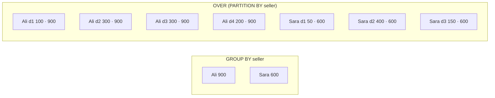
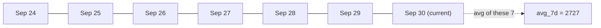

# Window Functions

> **Definition:** a window function computes a value for **each row** from a **set of related rows** (its "window"), **without collapsing them**. `GROUP BY` turns 7 rows into 2. A window function keeps all 7 rows and adds a column.

## 1. GROUP BY vs window — side by side

7 sales:

```sql
CREATE TEMP TABLE sales (day int, seller text, amount int);
INSERT INTO sales VALUES
  (1,'Ali',100), (2,'Ali',300), (3,'Ali',300), (4,'Ali',200),
  (1,'Sara',50), (2,'Sara',400), (3,'Sara',150);
```

```sql
SELECT seller, sum(amount) FROM sales GROUP BY seller;
--  Ali  | 900
--  Sara | 600                         ← 2 rows, details gone

SELECT seller, day, amount,
       sum(amount) OVER (PARTITION BY seller) AS seller_total
FROM sales;
--  Ali  | 1 | 100 | 900
--  Ali  | 2 | 300 | 900
--  …                                  ← 7 rows, total added to each
```



## 2. Anatomy of `OVER (…)`

```sql
function(...) OVER (
    PARTITION BY seller      -- split rows into independent windows (like GROUP BY, without collapsing)
    ORDER BY day             -- order inside each window
    ROWS 1 PRECEDING         -- frame: which rows around the current one count
)
```

| Part | Definition | If omitted |
|---|---|---|
| `PARTITION BY` | splits rows into groups; each group is computed separately | the whole result is one window |
| `ORDER BY` | order inside the window. Needed for running totals, `lag`, ranking | no order → aggregate over the whole window |
| frame (`ROWS …`) | subset of the window relative to the current row | with `ORDER BY`: start → current row (and its ties) |

## 3. All the common functions on one table (measured)

```sql
SELECT seller, day, amount,
  sum(amount)  OVER (PARTITION BY seller)                        AS seller_total,
  sum(amount)  OVER (PARTITION BY seller ORDER BY day)           AS running,
  row_number() OVER (PARTITION BY seller ORDER BY amount DESC)   AS rn,
  rank()       OVER (PARTITION BY seller ORDER BY amount DESC)   AS rnk,
  dense_rank() OVER (PARTITION BY seller ORDER BY amount DESC)   AS drnk,
  lag(amount)  OVER (PARTITION BY seller ORDER BY day)           AS prev,
  amount - lag(amount) OVER (PARTITION BY seller ORDER BY day)   AS diff,
  round(100.0 * amount / sum(amount) OVER (PARTITION BY seller)) AS pct
FROM sales ORDER BY seller, day;
```

| seller | day | amount | seller_total | running | rn | rnk | drnk | prev | diff | pct |
|---|---|---|---|---|---|---|---|---|---|---|
| Ali | 1 | 100 | 900 | 100 | 4 | 4 | 3 | | | 11 |
| Ali | 2 | 300 | 900 | 400 | 2 | 1 | 1 | 100 | 200 | 33 |
| Ali | 3 | 300 | 900 | 700 | 1 | 1 | 1 | 300 | 0 | 33 |
| Ali | 4 | 200 | 900 | 900 | 3 | 3 | 2 | 300 | −100 | 22 |
| Sara | 1 | 50 | 600 | 50 | 3 | 3 | 3 | | | 8 |
| Sara | 2 | 400 | 600 | 450 | 1 | 1 | 1 | 50 | 350 | 67 |
| Sara | 3 | 150 | 600 | 600 | 2 | 2 | 2 | 400 | −250 | 25 |

Reading Ali's rows:

| Column | Function | Ali's values | Meaning |
|---|---|---|---|
| `running` | `sum … ORDER BY day` | 100 → 400 → 700 → 900 | cumulative total |
| `rn` | `row_number()` | 4, 2, 1, 3 | always unique. The tie 300/300 gets 1 and 2 **in no guaranteed order** |
| `rnk` | `rank()` | 4, 1, 1, 3 | ties share a rank, **next rank skips** (1, 1, 3) |
| `drnk` | `dense_rank()` | 3, 1, 1, 2 | ties share, **no gaps** (1, 1, 2) |
| `prev` | `lag(amount)` | –, 100, 300, 300 | previous row's value (`lead` = next) |
| `pct` | `amount / sum() OVER` | 11, 33, 33, 22 | share of seller total |

More functions:

| Function | Definition | Example result |
|---|---|---|
| `first_value(x)` / `last_value(x)` | first / last value in the frame | Ali's best day = 3 |
| `ntile(n)` | split into n equal buckets | `ntile(4)` = quartiles |
| `avg(x) OVER (… ROWS n PRECEDING)` | moving average | see section 5 |

## 4. Top-N per group (most used pattern)

**Question:** the 3 most expensive products in each category.

```sql
SELECT category, name, price
FROM (
    SELECT category, name, price,
           row_number() OVER (PARTITION BY category ORDER BY price DESC) AS rn
    FROM products
) x
WHERE rn <= 3
ORDER BY category, price DESC;
--   category   |     name     | price
--  books       | Product 2895 | 499.41
--  books       | Product 3855 | 499.24
--  books       | Product 3620 | 498.73
--  electronics | Product 2196 | 498.52
--  …                                     (15 rows: 5 categories × 3)
```

Why the sub-query? Window functions run **after** `WHERE` (same step as `SELECT`):
```sql
SELECT name FROM products WHERE row_number() OVER (ORDER BY price) <= 3;
-- ERROR:  window functions are not allowed in WHERE
```

Ties: `row_number()` → exactly 3 per category. `rank() <= 3` → maybe more than 3 when prices tie.

## 5. Time series: running total, day-over-day, 7-day average

```sql
WITH daily AS (
    SELECT created_at::date AS day, count(*) AS orders
    FROM orders WHERE created_at < '2026-10-01'
    GROUP BY 1
)
SELECT day, orders,
       sum(orders) OVER (ORDER BY day)                         AS running_total,
       orders - lag(orders) OVER (ORDER BY day)                AS diff_vs_yesterday,
       round(avg(orders) OVER (ORDER BY day ROWS 6 PRECEDING)) AS avg_7d
FROM daily
ORDER BY day DESC LIMIT 5;
--     day     | orders | running_total | diff_vs_yesterday | avg_7d
--  2026-09-30 |   2666 |        985004 |              -103 |   2727
--  2026-09-29 |   2769 |        982338 |                76 |   2740
--  2026-09-28 |   2693 |        979569 |               -19 |   2734
--  …
```

`ROWS 6 PRECEDING` = the current row + the 6 before = 7 days.



## 6. Frame trap: `ORDER BY` alone uses `RANGE`

With `ORDER BY` and no frame, the default frame is `RANGE UNBOUNDED PRECEDING`: start up to the current row **and every row tied with it**.

```sql
-- d = 2 appears twice
SELECT d, v,
       sum(v) OVER (ORDER BY d)                          AS range_default,
       sum(v) OVER (ORDER BY d ROWS UNBOUNDED PRECEDING) AS rows_frame,
       last_value(v) OVER (ORDER BY d)                   AS last_default,
       last_value(v) OVER (ORDER BY d ROWS BETWEEN UNBOUNDED PRECEDING AND UNBOUNDED FOLLOWING) AS last_full
FROM f;
--  d | v  | range_default | rows_frame | last_default | last_full
--  1 | 10 |            10 |         10 |           10 |        40
--  2 | 20 |            60 |         30 |           30 |        40   ← RANGE includes the tied row (20+30)
--  2 | 30 |            60 |         60 |           30 |        40
--  3 | 40 |           100 |        100 |           40 |        40
```

| Want | Write |
|---|---|
| running total, row by row | `ROWS UNBOUNDED PRECEDING` |
| `last_value` of the whole partition | `ROWS BETWEEN UNBOUNDED PRECEDING AND UNBOUNDED FOLLOWING` |

## 7. Name a window once

```sql
SELECT seller, day, amount, first_value(day) OVER w AS best_day
FROM sales
WINDOW w AS (PARTITION BY seller ORDER BY amount DESC);
--  Ali → best_day 3 · Sara → best_day 2
```

## Key Points
- Window = compute over related rows, **keep every row**
- `PARTITION BY` splits, `ORDER BY` orders, frame picks neighbours
- Top-N per group = `row_number()` in a sub-query, then `WHERE rn <= N`
- `row_number` unique · `rank` 1,1,3 · `dense_rank` 1,1,2
- Running total with ties → `ROWS UNBOUNDED PRECEDING`

Next → [03-jsonb](03-jsonb.md)
