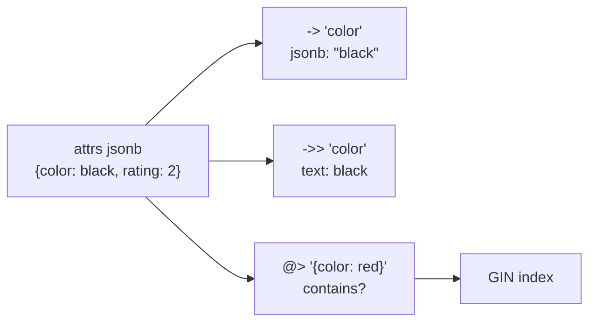

# JSONB

> **Definition:** `jsonb` is a column type that stores a JSON document in a **parsed binary form**. You get flexible fields (each row can have different keys) inside a normal relational table, and you can still filter, update and index them.



## 1. The shop data

```sql
SELECT id, attrs FROM products ORDER BY id LIMIT 3;
--  id |              attrs
--   1 | {"color": "black", "rating": 2}
--   2 | {"color": "white", "rating": 3}
--   3 | {"color": "red", "rating": 4}
```

## 2. Reading values: `->` vs `->>`

| Operator | Returns | Example on product 1 | Result |
|---|---|---|---|
| `->` | **jsonb** (still JSON, keeps quotes) | `attrs -> 'color'` | `"black"` |
| `->>` | **text** | `attrs ->> 'color'` | `black` |
| `#>` / `#>>` | jsonb / text at a **path** | `attrs #>> '{dims,width}'` | `30` |
| `['key']` (PG 14+) | jsonb, subscript style | `attrs['dims']['height']` | `2` |

```sql
SELECT attrs -> 'color'           AS as_json,
       attrs ->> 'color'          AS as_text,
       (attrs ->> 'rating')::int  AS rating,
       pg_typeof(attrs -> 'color'),
       pg_typeof(attrs ->> 'color')
FROM products WHERE id = 1;
--  as_json | as_text | rating | pg_typeof | pg_typeof
--  "black" | black   |      2 | jsonb     | text
```

### ❌ Comparing numbers as text

```sql
SELECT (attrs->>'rating') > '10'      AS text_cmp,   -- product 2: rating 3
       (attrs->>'rating')::int > 10   AS int_cmp
FROM products WHERE id = 2;
--  text_cmp | int_cmp
--  t        | f          ← '3' > '10' as text (compares the character '3' with '1')
```
✅ Cast before comparing numbers: `(attrs->>'rating')::int`.

## 3. Filtering (measured, 5,000 products)

| Query | Meaning | Rows |
|---|---|---|
| `WHERE attrs @> '{"color": "red"}'` | contains this key/value | 1,666 |
| `WHERE attrs ->> 'color' = 'red'` | same result, different operator | 1,666 |
| `WHERE attrs ? 'color'` | key exists | 5,000 |
| `WHERE (attrs->>'rating')::int >= 4` | numeric comparison | 2,000 |
| `WHERE attrs @? '$.dims ? (@.width > 20)'` | JSONPath | |

Group by a JSON field:
```sql
SELECT attrs->>'color' AS color, count(*), round(avg((attrs->>'rating')::int), 2)
FROM products GROUP BY 1 ORDER BY 1;
--  black | 1667 | 3.00
--  red   | 1666 | 3.00
--  white | 1667 | 3.00
```

## 4. Updating (measured, product 1)

Start: `{"color": "black", "rating": 2}`

| Statement | Result |
|---|---|
| `attrs \|\| '{"on_sale": true}'` | `{"color": "black", "rating": 2, "on_sale": true}` — merge/add keys |
| `jsonb_set(attrs, '{rating}', '5')` | `{… "rating": 5 …}` — replace a value |
| `jsonb_set(attrs, '{dims,width}', '30', true)` | ⚠️ **unchanged**: `dims` doesn't exist, and `create_missing` only creates the **last** key |
| `jsonb_set(attrs, '{dims}', '{"width":30,"height":2}')` | `{"dims": {"width": 30, "height": 2}, …}` ✅ |
| `attrs - 'on_sale'` | key removed |
| `attrs['tags'] = '["new","gift"]'` (in `SET`) | `{… "tags": ["new", "gift"] …}` |

```sql
UPDATE products SET attrs = attrs || '{"on_sale": true}' WHERE id = 1;
UPDATE products SET attrs['tags'] = '["new","gift"]'      WHERE id = 1;
```
Each update rewrites the **whole** document (a new row version, see [MVCC](../06-transactions-mvcc/03-mvcc.md)).

## 5. Breaking JSON apart / building JSON

```sql
-- every key as a row
SELECT key, value FROM products, jsonb_each(attrs) WHERE id = 1;
--   key   |           value
--  dims   | {"width": 30, "height": 2}
--  tags   | ["new", "gift"]
--  color  | "black"
--  rating | 5

-- array elements as rows
SELECT jsonb_array_elements_text(attrs->'tags') FROM products WHERE id = 1;
--  new
--  gift

-- rows → JSON (e.g. an API response straight from SQL)
SELECT jsonb_build_object('id', id, 'name', name, 'price', price) FROM products WHERE id = 1;
--  {"id": 1, "name": "Product 1", "price": 361.81}
SELECT jsonb_agg(name ORDER BY id) FROM products WHERE id <= 3;
--  ["Product 1", "Product 2", "Product 3"]
```

Invalid JSON is rejected on insert:
```sql
SELECT '{"a":1'::jsonb;
-- ERROR:  invalid input syntax for type json
-- DETAIL:  The input string ended unexpectedly.
```

## 6. Indexing: which operator, which index

| Query shape | Index | Measured on 500K rows ([index types](../05-indexes-performance/03-index-types.md#31-jsonb)) |
|---|---|---|
| `attrs @> '{"brand":"brand42"}'` | `GIN (attrs)` or `GIN (attrs jsonb_path_ops)` | 125.6 → **18.0 ms** |
| `attrs ? 'discount'` | `GIN (attrs)` (default ops) | **0.018 ms** |
| `attrs ->> 'brand' = 'brand42'` | ❌ GIN not used → `B-Tree ((attrs->>'brand'))` | 102 → **3.5 ms** |
| `(attrs->>'rating')::int > 4` | `B-Tree (((attrs->>'rating')::int))` | GIN can't do ranges |

```sql
CREATE INDEX products_attrs_gin ON products USING gin (attrs);
CREATE INDEX products_brand_idx ON products ((attrs->>'brand'));
```

## 7. JSONB or a real column?

| Field | ✅ Store as | Why |
|---|---|---|
| `price`, `stock`, `category` | columns | always present, typed, constraints, FK, smaller |
| `color`, `size`, `material`, `voltage`… | `jsonb` | differ per product type |
| a value you filter/sort by on every page | column (or generated column) | simpler indexes, real statistics |

```sql
-- promote a hot JSON key to a typed column, kept in sync automatically
ALTER TABLE products ADD COLUMN rating int GENERATED ALWAYS AS ((attrs->>'rating')::int) STORED;
```

## Key Points
- `->` returns jsonb, `->>` returns text → cast before comparing numbers
- `@>` "contains" is the GIN-friendly filter
- `->> =` needs a B-Tree expression index, not GIN
- `||` merges, `-` removes, `jsonb_set` replaces (doesn't create missing parents)
- Fixed, always-present fields → real columns

Next → [04-upsert](04-upsert.md)
