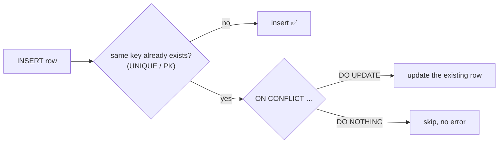
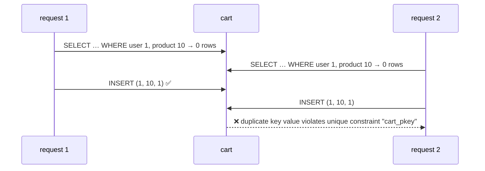
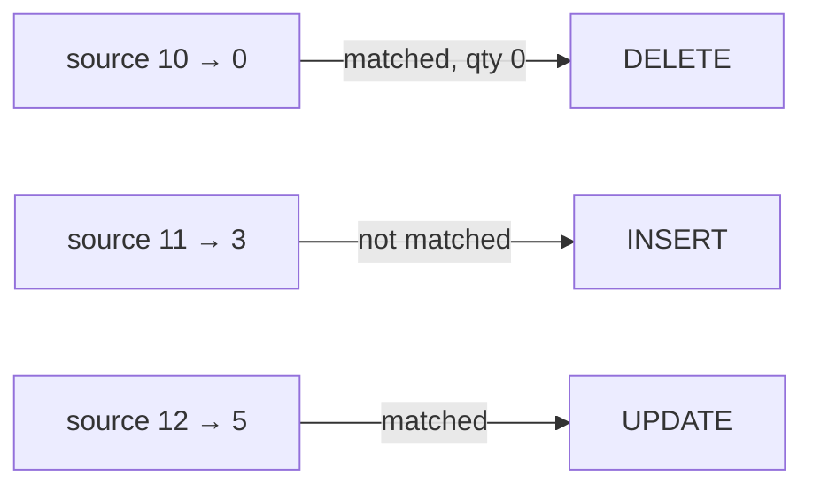

# UPSERT & MERGE

> **Definition:** an **upsert** = "**up**date if the row exists, otherwise in**sert**", done as **one atomic statement**. PostgreSQL has two forms: `INSERT … ON CONFLICT` (fast, the common case) and `MERGE` (SQL standard, several actions in one statement).



## 1. Setup

```sql
CREATE TABLE cart (
    user_id    bigint,
    product_id bigint,
    qty        int NOT NULL CHECK (qty > 0),
    PRIMARY KEY (user_id, product_id)      -- ON CONFLICT needs a UNIQUE/PK to detect "exists"
);
```

## 2. Why not "SELECT, then INSERT"? (measured race)

Two requests add the same product at the same moment:



| Pattern | Two concurrent requests (measured) |
|---|---|
| `SELECT` → `INSERT` in the app | both see **0** rows → second fails with `23505` |
| `INSERT … ON CONFLICT DO UPDATE` | both succeed → one row, `qty = 2` ✅ |

The check and the write happen in **one** statement, protected by the unique index.

## 3. `ON CONFLICT DO UPDATE` — add to cart

```sql
INSERT INTO cart (user_id, product_id, qty) VALUES (1, 10, 2)
ON CONFLICT (user_id, product_id)
DO UPDATE SET qty = cart.qty + EXCLUDED.qty
RETURNING *, (xmax = 0) AS inserted;
--  user_id | product_id | qty | inserted
--        1 |         10 |   2 | t          ← first call: inserted

-- same statement with qty 3
--        1 |         10 |   5 | f          ← second call: updated, 2 + 3
```

| Name | Definition |
|---|---|
| `cart.qty` | the value **already in the table** |
| `EXCLUDED.qty` | the value **you tried to insert** (the row that was "excluded") |
| `(xmax = 0) AS inserted` | trick: `true` = inserted, `false` = updated |

### Update only when it helps: `DO UPDATE … WHERE`

```sql
-- keep the larger qty
INSERT INTO cart VALUES (1, 10, 7)
ON CONFLICT (user_id, product_id) DO UPDATE SET qty = EXCLUDED.qty
WHERE cart.qty < EXCLUDED.qty
RETURNING *;
--  1 | 10 | 7        ← 5 < 7 → updated

-- same with 2
-- (0 rows) INSERT 0 0   ← 7 < 2 is false → row left alone
```

## 4. `ON CONFLICT DO NOTHING` — idempotent insert

```sql
INSERT INTO cart VALUES (1, 10, 1) ON CONFLICT DO NOTHING;
-- INSERT 0 0      ← already there, no error

INSERT INTO cart VALUES (1, 10, 1);
-- ERROR:  duplicate key value violates unique constraint "cart_pkey"
-- DETAIL:  Key (user_id, product_id)=(1, 10) already exists.
```
Use case: processing the same webhook / message twice must not create two rows.

## 5. Errors you'll meet (measured)

```sql
-- the conflict target must match a UNIQUE/PK exactly
INSERT INTO cart VALUES (1, 11, 4) ON CONFLICT (user_id) DO NOTHING;
-- ERROR:  there is no unique or exclusion constraint matching the ON CONFLICT specification

-- the same key twice in ONE statement
INSERT INTO cart VALUES (1, 10, 1), (1, 10, 2)
ON CONFLICT (user_id, product_id) DO UPDATE SET qty = EXCLUDED.qty;
-- ERROR:  ON CONFLICT DO UPDATE command cannot affect row a second time
-- HINT:  Ensure that no rows proposed for insertion within the same command have duplicate constrained values.
```
✅ Deduplicate the input first (`SELECT DISTINCT ON (user_id, product_id) …` or `GROUP BY` + `sum(qty)`).

## 6. `MERGE` — sync a list in one statement (PG 15+)

**Definition:** `MERGE` compares a **source** (a list or query) with a **target** table, row by row, and for each pair runs `UPDATE`, `DELETE`, `INSERT` or nothing.

**Scenario:** the mobile app sends the whole cart: product 10 → qty 0 (remove), 11 → 3 (new), 12 → 5 (change).

Before: `cart` = `(1, 10, 7)`, `(1, 12, 1)`

```sql
MERGE INTO cart c
USING (VALUES (1, 10, 0), (1, 11, 3), (1, 12, 5)) AS s(user_id, product_id, qty)
ON c.user_id = s.user_id AND c.product_id = s.product_id
WHEN MATCHED AND s.qty = 0 THEN DELETE
WHEN MATCHED THEN UPDATE SET qty = s.qty
WHEN NOT MATCHED THEN INSERT VALUES (s.user_id, s.product_id, s.qty)
RETURNING merge_action(), c.*;          -- RETURNING on MERGE: PG 17+
--  merge_action | user_id | product_id | qty
--  DELETE       |       1 |         10 |   7
--  INSERT       |       1 |         11 |   3
--  UPDATE       |       1 |         12 |   5
-- MERGE 3
```

After: `(1, 11, 3)`, `(1, 12, 5)`



| | `INSERT … ON CONFLICT` | `MERGE` |
|---|---|---|
| Actions | insert or update/nothing | insert, update, delete, nothing, with conditions |
| Concurrency safe | ✅ always | ⚠️ concurrent inserts of the same key can still raise `23505` → retry |
| Needs a unique index | ✅ | ❌ (any join condition) |
| Best for | single upserts from the app | batch sync / ETL |

## Key Points
- "Check then insert" in the app is a race → use `ON CONFLICT`
- Conflict target must match a UNIQUE/PK exactly
- `EXCLUDED.col` = the proposed value, `table.col` = the current value
- `DO NOTHING` = idempotent inserts
- `MERGE` = several actions per row (sync a list); retry on `23505` under concurrency

Lab → [labs/04-advanced-sql.sql](../../labs/04-advanced-sql.sql)

Next → [05-indexes-performance/01-explain](../05-indexes-performance/01-explain.md)
