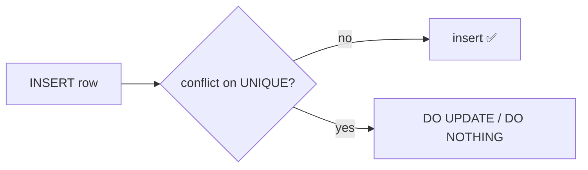

# UPSERT & MERGE

> Insert if missing, update if present — as one atomic statement.



## Example — ON CONFLICT

```sql
CREATE TABLE cart (
    user_id    bigint,
    product_id bigint,
    qty        int NOT NULL,
    PRIMARY KEY (user_id, product_id)
);

-- add to cart: if present, increase qty
INSERT INTO cart (user_id, product_id, qty) VALUES (1, 10, 2)
ON CONFLICT (user_id, product_id)
DO UPDATE SET qty = cart.qty + EXCLUDED.qty;     -- EXCLUDED = the proposed row

-- idempotent insert
INSERT INTO cart VALUES (1, 10, 1) ON CONFLICT DO NOTHING;
```

## MERGE (PG15+)

```sql
MERGE INTO cart c
USING (VALUES (1, 10, 0), (1, 11, 3)) AS s(user_id, product_id, qty)
ON c.user_id = s.user_id AND c.product_id = s.product_id
WHEN MATCHED AND s.qty = 0 THEN DELETE
WHEN MATCHED THEN UPDATE SET qty = s.qty
WHEN NOT MATCHED THEN INSERT VALUES (s.user_id, s.product_id, s.qty);
```

## Race condition — before → after

| Pattern | 2 concurrent requests |
|---|---|
| App does `SELECT` then `INSERT` | ❌ duplicate / 23505 |
| `INSERT ... ON CONFLICT` | ✅ always correct |

## Key Points
- Needs a UNIQUE / PK on the columns
- `EXCLUDED.col` = the proposed value
- `MERGE` for complex syncs

Lab → [labs/04-advanced-sql.sql](../../labs/04-advanced-sql.sql)

Next → [05-indexes-performance/01-explain](../05-indexes-performance/01-explain.md)
