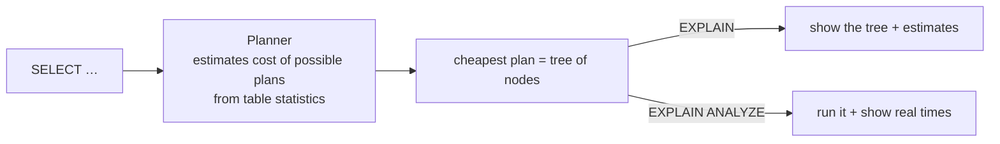
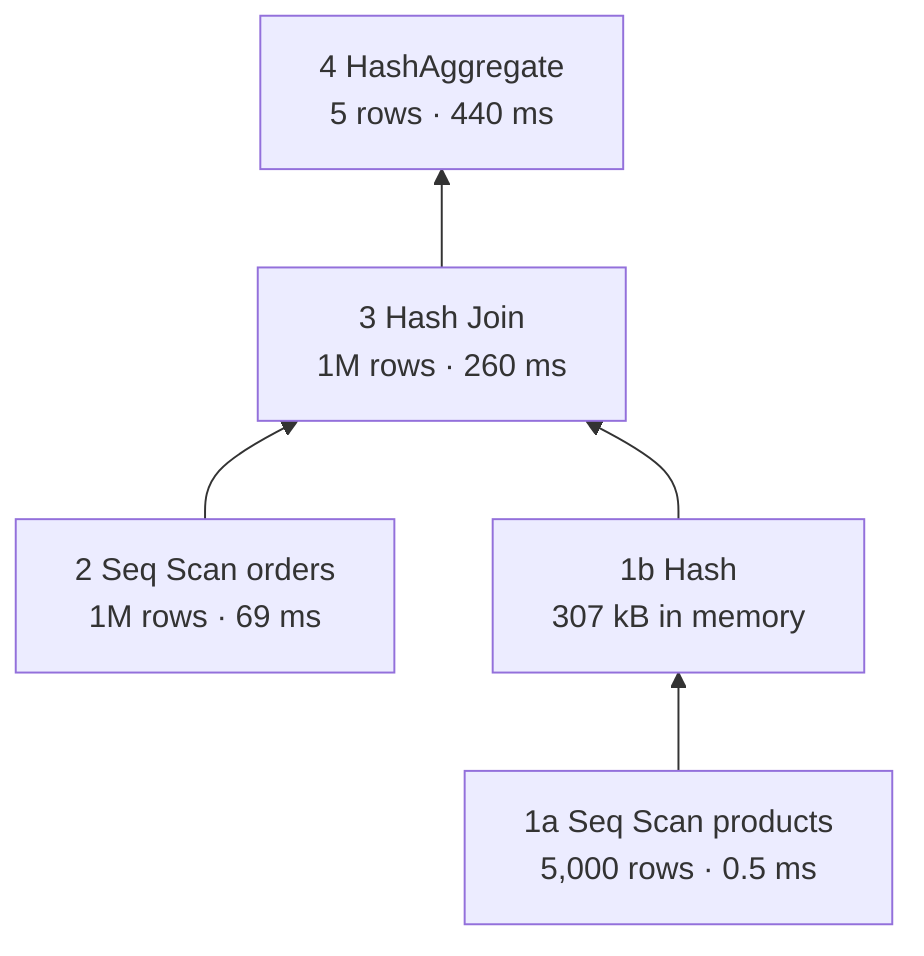
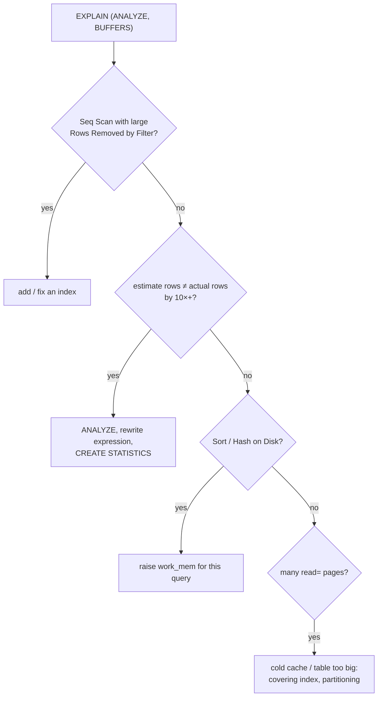

# EXPLAIN ANALYZE

> **Definition:** the **planner** chooses *how* to run a query (which index, which join method, in which order). `EXPLAIN` shows that chosen **plan** with estimates. `EXPLAIN ANALYZE` **runs** the query and adds the real time and row counts of every step.



## 1. The 3 variants

| Command | Runs the query? | Shows |
|---|---|---|
| `EXPLAIN …` | ❌ | plan + estimated cost/rows |
| `EXPLAIN ANALYZE …` | ✅ | + real time, real rows, loops |
| `EXPLAIN (ANALYZE, BUFFERS) …` | ✅ | + pages read from cache / disk ← **use this one** |

⚠️ `ANALYZE` really executes. `EXPLAIN ANALYZE DELETE …` **deletes**:
```sql
BEGIN;
EXPLAIN ANALYZE DELETE FROM orders WHERE product_id = 77;
ROLLBACK;
```

## 2. One plan, line by line (measured)

`orders` = 1M rows, no index on `user_id` yet, single worker:

```sql
EXPLAIN (ANALYZE, BUFFERS) SELECT * FROM orders WHERE user_id = 42;
```
```text
Seq Scan on orders  (cost=0.00..21846.00 rows=11 width=43) (actual time=2.962..96.862 rows=15 loops=1)
  Filter: (user_id = 42)
  Rows Removed by Filter: 999985
  Buffers: shared hit=3505 read=5841
Planning Time: 0.065 ms
Execution Time: 96.884 ms
```

| Part | Value | Meaning |
|---|---|---|
| `Seq Scan on orders` | node type | read **every** page of the table |
| `cost=0.00..21846.00` | estimate | startup..total cost in planner units (**not ms**) |
| `rows=11` (in `cost`) | estimate | planner expected 11 rows |
| `width=43` | estimate | average row size in bytes |
| `actual time=2.962..96.862` | real | ms to the **first** row .. ms to the **last** row |
| `rows=15` (in `actual`) | real | 15 rows came out. 11 vs 15 = good estimate |
| `loops=1` | real | node ran once. Time and rows are **per loop** |
| `Rows Removed by Filter: 999985` | real | 999,985 rows read for nothing → index candidate |
| `shared hit=3505` | real | pages found in RAM (`shared_buffers`) |
| `read=5841` | real | pages read from the OS / disk |
| `Execution Time` | real | total time on the server |

Same query **with** an index on `user_id`:
```text
Bitmap Heap Scan on orders  (cost=4.51..47.52 rows=11 width=43) (actual time=0.084..0.157 rows=15 loops=1)
  Recheck Cond: (user_id = 42)
  Heap Blocks: exact=15
  Buffers: shared hit=10 read=11
  ->  Bitmap Index Scan on orders_user_id_idx  (cost=0.00..4.51 rows=11 width=0) (actual time=0.067..0.067 rows=15 loops=1)
        Index Cond: (user_id = 42)
Execution Time: 0.186 ms
```

| | Seq Scan | Index |
|---|---|---|
| Pages touched | 9,346 | 21 |
| Time | 96.9 ms | **0.19 ms** (~500×) |

## 3. Read a plan bottom-up

A plan is a **tree**. Children (indented deeper, `->`) run first and feed rows to their parent.

```sql
EXPLAIN ANALYZE
SELECT p.category, count(*)
FROM orders o JOIN products p ON p.id = o.product_id
GROUP BY p.category;
```
```text
HashAggregate  (actual time=439.926..439.929 rows=5 loops=1)               ← 4. group into 5 rows
  Group Key: p.category
  ->  Hash Join  (actual time=1.385..259.876 rows=1000000 loops=1)          ← 3. match each order to its product
        Hash Cond: (o.product_id = p.id)
        ->  Seq Scan on orders o  (actual time=0.006..68.660 rows=1000000 loops=1)   ← 2. stream 1M orders
        ->  Hash  (actual time=1.335..1.336 rows=5000 loops=1)               ← 1b. build hash table
              Buckets: 8192  Batches: 1  Memory Usage: 307kB
              ->  Seq Scan on products p  (actual time=0.005..0.520 rows=5000 loops=1)  ← 1a. read 5K products
Execution Time: 439.967 ms
```



Times are **cumulative**: a parent's time includes its children. The Hash Join itself took ≈ 260 − 69 − 1.3 ≈ 190 ms.

## 4. Node types (all measured on the shop)

### Scans: how rows are read

| Node | Definition | Example | Time |
|---|---|---|---|
| **Seq Scan** | read every page | `WHERE user_id = 42` without index | 96.9 ms |
| **Index Scan** | walk the index, then fetch each row from the table | `WHERE id = 42` (PK) | 0.021 ms |
| **Bitmap Index + Heap Scan** | collect matching page numbers first, read each page once | `WHERE user_id = 42` (15 rows on 15 pages) | 0.19 ms |
| **Index Only Scan** | answer from the index alone, no table access | `SELECT user_id … WHERE user_id BETWEEN 42 AND 50` | 0.037 ms, `Heap Fetches: 0` |

Index Only Scan needs every selected column in the index and an up-to-date visibility map (`VACUUM`). `Heap Fetches: 0` = the table was never touched.

### Joins: how two inputs are matched

| Node | Definition | Best when | Measured |
|---|---|---|---|
| **Nested Loop** | for each outer row, look up matches in the inner (usually by index) | few outer rows | 15 orders of user 42 → 15 index lookups in `products` (`loops=15`), 0.16 ms |
| **Hash Join** | build a hash table from the smaller input, stream the larger through it | big inputs, `=` condition | 1M orders × 5K products, 260 ms |
| **Merge Join** | both inputs sorted on the key, walk them side by side | both already sorted (indexes) | |

`loops=15` on the inner node → its `actual time` is **per loop**: total ≈ 15 × 0.005 ms.

### Others

| Node | Watch for |
|---|---|
| `Sort` | `Sort Method: external merge  Disk: 25456kB` = didn't fit in `work_mem` |
| `Sort` + `Limit` | `top-N heapsort  Memory: 26kB` = keeps only the N best rows |
| `HashAggregate` / `GroupAggregate` | `Batches: > 1` = spilled to disk |
| `Gather` | parallel workers (`Workers Launched: 2`) |

```text
ORDER BY created_at (1M rows), work_mem = 4MB  → Sort Method: external merge  Disk: 25456kB
                               work_mem = 64MB → Sort Method: quicksort  Memory: 55827kB
```

## 5. Bad estimates

**Definition:** the planner guesses row counts from **statistics** ([07-04](../07-internals/04-planner-stats.md)). Expressions it can't analyse get a default guess.

```sql
EXPLAIN ANALYZE SELECT * FROM orders WHERE user_id + 0 = 42;
-- Seq Scan on orders  (cost=0.00..24346.00 rows=5000 …) (actual … rows=15 …)
--                                          ^^^^^^^^^^           ^^^^^^^
--                     guessed 5,000 (0.5% default)        real 15 → 333× off
-- and the index on user_id is NOT used: "user_id + 0" ≠ "user_id"
```

| Estimate vs actual | Likely cause | Fix |
|---|---|---|
| far off on a plain column | stale statistics | `ANALYZE orders;` |
| far off on an expression | no stats for the expression | rewrite (`user_id = 42`) or expression index + `ANALYZE` |
| far off on correlated columns (`city` + `country`) | planner assumes independence | `CREATE STATISTICS` |

## 6. Checklist when a query is slow



Visual plan viewer: paste the text output into [explain.dalibo.com](https://explain.dalibo.com).

## Key Points
- `EXPLAIN (ANALYZE, BUFFERS)` = real times + pages
- `cost` is in planner units, `actual time` is ms; both are first-row..last-row
- Read bottom-up; times include children; multiply by `loops`
- `Rows Removed by Filter` large → index candidate
- Estimated rows ≠ actual rows → statistics problem
- `ANALYZE` executes → wrap writes in `BEGIN … ROLLBACK`

Next → [02-btree](02-btree.md)
