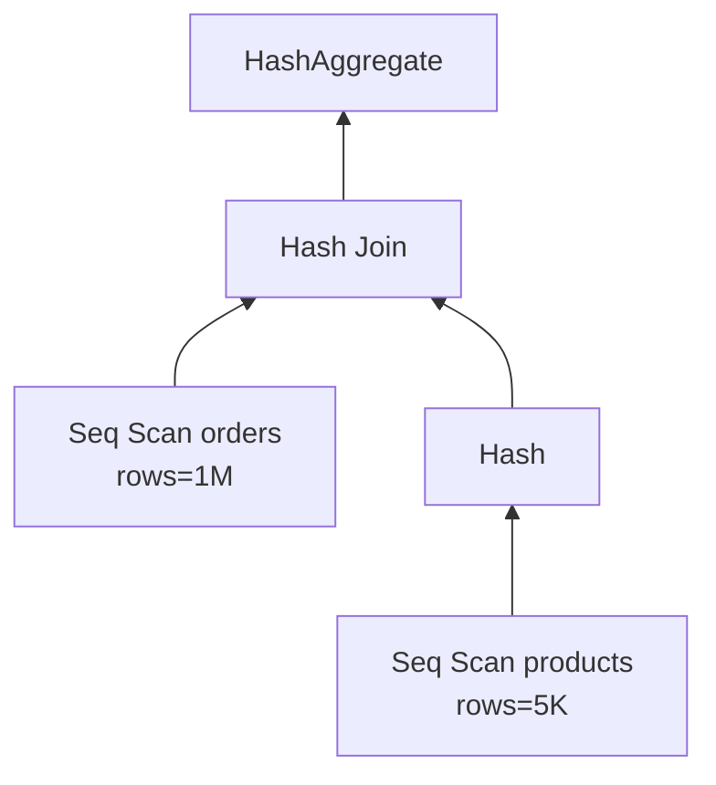

# EXPLAIN ANALYZE

> The planner picks a plan; `EXPLAIN ANALYZE` runs it and shows the real time of every step.


Read a plan **bottom-up**, inside-out.

## Example (measured, Docker Desktop, cold cache)

```sql
EXPLAIN (ANALYZE, BUFFERS)
SELECT * FROM orders WHERE user_id = 42;
```
```text
Gather  (cost=1000.00..15555.43 rows=11 width=43) (actual time=108.9..631.5 rows=12 loops=1)
  Workers Planned: 2
  ->  Parallel Seq Scan on orders  (actual time=108.9..493.7 rows=4 loops=3)
        Filter: (user_id = 42)
        Rows Removed by Filter: 333329
        Buffers: shared hit=529 read=8817
Planning Time: 0.2 ms
Execution Time: 631.7 ms
```

## Reading the numbers

| Field | Meaning |
|---|---|
| `cost=a..b` | planner estimate (arbitrary units, not ms) |
| `actual time=a..b` | real ms (first row..last row) |
| `rows` estimate vs actual | big gap = stale statistics |
| `loops` | multiply time by it |
| `Rows Removed by Filter` | wasted work → index? |
| `shared hit / read` | pages from RAM / from disk |

## Node types

| Node | When |
|---|---|
| Seq Scan | whole table |
| Index Scan | index + heap |
| Index Only Scan | index only ⚡ |
| Bitmap Heap Scan | many scattered rows |
| Nested Loop / Hash / Merge Join | join strategies |

## Pitfall
❌ `EXPLAIN ANALYZE DELETE ...` → **really deletes**
✅ `BEGIN; EXPLAIN ANALYZE DELETE ...; ROLLBACK;`

Next → [02-btree](02-btree.md)
