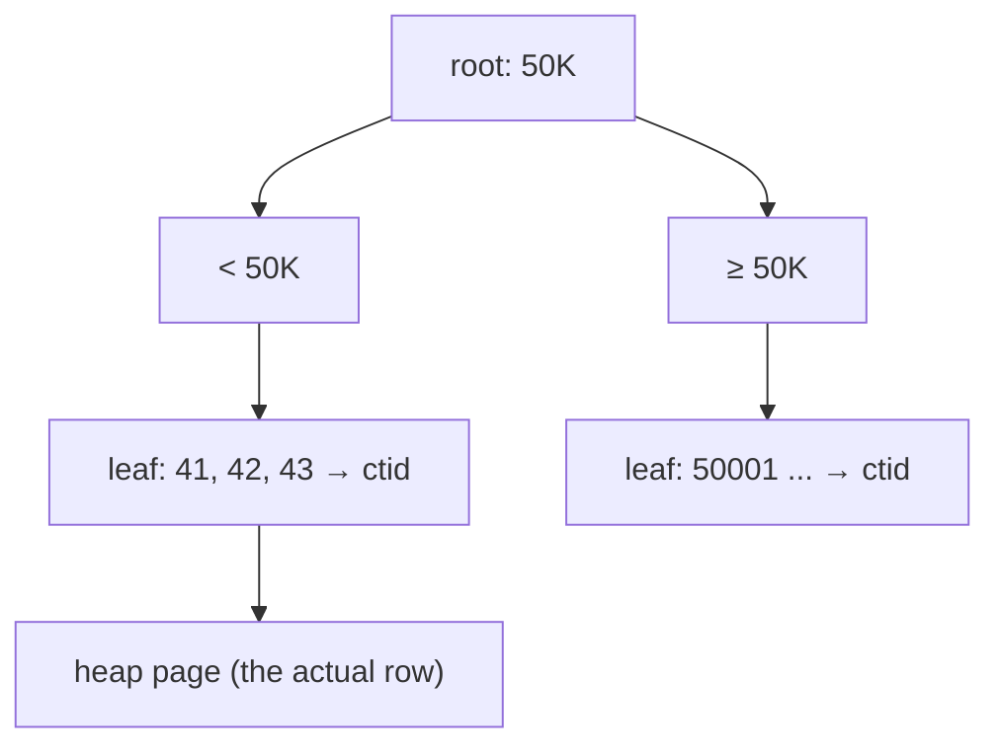

# B-Tree Index

> The default index. A sorted tree → `=`, `<`, `>`, `BETWEEN`, `ORDER BY` in O(log n).



## Before → after (measured)

```sql
EXPLAIN ANALYZE SELECT * FROM orders WHERE user_id = 42;
-- Parallel Seq Scan · Execution Time: 631 ms

CREATE INDEX orders_user_id_idx ON orders (user_id);

EXPLAIN ANALYZE SELECT * FROM orders WHERE user_id = 42;
-- Bitmap Heap Scan → Bitmap Index Scan on orders_user_id_idx · Execution Time: 0.36 ms
```

| | Time | Buffers |
|---|---|---|
| Seq Scan | 340–630 ms | 9,346 pages |
| Index | 0.36 ms | 18 pages |
| | **~1,750× faster** | |

## Composite — column order matters

```sql
CREATE INDEX orders_user_created_idx ON orders (user_id, created_at DESC);
```

| Query | Uses the index? |
|---|---|
| `WHERE user_id = 42` | ✅ |
| `WHERE user_id = 42 ORDER BY created_at DESC` | ✅ no sort needed |
| `WHERE created_at > now() - '1 day'` | ❌ (not the first column) |

Rule: **equality columns first, range/sort columns last**.

## Cost

```sql
SELECT pg_size_pretty(pg_relation_size('orders_user_id_idx'));  -- 9 MB (dedup: ~10 orders/user)
```
Every index = disk space + slower `INSERT/UPDATE`.

## Pitfall
❌ `CREATE INDEX` in production → blocks writes
✅ `CREATE INDEX CONCURRENTLY ...`

Next → [03-index-types](03-index-types.md)
