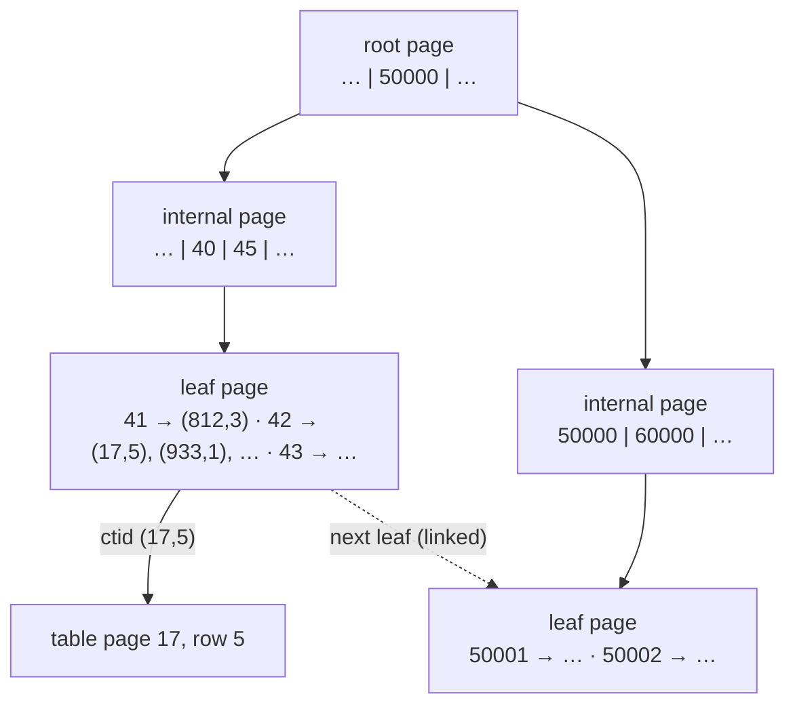

# B-Tree Index

> **Definition:** an index is a separate structure that maps **column value → row address** (`ctid`), so a query can jump to matching rows instead of reading the whole table. A **B-Tree** keeps those values **sorted** in a balanced tree. It is the default (`CREATE INDEX` without `USING`) and answers `=`, `<`, `>`, `BETWEEN`, `IN`, `ORDER BY`. Other index types: [03-index-types](03-index-types.md).

## 1. Analogy and structure

A phone book: sorted by name, so you open the middle, go left or right, and find "Omar" in a few steps instead of reading every page.



Measured on `orders_user_id_idx` (1M rows, `pageinspect`):

| Property | Value |
|---|---|
| Levels | root → 1 internal level → leaves (`level = 2`) |
| Leaf pages | 1,130 |
| Size | 9 MB (table: 73 MB) |
| Pages read to find `user_id = 42` | ~3 index pages + 1 page per matching row |

Leaves are linked left ↔ right → a range (`BETWEEN 42 AND 50`) = find 42, then walk the leaves.

## 2. Before → after (measured, single worker)

```sql
EXPLAIN (ANALYZE, BUFFERS) SELECT * FROM orders WHERE user_id = 42;
-- Seq Scan on orders … rows=15 · Rows Removed by Filter: 999985
-- Buffers: shared hit=3505 read=5841 · Execution Time: 96.9 ms

CREATE INDEX orders_user_id_idx ON orders (user_id);

EXPLAIN (ANALYZE, BUFFERS) SELECT * FROM orders WHERE user_id = 42;
-- Bitmap Heap Scan → Bitmap Index Scan on orders_user_id_idx … rows=15
-- Buffers: shared hit=10 read=11 · Execution Time: 0.19 ms
```

| | Pages read | Time |
|---|---|---|
| Seq Scan | 9,346 | 96.9 ms |
| B-Tree | 21 | **0.19 ms** (~500×) |

## 3. Which queries use it (index on `user_id`)

| Query | Uses index? | Why |
|---|---|---|
| `WHERE user_id = 42` | ✅ | find in tree |
| `WHERE user_id IN (42, 43, 44)` | ✅ measured 0.14 ms, 33 rows | 3 lookups |
| `WHERE user_id BETWEEN 42 AND 50` | ✅ | find 42, walk leaves |
| `ORDER BY user_id LIMIT 10` | ✅ | already sorted, no Sort node |
| `WHERE user_id + 0 = 42` | ❌ Seq Scan 75.9 ms | expression ≠ indexed column |
| `WHERE created_at::date = '2026-01-01'` (index on `created_at`) | ❌ | cast on the column |
| ✅ rewrite: `WHERE created_at >= '2026-01-01' AND created_at < '2026-01-02'` | ✅ | plain range on the column |

## 4. Composite index — column order matters (measured)

**Definition:** an index on several columns, sorted by the first, then by the second **inside** equal first values (like a phone book: last name, then first name).

```sql
CREATE INDEX orders_user_created_idx ON orders (user_id, created_at DESC);
```

```text
user_id │ created_at (DESC)
   42   │ 2026-09-30 …   ┐
   42   │ 2026-08-14 …   │ all of user 42, newest first
   42   │ 2026-02-01 …   ┘
   43   │ 2026-09-29 …
```

| Query | Measured plan | Time |
|---|---|---|
| `WHERE user_id = 42` | ✅ `Bitmap Index Scan on orders_user_created_idx` | 0.039 ms |
| `WHERE user_id = 42 ORDER BY created_at DESC LIMIT 5` | ✅ `Index Scan` + `Limit`, **no Sort** | 0.054 ms |
| `WHERE user_id = 42 ORDER BY created_at ASC LIMIT 5` | ✅ `Index Scan Backward` | |
| `WHERE user_id = 42 AND created_at > now() - '90 days'` | ✅ both columns in `Index Cond` | 0.025 ms |
| `WHERE user_id BETWEEN 42 AND 50 ORDER BY created_at DESC` | ⚠️ index for the range, then a **Sort** | range on col 1 → col 2 not in order |
| `WHERE created_at > now() - '1 day'` | ❌ `Seq Scan` | 214 ms — col 2 alone is scattered |

Rule: **equality columns first, then the range / sort column**. One `(a, b)` index also serves queries on `a` alone → a separate `(a)` index is redundant.

## 5. When an index doesn't help

**Selectivity** = % of rows matched. B-Tree pays off when it's small.

| Query | Rows matched | Measured |
|---|---|---|
| `WHERE user_id = 42` | 15 (0.0015%) | 97 ms → 0.19 ms ✅ |
| `WHERE status = 'paid'` (index on `status`) | 249,533 (25%) | 79 ms with index, `Heap Blocks: exact=9346` = **every page anyway** ❌ |

Few distinct values (`status`, `boolean`) → plain index is useless. Use a partial index instead ([04-partial-covering](04-partial-covering.md)).

## 6. Cost: space + slower writes (measured)

```sql
SELECT pg_size_pretty(pg_relation_size('orders_user_id_idx'));   -- 9 MB
```

| Index on `orders` | Size | Why |
|---|---|---|
| `(created_at)` — unique values | 21 MB | one entry per row |
| `(user_id)` — ~10 rows per user | 9 MB | **deduplication**: one key + list of ctids |
| `(status)` — 4 values | 6.8 MB | heavy dedup |

Insert 500,000 rows:

| Indexes on the table | Time |
|---|---|
| 0 | 1.5 s |
| 5 B-Trees | **9.0 s** (6×) |

## 7. Production: `CREATE INDEX CONCURRENTLY` (measured)

Plain `CREATE INDEX` locks the table against writes until it finishes. Two sessions, building an index on `orders` (~1 s) while an `INSERT` arrives:

| Build mode | Build time | Concurrent `INSERT` |
|---|---|---|
| `CREATE INDEX` | 0.80 s | **waited 530 ms** (blocked) |
| `CREATE INDEX CONCURRENTLY` | 0.96 s | 3 ms ✅ |

On a 100 GB table the plain build blocks writes for minutes.

```sql
CREATE INDEX CONCURRENTLY orders_user_id_idx ON orders (user_id);
-- can't run inside BEGIN … COMMIT
-- if it fails, it leaves an INVALID index → DROP INDEX CONCURRENTLY and retry
```

## Key Points
- B-Tree = sorted tree: `=`, ranges, `IN`, `ORDER BY`
- Index the column **as-is**; expressions/casts on it skip the index
- Composite: equality first, range/sort last; `(a, b)` covers `(a)`
- Low selectivity (25%+) → index doesn't help
- Every index costs space and write speed (5 indexes = 6× slower inserts)
- Production → `CREATE INDEX CONCURRENTLY`

Next → [03-index-types](03-index-types.md)
