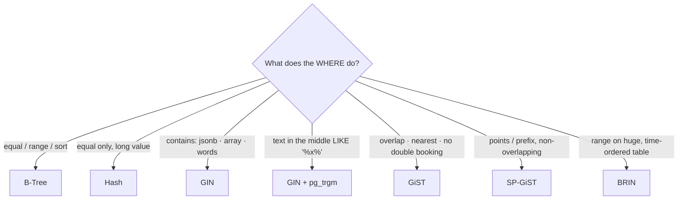
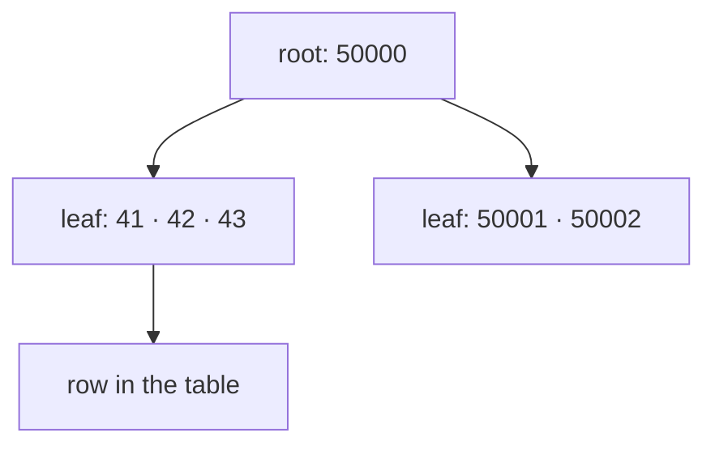
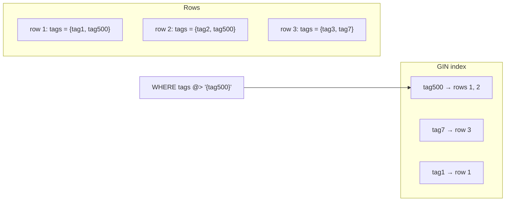
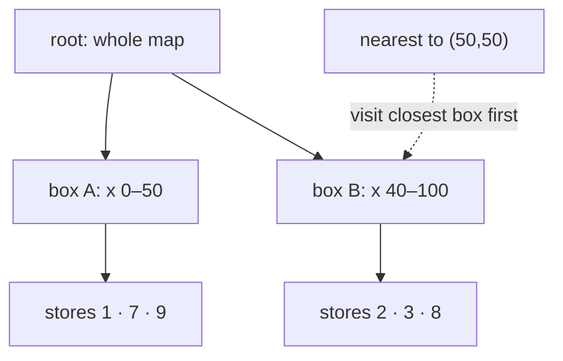
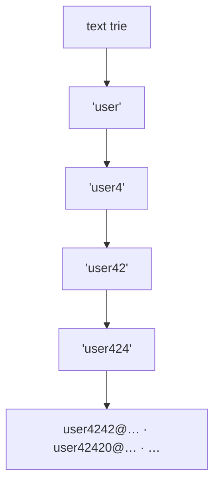
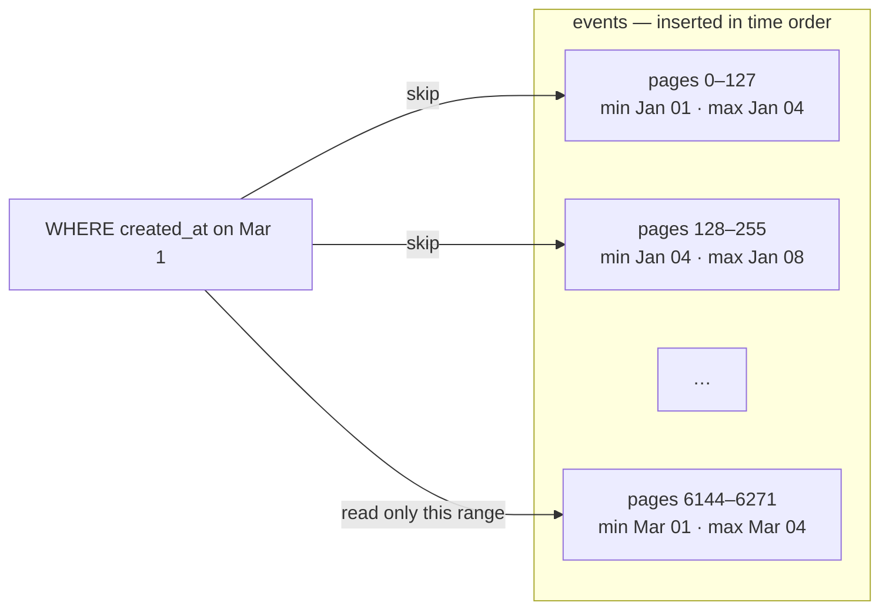

# Index Types

> **Definition:** an index type (access method) is **a data structure + the list of operators it can answer**. An index helps a query **only if** the `WHERE` / `ORDER BY` uses one of those operators on **exactly** the indexed column or expression.

PostgreSQL ships 6 types:

| Type | Structure | Answers | Typical column |
|---|---|---|---|
| **B-Tree** | sorted tree | `=` `<` `>` `BETWEEN` `IN` `ORDER BY` | ids, dates, numbers, short text |
| **Hash** | hash table | `=` only | long text compared by equality |
| **GIN** | inverted index: element → list of rows | "contains": `@>` `?` `&&` `@@` `LIKE '%x%'` | `jsonb`, arrays, full-text, trigram |
| **GiST** | tree of bounding boxes | overlap `&&`, inside `<@`, nearest `<->` | ranges, geometry, exclusion constraints |
| **SP-GiST** | space-partitioning tree (quad-tree, trie) | like GiST, for non-overlapping data | points, IP, text prefix |
| **BRIN** | min/max per block range | `<` `>` `BETWEEN` on ordered data | time-series, logs, append-only |



## 0. Vocabulary

| Term | Definition | Seen in `EXPLAIN` as |
|---|---|---|
| **Operator class** | which operators a given index on a given type supports | `gin_trgm_ops`, `jsonb_path_ops` |
| **Index Scan** | walk the index, fetch each matching row | `Index Scan using x` |
| **Bitmap Scan** | collect matching page numbers first, then read each page once | `Bitmap Index Scan` → `Bitmap Heap Scan` |
| **Recheck** | the index may return false positives → re-test the condition on the row | `Recheck Cond:` |
| **Lossy** | the index only knows the **page**, not the row → every row on the page is re-tested | `Heap Blocks: lossy=128` |
| **Selectivity** | % of rows matched. Low % → index wins. High % → Seq Scan wins | `rows=2500` of 500,000 |

## Setup — test tables used below

The shop dataset has no arrays, long texts, points or time-ordered data, so a few extra tables. Run inside `BEGIN; … ROLLBACK;` to leave the DB clean.

```sql
SET max_parallel_workers_per_gather = 0;   -- single worker → comparable timings
CREATE EXTENSION IF NOT EXISTS pg_trgm;
CREATE EXTENSION IF NOT EXISTS btree_gist;

-- 500K products: jsonb + array + title  (90 MB)
CREATE TABLE items AS
SELECT g AS id,
       jsonb_build_object('color', (ARRAY['red','black','white','blue','green'])[1+g%5],
                          'brand', 'brand'||(g%200),
                          'rating', 1+g%5) AS attrs,
       ARRAY['tag'||(g%50), 'tag'||(g%997)] AS tags,
       'Product '||g||' '||(ARRAY['wireless keyboard','gaming mouse','usb cable',
                                  'office chair','running shoes','coffee mug'])[1+g%6]
                    ||' '||(ARRAY['for home','for office','for gamers','for travel'])[1+g%4] AS title
FROM generate_series(1, 500000) g;

-- 500K store locations on a 100×100 map
CREATE TABLE stores AS
SELECT g AS id, point(random()*100, random()*100) AS loc FROM generate_series(1, 500000) g;

-- 1M events, inserted in time order (one every 30 s)  (50 MB)
CREATE TABLE events AS
SELECT g AS id, timestamptz '2025-01-01' + g * interval '30 seconds' AS created_at, g % 100 AS kind
FROM generate_series(1, 1000000) g;

ANALYZE items, stores, events;
```

---

## 1. B-Tree — the default

**Definition:** a balanced, **sorted** tree. Leaves hold `value → row address (ctid)` in order. `CREATE INDEX` without `USING` = B-Tree. Full details: [02-btree](02-btree.md).



```sql
CREATE INDEX orders_user_id_idx ON orders (user_id);
```

| Query | Uses index? | Why |
|---|---|---|
| `WHERE user_id = 42` | ✅ | equality |
| `WHERE user_id IN (1, 2, 3)` | ✅ | several equalities |
| `WHERE user_id BETWEEN 10 AND 20` | ✅ | range = walk sorted leaves |
| `ORDER BY user_id LIMIT 10` | ✅ | already sorted → no Sort node |
| `WHERE user_id IS NULL` | ✅ | NULLs are stored too |
| `WHERE user_id + 1 = 43` | ❌ | expression on the column → index on `user_id` doesn't match |
| `WHERE user_id::text = '42'` | ❌ | same: cast on the column |
| `WHERE email LIKE 'user4242%'` | ❌ **measured: Seq Scan** | default collation isn't byte order → needs `text_pattern_ops` (then: Index Scan ✅) |
| `WHERE email LIKE '%4242'` | ❌ | sorted by the **start** of the text |

Fixes:
```sql
CREATE INDEX ON users (email text_pattern_ops);   -- LIKE 'abc%'
CREATE INDEX ON users (lower(email));             -- WHERE lower(email) = '...'
```

**Measured** (`orders`, 1M rows): Seq Scan 631 ms → Index 0.36 ms.

---

## 2. Hash — equality only

**Definition:** stores a 32-bit **hash code** of each value → bucket → rows. It cannot know the order of values, so it answers `=` and nothing else.


```sql
CREATE INDEX users_email_hash ON users USING hash (email);
```

| Query | Uses index? | Measured plan |
|---|---|---|
| `WHERE email = 'user4242@shop.test'` | ✅ | `Index Scan using users_email_hash` · **0.023 ms** |
| `WHERE id BETWEEN 1 AND 10` (hash on `id`) | ❌ | `Seq Scan` |
| `ORDER BY id LIMIT 5` (hash on `id`) | ❌ | `Sort` + `Seq Scan` |
| `WHERE email LIKE 'user%'` | ❌ | prefix = a range |
| unique constraint | ❌ | hash indexes can't be `UNIQUE` |

| `users.email` (100K rows) | Size |
|---|---|
| B-Tree (`users_email_key`) | 6.9 MB |
| Hash | **4.1 MB** |

**When:** long values (URLs, tokens, hashes) only ever compared with `=`. Otherwise B-Tree does the same plus ranges.

---

## 3. GIN — "contains" searches

**Definition:** Generalized **Inverted** Index. It splits each value into **elements** (jsonb keys/values, array items, words, 3-letter chunks) and stores `element → list of rows`. Like the index at the back of a book.



Cost: one row = many index entries → **slow writes** (see [section 7](#7-write-cost)).

### 3.1 jsonb

```sql
CREATE INDEX items_attrs_gin ON items USING gin (attrs);                    -- jsonb_ops (default)
CREATE INDEX items_attrs_path ON items USING gin (attrs jsonb_path_ops);     -- smaller, only @>
```

| Query | Index | Measured |
|---|---|---|
| `WHERE attrs @> '{"brand":"brand42"}'` | ✅ GIN | Seq 125.6 ms → **18.0 ms** (2,500 rows) |
| `WHERE attrs ? 'discount'` (key exists) | ✅ `jsonb_ops` only | **0.018 ms** |
| `WHERE attrs ?\| array['a','b']` · `?&` | ✅ `jsonb_ops` only | |
| `WHERE attrs @> '{"color":"red"}'` | ⚠️ uses index, little gain | **112 ms** — 20% of rows match |
| `WHERE attrs->>'brand' = 'brand42'` | ❌ **Seq Scan 102 ms** | `->>` is not a GIN operator |
| `WHERE (attrs->>'rating')::int > 4` | ❌ Seq Scan 136 ms | GIN has no ranges |

Fix for `->>` and ranges = **B-Tree on the expression**:
```sql
CREATE INDEX items_brand_idx ON items ((attrs->>'brand'));
-- WHERE attrs->>'brand' = 'brand42'  →  102 ms → 3.5 ms
```

| Operator class | Size (500K rows) | Supports |
|---|---|---|
| `jsonb_ops` | 4.5 MB | `@>` `?` `?\|` `?&` |
| `jsonb_path_ops` | **2.9 MB** | `@>` only (plus jsonpath `@?` `@@`) |

### 3.2 Arrays

```sql
CREATE INDEX items_tags_gin ON items USING gin (tags);   -- 3.6 MB
```

| Query | Meaning | Uses index? | Measured |
|---|---|---|---|
| `WHERE tags @> ARRAY['tag500']` | has **all** of these | ✅ | Seq 128.3 ms → **0.76 ms** |
| `WHERE tags && ARRAY['tag500','tag501']` | has **any** of these | ✅ | **0.94 ms** |
| `WHERE tags <@ ARRAY['a','b','c']` | only these | ✅ | |
| `WHERE 'tag500' = ANY(tags)` | same meaning as `@>` | ❌ **Seq Scan 102 ms** | `ANY` is not a GIN operator |

→ Rewrite `x = ANY(tags)` as `tags @> ARRAY[x]`.

### 3.3 Full-text search

**Definition:** `to_tsvector` turns text into normalized **words** (stems), `to_tsquery` builds a search. `'gaming'` → `'game'`, `'keyboards'` → `'keyboard'`, `'for'` → removed (stop word).

```sql
SELECT to_tsvector('english', 'Product 7 gaming mouse for office');
-- '7':2 'game':3 'mous':4 'offic':6 'product':1

CREATE INDEX items_title_fts ON items USING gin (to_tsvector('english', title));   -- 29 MB
```

| Query | Uses index? | Measured |
|---|---|---|
| `WHERE to_tsvector('english', title) @@ to_tsquery('english', 'gaming & office')` | ✅ | Seq **2,970 ms** → **98 ms** (41,667 rows) |
| `… @@ to_tsquery('english', 'keyboards')` | ✅ matches "keyboard" (stem) | **29 ms** |
| `… @@ websearch_to_tsquery('english', 'wireless keyboard -travel')` | ✅ Google-like syntax | **44 ms** |
| `WHERE to_tsvector('simple', title) @@ …` | ❌ **Seq Scan 2,066 ms** | config `'simple'` ≠ indexed `'english'` |
| `WHERE to_tsvector(title) @@ …` | ❌ | no config → expression differs from the index |
| `WHERE title ILIKE '%gaming%'` | ❌ Seq Scan 475 ms | not FTS → use trigram (3.4) |

Rule: the `WHERE` expression must be **character-for-character** the indexed expression. Safer: a stored column.
```sql
ALTER TABLE items ADD COLUMN fts tsvector
    GENERATED ALWAYS AS (to_tsvector('english', title)) STORED;
CREATE INDEX ON items USING gin (fts);
SELECT * FROM items WHERE fts @@ websearch_to_tsquery('english', 'gaming office');
```

### 3.4 Trigram (`pg_trgm`) — `LIKE '%text%'`

**Definition:** splits text into **3-character chunks** (trigrams) and indexes them with GIN. A search for `er4242` looks up its trigrams, then rechecks.

```sql
SELECT show_trgm('er4242');
-- {"  e"," er",242,"42 ",424,er4,r42}

CREATE INDEX users_email_trgm ON users USING gin (email gin_trgm_ops);   -- 3.3 MB
```

| Query | Uses index? | Measured (`users`, 100K) |
|---|---|---|
| `WHERE email LIKE '%er4242%'` | ✅ | Seq 15.0 ms → **3.1 ms** (11 rows) |
| `WHERE email ILIKE '%ER4242%'` | ✅ case-insensitive too | **0.16 ms** |
| `WHERE email ~ 'user42(42\|43)@'` | ✅ regex | **1.8 ms** |
| `WHERE email LIKE '%42%'` | ❌ Seq Scan | 3,970 rows (4%) → planner prefers Seq Scan |
| `WHERE email LIKE '%4%'` | ❌ Seq Scan | under 3 characters → no trigram to look up |

---

## 4. GiST — overlap, containment, nearest

**Definition:** Generalized Search Tree. Each node stores a **bounding box** (or range) that covers everything below it. A search skips any subtree whose box doesn't touch the target. Boxes **may overlap** — that's what makes it fit ranges and shapes.



### 4.1 Ranges + exclusion constraint (no double booking)

```sql
CREATE TABLE bookings (
    id     bigint GENERATED ALWAYS AS IDENTITY,
    room   int       NOT NULL,
    during tstzrange NOT NULL,
    EXCLUDE USING gist (room WITH =, during WITH &&)   -- same room + overlapping time = rejected
);
-- 200K bookings: 200 rooms, 90-min slots every 2 hours
```

`btree_gist` lets GiST handle `room WITH =` (a plain int) next to the range.

```sql
INSERT INTO bookings (room, during)
VALUES (7, tstzrange('2025-01-01 01:00', '2025-01-01 02:00'));
-- ERROR: conflicting key value violates exclusion constraint "bookings_room_during_excl"
-- DETAIL: Key (room, during)=(7, [01:00, 02:00)) conflicts with existing key (room, during)=(7, [00:00, 01:30))
```

| Query | Uses index? | Measured |
|---|---|---|
| `WHERE room = 7 AND during && tstzrange('2025-03-01 10:00','2025-03-01 12:00')` | ✅ overlaps | **0.065 ms** |
| `WHERE during @> timestamptz '2025-03-01 10:30'` | ✅ contains a moment | |
| `WHERE lower(during) > '2025-03-01'` | ❌ | `lower()` = expression → B-Tree on `lower(during)` |

### 4.2 Nearest neighbour (KNN)

```sql
CREATE INDEX stores_loc_gist ON stores USING gist (loc);   -- 32 MB

-- 5 stores nearest to (50, 50)
SELECT id, loc <-> point(50, 50) AS distance
FROM stores
ORDER BY loc <-> point(50, 50)
LIMIT 5;
```

| Query | Uses index? | Measured (500K points) |
|---|---|---|
| `ORDER BY loc <-> point(50,50) LIMIT 5` | ✅ `Index Scan … Order By` | Seq + Sort **119.5 ms** → **0.22 ms** |
| `WHERE loc <@ box(point(10,10), point(11,11))` | ✅ inside a box | **0.27 ms** (63 rows) |
| `ORDER BY loc <-> point(50,50)` **without** `LIMIT` | ⚠️ | must return all 500K rows anyway |
| `WHERE loc[0] > 10` | ❌ | coordinate extraction = expression |

Real geography (lat/lon, km): **PostGIS** `geography` + GiST — same idea.

---

## 5. SP-GiST — partitioned space

**Definition:** Space-Partitioned GiST. Splits space into **non-overlapping** parts: quad-tree for points (4 quadrants), radix tree (trie) for text. No overlap → fewer nodes visited, smaller index. Can't do ranges that overlap the way GiST does.



```sql
CREATE INDEX stores_loc_spgist ON stores USING spgist (loc);   -- 22 MB (GiST: 32 MB)
CREATE INDEX users_email_spgist ON users USING spgist (email);
```

| Query | Uses index? | Measured |
|---|---|---|
| `ORDER BY loc <-> point(50,50) LIMIT 5` | ✅ | **0.04 ms** (GiST: 0.22 ms) |
| `WHERE loc <@ box(point(10,10), point(11,11))` | ✅ | **0.18 ms** (GiST: 0.27 ms) |
| `WHERE email ^@ 'user4242'` (starts with) | ✅ | **0.22 ms** |
| `WHERE email LIKE '%4242'` | ❌ | trie works from the start of the text |
| exclusion constraint on ranges | ❌ | use GiST |

Also good for `inet` / `cidr`: `WHERE ip << '10.0.0.0/8'`.

---

## 6. BRIN — tiny index for ordered data

**Definition:** Block Range INdex. For every **128 pages** (1 MB) of the table it stores only **min and max** of the column. A query skips every block range whose min–max doesn't overlap the condition. Works **only** if the physical order of rows follows the column (e.g. rows inserted in time order).



```sql
CREATE INDEX events_created_brin ON events USING brin (created_at);
```

| `events.created_at` (1M rows, 50 MB) | B-Tree | BRIN |
|---|---|---|
| Index size | 21 MB | **24 kB** (~900× smaller) |

Query: one day of events.
```sql
SELECT count(*) FROM events
WHERE created_at >= '2025-03-01' AND created_at < '2025-03-02';
```

| Plan | Pages read | Time |
|---|---|---|
| Seq Scan | 6,400 | 95.9 ms |
| BRIN (`Heap Blocks: lossy=128`) | **133** | **3.7 ms** |

### Same index on random data = useless

Check the order first — `correlation` near ±1 = ordered, near 0 = random:
```sql
SELECT tablename, correlation FROM pg_stats WHERE attname = 'created_at';
-- events  1           ← BRIN works
-- orders  -0.006      ← BRIN useless
```

BRIN on `orders.created_at` (random dates), last 1 day:
```text
Bitmap Heap Scan on orders
  Rows Removed by Index Recheck: 997157
  Heap Blocks: lossy=9344          ← every page of the table
  Execution Time: 305 ms           ← slower than a plain Seq Scan
```

| Query | Uses BRIN well? |
|---|---|
| `WHERE created_at BETWEEN …` on time-ordered inserts | ✅ |
| `WHERE id > 900000` on an identity column | ✅ |
| `WHERE created_at = '…'` (one exact moment) | ⚠️ works, reads a whole 1 MB range |
| any condition on randomly ordered data | ❌ reads everything |
| `ORDER BY created_at LIMIT 10` | ❌ BRIN doesn't sort |

---

## 7. Write cost

Every index slows `INSERT/UPDATE`. Measured: insert 200K rows into a table with `tags text[]` and `title text`:

| Indexes on the table | Insert time |
|---|---|
| none | 315 ms |
| 1 B-Tree (`id`) | 659 ms |
| 2 GIN (`tags`, `to_tsvector(title)`) | **3,516 ms** (~11×) |

GIN keeps a **pending list** (`fastupdate = on`) to batch writes; `gin_pending_list_limit` controls it.

## 8. All measurements

| Type | Query | Without index | With index | Index size |
|---|---|---|---|---|
| B-Tree | `orders.user_id = 42` | 631 ms | 0.36 ms | 9 MB |
| Hash | `users.email = …` | — | 0.023 ms | 4.1 MB (B-Tree 6.9 MB) |
| GIN jsonb | `attrs @> '{"brand":…}'` | 125.6 ms | 18.0 ms | 2.9–4.5 MB |
| GIN array | `tags @> ARRAY['tag500']` | 128.3 ms | 0.76 ms | 3.6 MB |
| GIN FTS | `@@ 'gaming & office'` | 2,970 ms | 98 ms | 29 MB |
| GIN trigram | `email LIKE '%er4242%'` | 15.0 ms | 3.1 ms | 3.3 MB |
| GiST | 5 nearest points | 119.5 ms | 0.22 ms | 32 MB |
| SP-GiST | 5 nearest points | 119.5 ms | 0.04 ms | 22 MB |
| BRIN | 1 day of `events` | 95.9 ms | 3.7 ms | 24 kB |

Single worker (`max_parallel_workers_per_gather = 0`), PostgreSQL 17, Docker on a laptop.

## Check what you have

```sql
SELECT indexrelid::regclass AS index, am.amname AS type,
       pg_size_pretty(pg_relation_size(indexrelid)) AS size, idx_scan AS times_used
FROM pg_stat_user_indexes s
JOIN pg_class c ON c.oid = s.indexrelid
JOIN pg_am am   ON am.oid = c.relam
ORDER BY pg_relation_size(indexrelid) DESC;
```
`times_used = 0` after weeks → the index only costs writes → drop it.

## Key Points
- 95% of cases: **B-Tree**
- Index helps only when the query uses **its operator** on **its exact expression** (`ANY` ≠ `@>`, `->>` ≠ `@>`, `'simple'` ≠ `'english'`)
- **GIN**: jsonb / arrays / full-text / `LIKE '%x%'` — fast reads, ~11× slower writes
- **GiST**: ranges, no-overlap constraints, nearest neighbour · **SP-GiST**: points, prefixes
- **BRIN**: only when `correlation` ≈ ±1 (time-ordered inserts) — 24 kB instead of 21 MB
- Many matching rows (20%+) → Seq Scan wins whatever the index

Next → [04-partial-covering](04-partial-covering.md)
