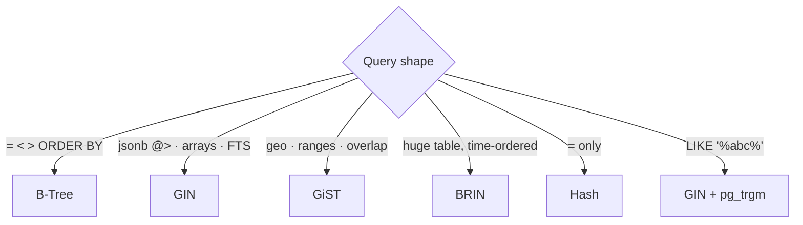

# Index Types

> Each kind of data/operator has a matching index.



## Examples

```sql
-- GIN: jsonb
CREATE INDEX ON products USING gin (attrs);
SELECT * FROM products WHERE attrs @> '{"color":"red"}';

-- BRIN: tiny index for append-only tables
CREATE INDEX orders_created_brin ON orders USING brin (created_at);

-- Trigram: substring search
CREATE EXTENSION IF NOT EXISTS pg_trgm;
CREATE INDEX ON users USING gin (email gin_trgm_ops);
SELECT * FROM users WHERE email LIKE '%er4242%';

-- GiST: prevent overlapping bookings
CREATE EXTENSION IF NOT EXISTS btree_gist;
CREATE TABLE bookings (
    room int,
    during tstzrange,
    EXCLUDE USING gist (room WITH =, during WITH &&)
);
```

## Numbers — `orders.created_at`, 1M rows (measured)

| Index | Size |
|---|---|
| B-Tree | 21 MB |
| BRIN | 24 KB |

⚠️ BRIN only helps when physical row order ≈ column order (time-ordered inserts). In the shop dataset `created_at` is random → BRIN is weak here.

## Key Points
- 95% of cases: B-Tree
- GIN: fast reads, slower writes
- BRIN: logs / events / time-series

Next → [04-partial-covering](04-partial-covering.md)
