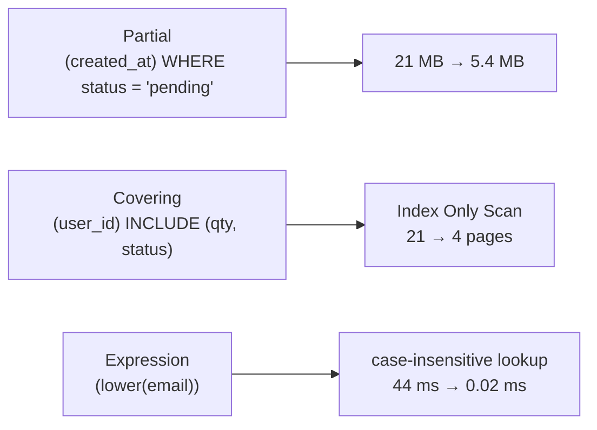
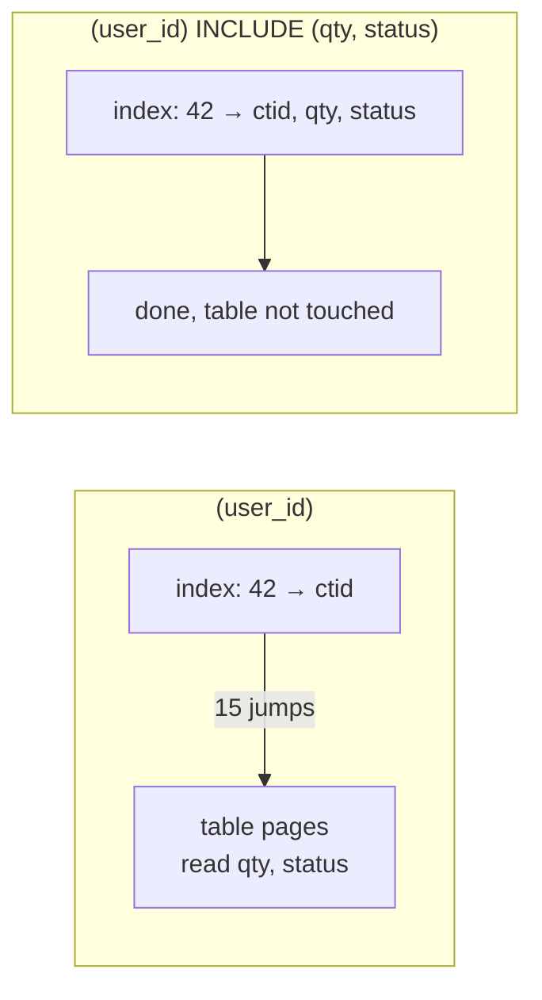

# Partial · Covering · Expression Indexes

> Three ways to make a B-Tree index **smaller** or **useful for more queries**:
> - **Partial**: index only the rows matching a `WHERE`.
> - **Covering**: also store extra columns, so the table is never read.
> - **Expression**: index a computed value, like `lower(email)`.



## 1. Partial index

**Definition:** `CREATE INDEX … WHERE <condition>` stores only the rows matching the condition. Smaller index, cheaper writes, and the planner uses it **only** when the query's `WHERE` implies that condition.

**Scenario:** a job checks for stale **pending** orders every minute. Only 25% of orders are pending:
```text
  status   | count
 cancelled | 249959
 paid      | 249533
 pending   | 249944     ← the only rows the job cares about
 shipped   | 250564
```

```sql
CREATE INDEX orders_pending_idx ON orders (created_at) WHERE status = 'pending';
```

| Index | Size |
|---|---|
| `(created_at)` on all rows | 21 MB |
| `(created_at) WHERE status = 'pending'` | **5.4 MB** |

| Query | Uses partial index? | Measured |
|---|---|---|
| `WHERE status = 'pending' AND created_at < now() - '364 days'` | ✅ `Bitmap Index Scan on orders_pending_idx` | 1.5 ms, 716 rows |
| `WHERE status = 'paid' AND created_at < …` | ❌ `Seq Scan` | `paid` rows aren't in the index |
| `WHERE created_at < …` (no status) | ❌ | the index lacks other statuses |

The query must contain the **same condition** (`status = 'pending'`); the planner doesn't guess.

### Partial UNIQUE: "unique among active rows"

```sql
CREATE TABLE coupons (code text, active bool);
CREATE UNIQUE INDEX ON coupons (code) WHERE active;

INSERT INTO coupons VALUES ('SALE', false), ('SALE', false), ('SALE', true);   -- ✅ ok
INSERT INTO coupons VALUES ('SALE', true);
-- ERROR:  duplicate key value violates unique constraint "coupons_code_idx"
-- DETAIL:  Key (code)=(SALE) already exists.
```
Old inactive codes can repeat; only one **active** `SALE` is allowed. Same pattern for soft deletes: `UNIQUE (email) WHERE deleted_at IS NULL`.

## 2. Covering index → Index Only Scan

**Definition:** `INCLUDE (cols)` stores extra columns in the index leaves. They aren't searchable keys, they're just carried along. If a query needs only the key + included columns, PostgreSQL answers **from the index alone** (Index Only Scan) and never reads the table.



```sql
CREATE INDEX orders_user_cov_idx ON orders (user_id) INCLUDE (qty, status);
VACUUM orders;    -- updates the visibility map (see below)

EXPLAIN (ANALYZE, BUFFERS) SELECT qty, status FROM orders WHERE user_id = 42;
```

| Index | Plan | Pages | Time (warm cache) |
|---|---|---|---|
| `(user_id)` | `Bitmap Heap Scan`, `Heap Blocks: exact=15` | 21 | 0.054 ms |
| `(user_id) INCLUDE (qty, status)` | `Index Only Scan`, `Heap Fetches: 0` | **4** | 0.061 ms |

Warm cache → same time. The gain shows on **cold / bigger-than-RAM** tables: 4 page reads instead of 21 random reads.

| Query | Index Only? | Why |
|---|---|---|
| `SELECT qty, status … WHERE user_id = 42` | ✅ | all columns in the index |
| `SELECT qty, status, created_at … WHERE user_id = 42` | ❌ `Bitmap Heap Scan` | `created_at` isn't in the index |

### Visibility map: why `VACUUM` matters

The index doesn't know if a row version is visible to you. PostgreSQL checks the **visibility map** (1 bit per table page: "all rows here are visible to everyone"). Page not marked → it must read the table page anyway.

```sql
UPDATE orders SET qty = qty WHERE user_id BETWEEN 40 AND 45;   -- touches 54 rows
EXPLAIN ANALYZE SELECT qty, status FROM orders WHERE user_id = 42;
-- Index Only Scan … Heap Fetches: 30     ← pages changed since the last VACUUM
```
After the next `VACUUM` (or autovacuum) → `Heap Fetches: 0` again.

### ⚠️ Cost: no deduplication

| Index | Size |
|---|---|
| `(user_id)` | 9 MB (deduplicated: 1 key, list of ctids) |
| `(user_id) INCLUDE (qty, status)` | **39 MB** (4×): `INCLUDE` disables deduplication |

Use it for a hot, read-heavy query, not by default.

## 3. Expression index

**Definition:** an index on the **result of an expression**, e.g. `lower(email)`. The query must use the **same expression**.

**Scenario:** login is case-insensitive. User types `User42@Shop.test`.

```sql
SELECT * FROM users WHERE lower(email) = 'user42@shop.test';
-- Seq Scan on users … Rows Removed by Filter: 99999 · 44.5 ms
-- (the unique index on email doesn't help: it stores 'user42@shop.test', not lower(…))

CREATE INDEX users_email_lower_idx ON users (lower(email));
-- Index Scan using users_email_lower_idx · 0.022 ms
```

| Query | Uses `(lower(email))`? |
|---|---|
| `WHERE lower(email) = 'user42@shop.test'` | ✅ |
| `WHERE LOWER(email) = lower('USER42@shop.test')` | ✅ same expression; the right side is a constant |
| `WHERE email ILIKE 'user42@shop.test'` | ❌ Seq Scan: different operator |
| `WHERE email = 'user42@shop.test'` | ❌ (uses the normal email index instead) |

### Run `ANALYZE` after creating an expression index

The table's statistics don't cover the new expression yet → the planner guesses 0.5%:
```text
before ANALYZE: Bitmap Heap Scan  (cost=16.29..875.42 rows=500 …) (actual … rows=1 …)   ← guessed 500
ANALYZE users;
after  ANALYZE: Index Scan        (cost=0.42..8.44   rows=1   …) (actual … rows=1 …)   ✅
```

### Casting a column = an expression (common mistake)

Index on `users (created_at)`; count users created on 2026-01-01 (137 rows):

| Query | Plan | Time |
|---|---|---|
| `WHERE created_at::date = '2026-01-01'` | scans **all** 100,000 index entries, `Rows Removed by Filter: 99863` | 13.3 ms |
| `WHERE created_at >= '2026-01-01' AND created_at < '2026-01-02'` | ✅ `Index Cond` on the range | **0.064 ms** (200×) |

✅ Rewrite as a range on the raw column, or create an index on `(created_at::date)` (only works if the session time zone is fixed).

## 4. Find unused indexes

```sql
SELECT relname AS table, indexrelname AS index, idx_scan AS times_used,
       pg_size_pretty(pg_relation_size(indexrelid)) AS size
FROM pg_stat_user_indexes
WHERE idx_scan = 0
ORDER BY pg_relation_size(indexrelid) DESC;
```
`times_used = 0` after weeks of real traffic → it only slows down writes → `DROP INDEX CONCURRENTLY`. Keep indexes that back a `UNIQUE`/`PK` constraint.

## Key Points
- **Partial**: index only the rows you query (21 → 5.4 MB); query must repeat the condition
- Partial `UNIQUE … WHERE active` = unique among active rows
- **Covering**: `INCLUDE` → Index Only Scan (21 → 4 pages), but no dedup (9 → 39 MB) and needs `VACUUM`
- **Expression**: query must use the identical expression; run `ANALYZE` after creating it
- `col::date = …` skips the index on `col` → use a range

Lab → [labs/05-indexes-performance.sql](../../labs/05-indexes-performance.sql)

Next → [06-transactions-mvcc/01-acid](../06-transactions-mvcc/01-acid.md)
