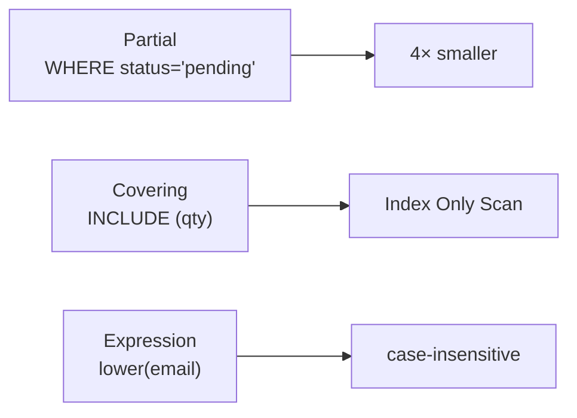

# Partial · Covering · Expression Indexes

> A smaller, smarter index = faster and cheaper.



## Partial

```sql
-- only 25% of orders are pending
CREATE INDEX orders_pending_idx ON orders (created_at) WHERE status = 'pending';

SELECT * FROM orders
WHERE status = 'pending' AND created_at < now() - interval '1 day';
```

## Covering → Index Only Scan

```sql
CREATE INDEX orders_user_cov_idx ON orders (user_id) INCLUDE (qty, status);
VACUUM orders;       -- refreshes the visibility map

EXPLAIN ANALYZE SELECT qty, status FROM orders WHERE user_id = 42;
-- Index Only Scan using orders_user_cov_idx   Heap Fetches: 0   (measured: 0.1 ms)
```

## Expression

```sql
CREATE INDEX users_email_lower_idx ON users (lower(email));
SELECT * FROM users WHERE lower(email) = 'user42@shop.test';   -- ✅ uses index
SELECT * FROM users WHERE email ILIKE 'user42@shop.test';      -- ❌ does not

-- a new expression index = new statistics → run ANALYZE
EXPLAIN ANALYZE SELECT * FROM users WHERE lower(email) = 'user42@shop.test';
-- before ANALYZE:  rows=500 (0.5% guess)   actual rows=1
ANALYZE users;
-- after  ANALYZE:  rows=1                  actual rows=1   ✅
```

## Numbers (measured)

| Index on orders | Size |
|---|---|
| `(created_at)` full | 21 MB |
| `(created_at) WHERE status='pending'` | 5.4 MB |

## Unused indexes

```sql
SELECT relname, indexrelname, idx_scan, pg_size_pretty(pg_relation_size(indexrelid))
FROM pg_stat_user_indexes
WHERE idx_scan = 0 ORDER BY pg_relation_size(indexrelid) DESC;
```

## Pitfall
❌ `WHERE created_at::date = '2026-01-01'` → can't use an index on `created_at`
✅ `WHERE created_at >= '2026-01-01' AND created_at < '2026-01-02'`

Lab → [labs/05-indexes-performance.sql](../../labs/05-indexes-performance.sql)

Next → [06-transactions-mvcc/01-acid](../06-transactions-mvcc/01-acid.md)
