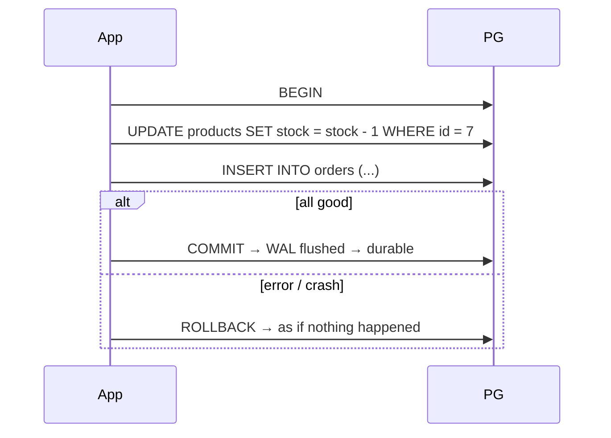

# ACID & Transactions

> A group of statements = one unit: all succeed or none do.



## ACID

| Letter | Meaning | Guaranteed by |
|---|---|---|
| **A**tomicity | all or nothing | transaction + CLOG |
| **C**onsistency | constraints always hold | constraints |
| **I**solation | transactions don't corrupt each other | MVCC + locks |
| **D**urability | after COMMIT it survives a crash | WAL |

## Example

```sql
BEGIN;
UPDATE products SET stock = stock - 1 WHERE id = 7;
INSERT INTO orders (user_id, product_id, qty) VALUES (1, 7, 1);
COMMIT;

-- SAVEPOINT: partial rollback
BEGIN;
INSERT INTO orders (user_id, product_id, qty) VALUES (1, 7, 1);
SAVEPOINT before_risky;
INSERT INTO orders (user_id, product_id, qty) VALUES (1, 7, -1);  -- ERROR 23514
ROLLBACK TO before_risky;
COMMIT;   -- first insert is kept
```

## Key Points
- No `BEGIN` = each statement is its own transaction
- Error inside a transaction → must ROLLBACK
- Keep transactions short

## Pitfall
❌ `BEGIN` → call an HTTP API (5 s) → `COMMIT` = locks held for 5 s
✅ Call the API outside the transaction

Next → [02-isolation-levels](02-isolation-levels.md)
