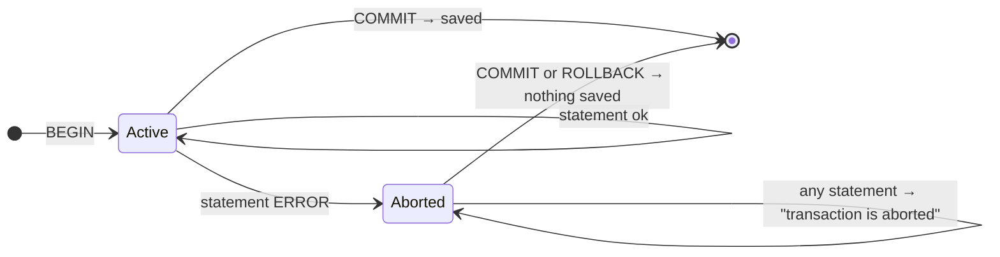
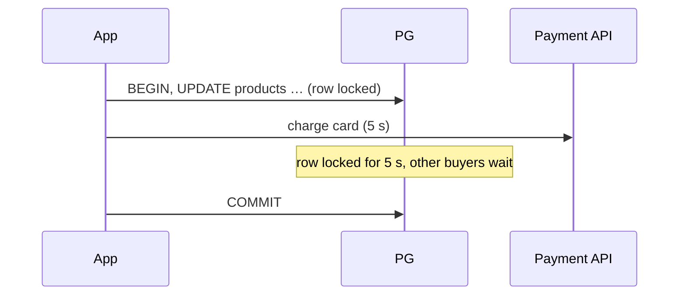

# ACID & Transactions

> **Definition:** a **transaction** is a group of statements that PostgreSQL treats as **one unit**: either all of them take effect (`COMMIT`) or none do (`ROLLBACK`). **ACID** names the 4 guarantees a transaction gives.


## 1. ACID, one letter at a time

| Letter | Definition | Shop example | Guaranteed by |
|---|---|---|---|
| **A**tomicity | all statements or none | stock decreased **and** order created, never just one | transaction status in `pg_xact` |
| **C**onsistency | every constraint holds after each transaction | `qty > 0`, FK to `products` | [constraints](../03-data-modeling/02-constraints.md) |
| **I**solation | concurrent transactions don't see each other's half-done work | two buyers of the last item | [MVCC](03-mvcc.md) + [locks](04-locks-deadlocks.md) + [isolation levels](02-isolation-levels.md) |
| **D**urability | after `COMMIT` returns, the change survives a crash or power loss | the order exists after a reboot | [WAL](../07-internals/02-wal.md) flushed with fsync |

## 2. Atomicity: an error cancels everything (measured)

**Scenario:** checkout = decrease stock, then insert the order. The order has `qty = -1` (a bug).

```sql
BEGIN;
UPDATE products SET stock = stock - 1 WHERE id = 7 RETURNING stock;
--  99999                                       ← stock changed (inside the transaction)

INSERT INTO orders (user_id, product_id, qty) VALUES (1, 7, -1);
-- ERROR:  new row for relation "orders" violates check constraint "orders_qty_check"

SELECT stock FROM products WHERE id = 7;
-- ERROR:  current transaction is aborted, commands ignored until end of transaction block

COMMIT;
-- ROLLBACK                                     ← COMMIT of a failed transaction = ROLLBACK

SELECT stock FROM products WHERE id = 7;
--  100000                                      ← the stock change was undone too
```



After an error, the transaction is **poisoned**. Every statement fails until `ROLLBACK` (or `ROLLBACK TO SAVEPOINT`).

## 3. SAVEPOINT: undo part of a transaction

**Definition:** a named point inside a transaction. `ROLLBACK TO name` undoes only the work after it, and the transaction stays usable.

```sql
BEGIN;
INSERT INTO orders (user_id, product_id, qty) VALUES (1, 7, 1);    -- id 1000005 ✅
SAVEPOINT before_risky;
INSERT INTO orders (user_id, product_id, qty) VALUES (1, 7, -1);   -- ERROR 23514
ROLLBACK TO before_risky;                                          -- back to a healthy state
INSERT INTO orders (user_id, product_id, qty) VALUES (1, 7, 2);    -- id 1000007 ✅
COMMIT;                                                            -- 2 orders saved, not 3
```

Use case: importing 1,000 rows, skip the bad ones without losing the good ones.

## 4. No `BEGIN` = autocommit

Without `BEGIN`, **each statement is its own transaction**: it commits as soon as it finishes.

```sql
SELECT txid_current();   -- 31029
SELECT txid_current();   -- 31030     ← new transaction per statement

BEGIN;
SELECT txid_current();   -- 31031
SELECT txid_current();   -- 31031     ← same transaction
COMMIT;
```

Cost: each autocommit `INSERT` waits for its own disk flush → 10,000 single inserts took **19.1 s** vs **538 ms** inside one transaction ([02-crud](../02-sql-basics/02-crud.md#6-bulk-loading--measured)).

## 5. Time inside a transaction

```sql
BEGIN;
SELECT now();               -- 13:10:58.652     ← start time of the transaction, fixed
SELECT pg_sleep(0.2);
SELECT now(), clock_timestamp();
--  13:10:58.652  |  13:10:58.854               ← now() didn't move, clock_timestamp() did
COMMIT;
```
All rows inserted in one transaction get the **same** `now()`. Handy for "created in the same batch".

## 6. Keep transactions short



| ❌ Inside the transaction | ✅ Instead |
|---|---|
| HTTP calls, emails, file uploads | do them before `BEGIN` or after `COMMIT` |
| waiting for user input | never hold a transaction across requests |
| one giant transaction for 10M rows | batches of 10K |

Open transactions also stop [VACUUM](../07-internals/03-vacuum.md) from cleaning ([03-mvcc](03-mvcc.md#5-long-transactions-block-cleanup-measured)).

## Key Points
- Transaction = all or nothing; `COMMIT` of a failed transaction = `ROLLBACK`
- After an error: `ROLLBACK` (or `ROLLBACK TO SAVEPOINT`) before anything else
- No `BEGIN` = one transaction per statement (slow for bulk writes)
- `now()` = transaction start time
- Short transactions: no network calls inside

Next → [02-isolation-levels](02-isolation-levels.md)
