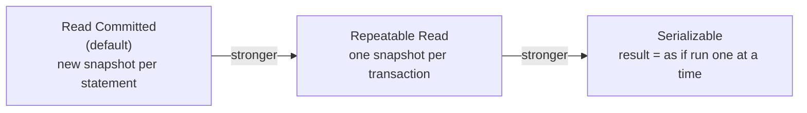
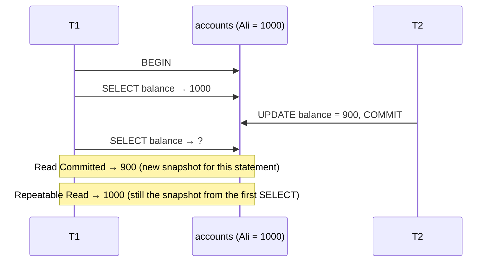
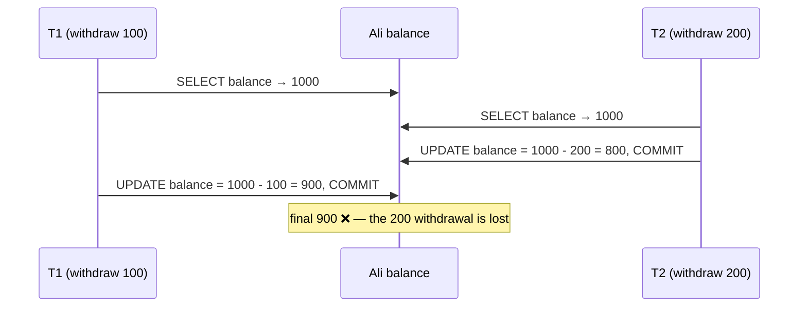
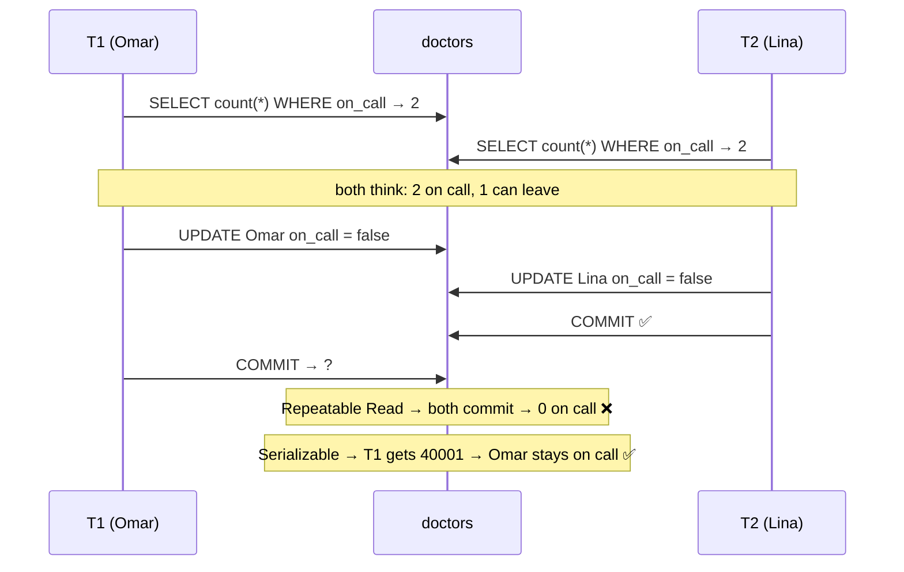
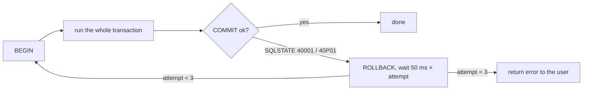

# Isolation Levels

> **Definition:** the isolation level decides **what a transaction sees of other transactions' changes while it is running**. Higher level = fewer surprises, but more errors you must retry.



## 0. Vocabulary

| Term | Definition | Example |
|---|---|---|
| **Transaction** | statements between `BEGIN` and `COMMIT`/`ROLLBACK` | transfer = 2 `UPDATE`s |
| **Concurrent** | two transactions running at the same time on different connections | two users buying the last item |
| **Snapshot** | a frozen picture of "which transactions are committed" taken at a moment; you see data as of that picture ([MVCC](03-mvcc.md)) | snapshot at 10:00 ignores a commit at 10:01 |
| **Anomaly** | a wrong or surprising result caused by concurrency | stock 10, two buyers, stock ends at 9 |
| **Serialization failure** | PostgreSQL aborts your transaction to prevent an anomaly. SQLSTATE **`40001`**. The fix is to **retry** | `could not serialize access …` |

## 1. Snapshot: the one idea behind it all



| Level | Snapshot taken | Sees commits made after it started? |
|---|---|---|
| Read Committed | at the start of **every statement** | ✅ yes, from the next statement |
| Repeatable Read | at the **first statement** of the transaction | ❌ never |
| Serializable | same as Repeatable Read **+** tracks read/write dependencies | ❌ never, and aborts dangerous patterns |

## 2. How to choose a level

```sql
BEGIN ISOLATION LEVEL REPEATABLE READ;      -- per transaction
-- or
BEGIN;
SET TRANSACTION ISOLATION LEVEL SERIALIZABLE;   -- must be the first statement

SHOW transaction_isolation;                 -- check
ALTER DATABASE shop SET default_transaction_isolation = 'repeatable read';  -- default for new sessions
```

.NET (Npgsql):
```csharp
await using var tx = await conn.BeginTransactionAsync(IsolationLevel.Serializable);
```

## 3. Setup for all demos

Open **two terminals** → `docker compose exec pg psql -U app -d shop` in each. Call them **T1** and **T2**.

```sql
CREATE TABLE accounts (id int PRIMARY KEY, owner text NOT NULL, balance int NOT NULL);
INSERT INTO accounts VALUES (1, 'Ali', 1000), (2, 'Sara', 500);

CREATE TABLE doctors (name text PRIMARY KEY, on_call bool NOT NULL);
INSERT INTO doctors VALUES ('Omar', true), ('Lina', true);
```

Reset between demos: `UPDATE accounts SET balance = 1000 WHERE id = 1; DELETE FROM accounts WHERE id > 2; UPDATE doctors SET on_call = true;`

> All outputs below were captured by running the two sessions concurrently on PostgreSQL 17.

## 4. The anomalies, one by one

Summary first, details after:

| Anomaly | Read Committed | Repeatable Read | Serializable |
|---|---|---|---|
| [4.1 Dirty read](#41-dirty-read--never-in-postgresql) | ❌ impossible | ❌ | ❌ |
| [4.2 Non-repeatable read](#42-non-repeatable-read) | ⚠️ happens | ❌ | ❌ |
| [4.3 Phantom read](#43-phantom-read) | ⚠️ happens | ❌ (in PostgreSQL) | ❌ |
| [4.4 Lost update](#44-lost-update) | ⚠️ happens | ❌ → error `40001` | ❌ → error `40001` |
| [4.5 Write skew](#45-write-skew) | ⚠️ happens | ⚠️ happens | ❌ → error `40001` |

### 4.1 Dirty read — never in PostgreSQL

**Definition:** reading data another transaction changed but **has not committed** (and may roll back).

| Step | T1 | T2 | Result |
|---|---|---|---|
| 1 | `BEGIN;` `UPDATE accounts SET balance = 0 WHERE id = 1;` | | not committed |
| 2 | | `BEGIN ISOLATION LEVEL READ UNCOMMITTED;` `SELECT balance FROM accounts WHERE id = 1;` | **`1000`** ✅ |
| 3 | `ROLLBACK;` | | the 0 never existed |

PostgreSQL accepts `READ UNCOMMITTED` but runs it as `READ COMMITTED`. Uncommitted versions are invisible to every snapshot.

### 4.2 Non-repeatable read

**Definition:** the **same row**, read twice in one transaction, returns **different values**.

**Scenario:** a report reads Ali's balance at the top of the page and again at the bottom.

| Step | T1 | T2 | Read Committed | Repeatable Read |
|---|---|---|---|---|
| 1 | `BEGIN ISOLATION LEVEL <level>;` `SELECT balance FROM accounts WHERE id = 1;` | | `1000` | `1000` |
| 2 | | `UPDATE accounts SET balance = 900 WHERE id = 1;` (auto-commit) | | |
| 3 | `SELECT balance FROM accounts WHERE id = 1;` | | **`900`** ⚠️ | **`1000`** ✅ |
| 4 | `COMMIT;` | | | |

When it hurts: the report's top says 1000, its bottom says 900, and the total doesn't add up.

### 4.3 Phantom read

**Definition:** the **same `WHERE`**, run twice, returns a **different set of rows** because another transaction inserted or deleted rows.

| Step | T1 | T2 | Read Committed | Repeatable Read |
|---|---|---|---|---|
| 1 | `BEGIN ISOLATION LEVEL <level>;` `SELECT count(*), sum(balance) FROM accounts WHERE balance > 100;` | | `2 · 1500` | `2 · 1500` |
| 2 | | `INSERT INTO accounts VALUES (3, 'Hadi', 300);` | | |
| 3 | same `SELECT` | | **`3 · 1800`** ⚠️ | **`2 · 1500`** ✅ |

The SQL standard allows phantoms at Repeatable Read. PostgreSQL's snapshot prevents them.

### 4.4 Lost update

**Definition:** two transactions **read** the same value, compute a new value **in the app**, and **write** it back. The second write overwrites the first, so one change disappears.

**Scenario:** Ali has 1000. Two withdrawals at the same time: −100 and −200. Expected: **700**.



Measured under Read Committed:

| Step | T1 | T2 | Ali |
|---|---|---|---|
| 1 | `BEGIN;` `SELECT balance …` → `1000` | | 1000 |
| 2 | | `BEGIN;` `SELECT balance …` → `1000` | |
| 3 | | `UPDATE accounts SET balance = 800 WHERE id = 1; COMMIT;` | 800 |
| 4 | `UPDATE accounts SET balance = 900 WHERE id = 1; COMMIT;` | | **900** ❌ |

#### Fix A — atomic `UPDATE` (best, works in Read Committed)

Let the database do the arithmetic:
```sql
UPDATE accounts SET balance = balance - 100 WHERE id = 1;   -- T1
UPDATE accounts SET balance = balance - 200 WHERE id = 1;   -- T2
```

| Step | T1 | T2 | Measured |
|---|---|---|---|
| 1 | `BEGIN;` `UPDATE … balance - 100` | | T1 holds the **row lock** |
| 2 | | `UPDATE … balance - 200 RETURNING balance;` | T2 **waits** |
| 3 | `COMMIT;` | | |
| 4 | | continues on the **new** version 900 | returns **`700`** ✅ after waiting **1,516 ms** |

Read Committed rule: a waiting `UPDATE` re-reads the **latest committed version** of the row, then re-checks its `WHERE`.

#### Fix B — `SELECT … FOR UPDATE` (when the app must decide)

```sql
BEGIN;
SELECT balance FROM accounts WHERE id = 1 FOR UPDATE;   -- lock the row now
-- app logic: is balance enough? fraud check? …
UPDATE accounts SET balance = <new value> WHERE id = 1;
COMMIT;
```

| Step | T1 | T2 | Measured |
|---|---|---|---|
| 1 | `SELECT … FOR UPDATE` → `1000` | | row locked |
| 2 | | `SELECT … FOR UPDATE` | T2 **waits** |
| 3 | `UPDATE … = 900; COMMIT;` | | |
| 4 | | gets **`900`** (not 1000) after **1,514 ms** → writes `700` | **700** ✅ |

More on locks: [04-locks-deadlocks](04-locks-deadlocks.md).

#### Fix C — Repeatable Read (PostgreSQL detects it)

| Step | T1 (Repeatable Read) | T2 | Measured |
|---|---|---|---|
| 1 | `BEGIN ISOLATION LEVEL REPEATABLE READ;` `SELECT balance …` → `1000` | | |
| 2 | | `UPDATE accounts SET balance = balance - 200 WHERE id = 1;` | 800 committed |
| 3 | `UPDATE accounts SET balance = balance - 100 WHERE id = 1;` | | ❌ `ERROR: could not serialize access due to concurrent update` |
| 4 | `ROLLBACK;` → **retry the whole transaction** | | retry reads 800 → writes **700** ✅ |

Repeatable Read refuses to update a row that changed after its snapshot.

#### ⚠️ Read Committed surprise: the `WHERE` is re-checked

| Step | T1 | T2 | Measured |
|---|---|---|---|
| 1 | `BEGIN;` `UPDATE accounts SET balance = balance - 100 WHERE id = 1;` (1000 → 900) | | |
| 2 | | `UPDATE accounts SET balance = balance + 50 WHERE id = 1 AND balance >= 1000;` | waits |
| 3 | `COMMIT;` | | |
| 4 | | re-checks `balance >= 1000` on 900 → false | **`UPDATE 0`**, Ali stays 900 |

T2 saw 1000 when it started, but updated nothing. Always check the affected-row count.

### 4.5 Write skew

**Definition:** two transactions read the **same set of rows**, each checks a rule, then each updates a **different** row. Neither overwrites the other, yet together they break the rule.

**Scenario:** hospital rule = **at least one doctor on call**. Omar and Lina both are. Both click "go off call" at the same time.



```sql
-- each session
BEGIN ISOLATION LEVEL <level>;
SELECT count(*) AS on_call FROM doctors WHERE on_call;   -- 2
UPDATE doctors SET on_call = false WHERE name = 'Omar';  -- T2: 'Lina'
COMMIT;
```

| Level | T1 | T2 | Final `doctors` |
|---|---|---|---|
| Repeatable Read | commit ✅ | commit ✅ | Omar `f` · Lina `f` → **nobody on call** ❌ |
| Serializable | ❌ `could not serialize access due to read/write dependencies among transactions` | commit ✅ | Omar `t` · Lina `f` ✅ |

Exact Serializable error (measured):
```text
ERROR:  could not serialize access due to read/write dependencies among transactions
DETAIL:  Reason code: Canceled on identification as a pivot, during commit attempt.
HINT:  The transaction might succeed if retried.
```

Why Repeatable Read doesn't catch it: the two transactions update **different rows**, so there is no row conflict. Serializable also tracks **what each one read** (SIREAD locks), sees that T1 read rows T2 changed and the reverse, and aborts one.

Alternative without Serializable: lock what you read → `SELECT … FROM doctors WHERE on_call FOR UPDATE;`

## 5. Retry: mandatory for Repeatable Read / Serializable



Retry the **whole** transaction, starting with the reads. Re-running only the failed statement reuses stale data. From [samples/dotnet/04-WebApi/Program.cs](../../samples/dotnet/04-WebApi/Program.cs):

```csharp
for (var attempt = 1; ; attempt++)
{
    try
    {
        await using var conn = await db.OpenConnectionAsync();
        await using var tx = await conn.BeginTransactionAsync(IsolationLevel.Serializable);
        // … reads + writes …
        await tx.CommitAsync();
        return Results.Ok();
    }
    catch (PostgresException e) when (attempt < 3 && e.SqlState is
        PostgresErrorCodes.SerializationFailure or PostgresErrorCodes.DeadlockDetected)
    {
        await Task.Delay(50 * attempt);   // back off, then retry everything
    }
}
```

## 6. Which level when

| Situation | Level | Why |
|---|---|---|
| Normal web CRUD | Read Committed | atomic `UPDATE … SET x = x - 1` already prevents lost updates |
| Read-modify-write with app logic | Read Committed + `FOR UPDATE` | lock only the rows you'll change |
| Report / export needing a consistent view | Repeatable Read (`READ ONLY`) | all queries see the same moment; read-only → no `40001` from writes |
| Rule spanning many rows (on-call, booking quota, budget) | Serializable + retry | catches write skew |
| `pg_dump` | Repeatable Read internally | consistent backup while the app writes |

## Key Points
- PostgreSQL has **3 real levels**; `READ UNCOMMITTED` = Read Committed
- Read Committed: **new snapshot per statement** → non-repeatable reads, phantoms, lost updates possible
- Repeatable Read: **one snapshot** → stable reads; concurrent update of the same row → `40001`
- Serializable: also stops **write skew** → `40001`
- `40001` is normal, not a bug → **retry the whole transaction**
- Prefer atomic `UPDATE … SET x = x - n` over read-then-write in the app

Next → [03-mvcc](03-mvcc.md)
