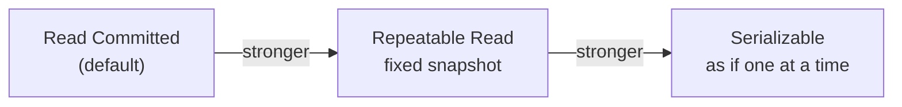

# Isolation Levels

> How much a transaction sees of other concurrent transactions' changes.



## Anomalies

| Level | Dirty read | Non-repeatable read | Phantom | Lost update / write skew |
|---|---|---|---|---|
| Read Committed | ❌ | ✅ possible | ✅ possible | ✅ possible |
| Repeatable Read | ❌ | ❌ | ❌ (in PG) | write skew possible |
| Serializable | ❌ | ❌ | ❌ | ❌ |

## Demo — open 2 terminals

```sql
-- T1                                        -- T2
BEGIN ISOLATION LEVEL REPEATABLE READ;
SELECT stock FROM products WHERE id = 1;     -- 100000
                                             UPDATE products SET stock = stock - 5 WHERE id = 1;
SELECT stock FROM products WHERE id = 1;     -- still 100000 (snapshot)
UPDATE products SET stock = stock - 1 WHERE id = 1;
-- ERROR: could not serialize access due to concurrent update
ROLLBACK;
```
Same demo under `READ COMMITTED` → the second SELECT returns `99995`.

## Lost update — before → after

```sql
-- ❌ app reads, then writes (2 requests → one update lost)
SELECT stock FROM products WHERE id = 1;           -- 10
UPDATE products SET stock = 9 WHERE id = 1;

-- ✅ atomic
UPDATE products SET stock = stock - 1 WHERE id = 1 AND stock > 0;
```

## Key Points
- Default RC is enough for most apps
- RR / Serializable → **retry** on `40001`
- Atomic `UPDATE` beats raising the level

Next → [03-mvcc](03-mvcc.md)
