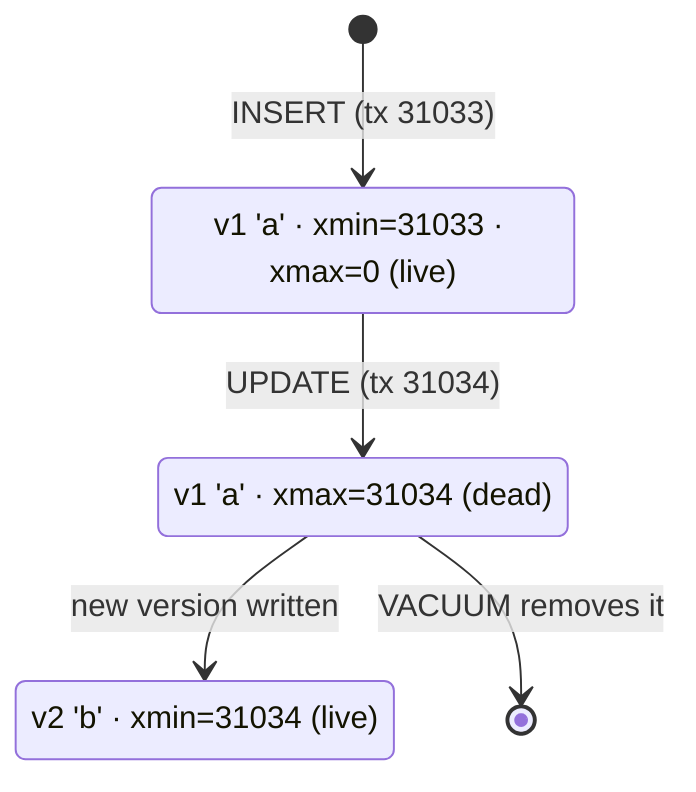

# MVCC — Multi-Version Concurrency Control

> **Definition:** MVCC means PostgreSQL keeps **several versions of a row** at once. `UPDATE` doesn't overwrite a row: it writes a **new version** and marks the old one as replaced. Each transaction sees the versions that match its **snapshot**. Result: **readers never wait for writers, writers never wait for readers.**



## 1. Vocabulary

| Term | Definition |
|---|---|
| **Row version** (tuple) | one physical copy of a row. An updated row has several |
| `xmin` | ID of the transaction that **created** this version |
| `xmax` | ID of the transaction that **deleted/replaced** it (0 = still current) |
| `ctid` | physical address `(page, slot)` of the version |
| **Snapshot** | list of which transactions count as committed for me, taken at query/transaction start ([isolation](02-isolation-levels.md#1-snapshot-the-one-idea-behind-it-all)) |
| **Dead tuple** | a version no running transaction can see anymore → garbage for VACUUM |

## 2. See the versions (measured)

`xmin`, `xmax`, `ctid` are hidden system columns on every table:

```sql
CREATE TEMP TABLE t (id int, v text);
INSERT INTO t VALUES (1, 'a');
SELECT ctid, xmin, xmax, * FROM t;
--  ctid  | xmin  | xmax | id | v
--  (0,1) | 31033 |    0 |  1 | a

UPDATE t SET v = 'b' WHERE id = 1;
SELECT ctid, xmin, xmax, * FROM t;
--  (0,2) | 31034 |    0 |  1 | b       ← new slot, new xmin

UPDATE t SET v = 'c' WHERE id = 1;
SELECT ctid, xmin, xmax, * FROM t;
--  (0,3) | 31035 |    0 |  1 | c       ← page 0 now holds 3 versions: 'a' (dead), 'b' (dead), 'c'
```

`SELECT` shows only the version visible to you. The old ones are still on the page: [05-crud-internals](../00-introduction/05-crud-internals.md) shows them with `pageinspect`.

## 3. Visibility rule

A version is visible to my snapshot when **both** hold:

| Check | Meaning |
|---|---|
| `xmin` is committed **and** committed before my snapshot | its creator finished before I looked |
| `xmax` is 0, **or** aborted, **or** not yet committed in my snapshot | nobody had removed it when I looked |

| Version | `xmin` | `xmax` | Visible to a snapshot taken… |
|---|---|---|---|
| `'a'` | 31033 ✅ | 31034 | before tx 31034 committed → **yes**. After → no |
| `'b'` | 31034 | 0 | before tx 31034 committed → no. After → **yes** |

## 4. Readers don't block writers (measured, 2 sessions)

| Step | T1 | T2 | Measured |
|---|---|---|---|
| 1 | `BEGIN; UPDATE acc SET balance = 0 WHERE id = 1;` | | new version, not committed |
| 2 | | `SELECT balance FROM acc WHERE id = 1;` | **`1000`** in **4.7 ms**, no waiting, sees the old version |
| 3 | | `UPDATE acc SET balance = balance + 1 WHERE id = 1;` | **waits** (writer vs writer) |
| 4 | `COMMIT;` | | T2's UPDATE continues: waited **1,004 ms** |

| Who | Waits for whom? |
|---|---|
| reader vs writer | ❌ never: the reader takes the old version |
| writer vs writer on the **same row** | ✅ the second waits for the first's COMMIT/ROLLBACK ([locks](04-locks-deadlocks.md)) |

## 5. Long transactions block cleanup (measured)

Dead versions can be removed only when **no running transaction** might still see them. One old open snapshot keeps all newer garbage alive:

| Step | T1 | T2 |
|---|---|---|
| 1 | `BEGIN ISOLATION LEVEL REPEATABLE READ; SELECT count(*) FROM acc;` (snapshot held) | |
| 2 | | `UPDATE acc SET balance = balance;` ×2 |
| 3 | | `VACUUM (VERBOSE) acc;` → `4 are dead but not yet removable` ❌ |
| 4 | `COMMIT;` | |
| 5 | | `VACUUM (VERBOSE) acc;` → `4 removed, 0 are dead but not yet removable` ✅ |

In production: a session stuck `idle in transaction` for hours → every table keeps growing (bloat).

```sql
-- find them
SELECT pid, state, now() - xact_start AS open_for, left(query, 50)
FROM pg_stat_activity
WHERE state = 'idle in transaction' ORDER BY xact_start;

-- protect the server
ALTER SYSTEM SET idle_in_transaction_session_timeout = '5min';
SELECT pg_reload_conf();
```

## 6. Dead tuples on the shop (measured)

```sql
SELECT n_live_tup, n_dead_tup FROM pg_stat_user_tables WHERE relname = 'products';
--  4964 |    8

UPDATE products SET stock = stock WHERE id <= 1000;   -- "no change", still 1,000 new versions

--  4964 | 1009          ← 1,000 dead versions waiting

VACUUM products;
--  4943 |    0          ← cleaned, space reusable
```

An `UPDATE` that changes nothing still writes a new version. Skip it in the app, or add `WHERE stock IS DISTINCT FROM <new value>`.

## 7. MVCC cost summary

| Benefit | Cost |
|---|---|
| readers never block writers | every UPDATE = a full new row copy |
| consistent snapshots without read locks | dead versions → bloat until VACUUM |
| instant `ROLLBACK` (versions just become invisible) | long transactions stop cleanup |

## Key Points
- `UPDATE` = new version + old marked by `xmax`; `DELETE` = only `xmax`
- Visible = creator committed before my snapshot, remover not
- Readers see the old version immediately; writers on the same row queue
- Dead versions → [VACUUM](../07-internals/03-vacuum.md); old open transactions block it
- Set `idle_in_transaction_session_timeout`

Next → [04-locks-deadlocks](04-locks-deadlocks.md)
