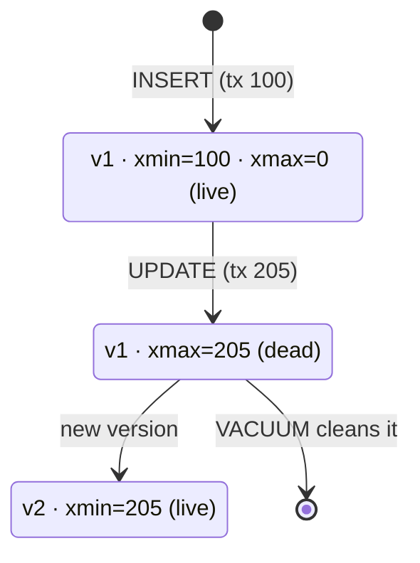

# MVCC — Multi-Version Concurrency Control

> `UPDATE` doesn't modify the row; it creates a **new version**. Readers never wait for writers.



## Example — see the versions

```sql
CREATE TEMP TABLE t (id int, v text);
INSERT INTO t VALUES (1, 'a');
SELECT ctid, xmin, xmax, * FROM t;
--  ctid  | xmin | xmax | id | v
--  (0,1) | 812  |  0   |  1 | a

UPDATE t SET v = 'b' WHERE id = 1;
SELECT ctid, xmin, xmax, * FROM t;
--  (0,2) | 813  |  0   |  1 | b      ← new location (ctid changed)
```
Page-level view: [00-introduction/05-crud-internals](../00-introduction/05-crud-internals.md)

## Visibility rule

| A row version is visible to transaction X if |
|---|
| `xmin` committed and is before X's snapshot |
| and `xmax` is 0, aborted, or after X's snapshot |

## Numbers (measured)

```sql
UPDATE products SET stock = stock WHERE id <= 1000;
SELECT n_live_tup, n_dead_tup FROM pg_stat_user_tables WHERE relname = 'products';
--  n_live_tup | n_dead_tup
--     5000    |   1002      ← dead versions waiting for VACUUM
```

## Key Points
- Readers don't block writers
- Every UPDATE = INSERT + mark dead
- Dead tuples → [VACUUM](../07-internals/03-vacuum.md)

## Pitfall
❌ Transaction left open for hours (`idle in transaction`) → VACUUM can't clean → bloat
✅ `idle_in_transaction_session_timeout = '5min'`

Next → [04-locks-deadlocks](04-locks-deadlocks.md)
