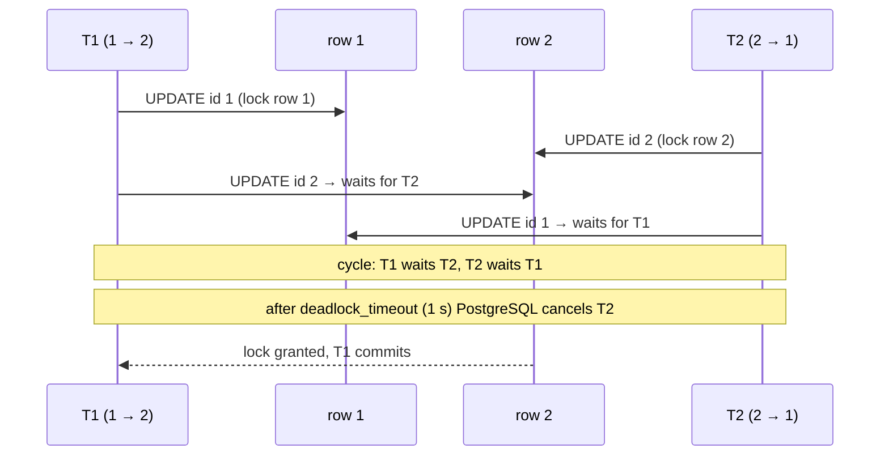
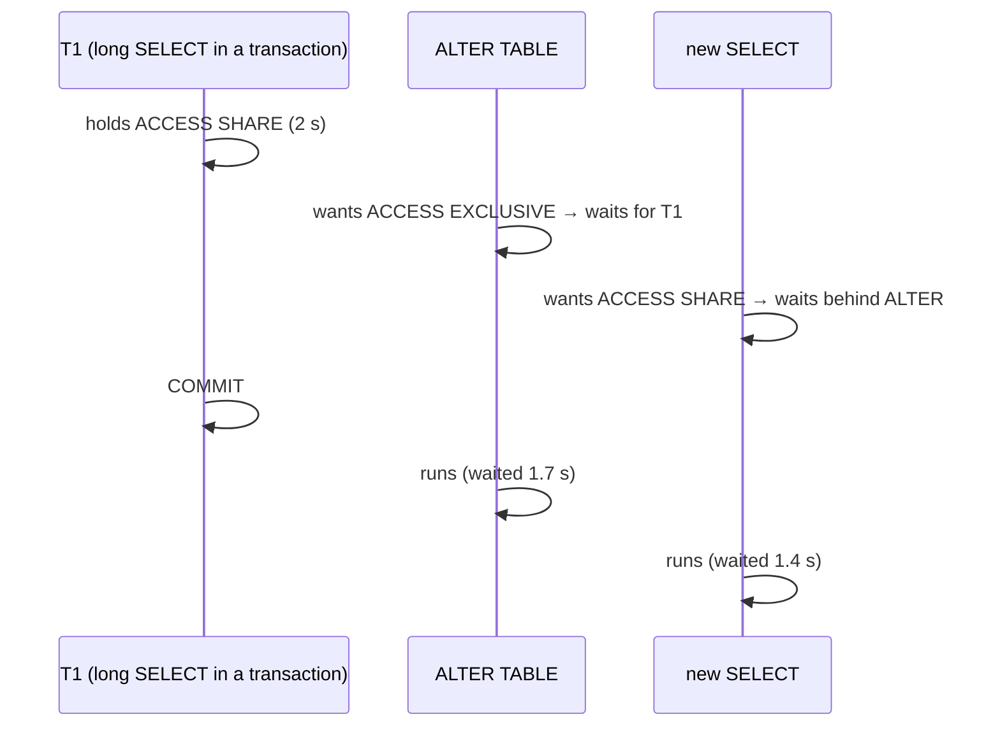

# Locks & Deadlocks

> **Definition:** a **lock** is a marker that says "this transaction is using this row/table, others must wait (or fail)". MVCC removes most waiting (readers never wait), but **two writers on the same row** still queue. A **deadlock** happens when two transactions each wait for a lock the other one holds. Neither can ever continue, so PostgreSQL cancels one.

## 1. Two kinds of locks

| Kind | Taken by | Lasts until | Example |
|---|---|---|---|
| **Row lock** | `UPDATE`, `DELETE`, `SELECT … FOR UPDATE` | end of transaction | two users updating the same account |
| **Table lock** | every statement (most are weak and don't conflict) | end of transaction | `ALTER TABLE` takes the strongest one |

Table lock conflicts that matter:

| Statement | Lock | Blocks |
|---|---|---|
| `SELECT` | `ACCESS SHARE` | only `ALTER TABLE`/`DROP`/`VACUUM FULL` |
| `INSERT` / `UPDATE` / `DELETE` | `ROW EXCLUSIVE` | `CREATE INDEX` (non-concurrent), `ALTER TABLE` |
| `CREATE INDEX` | `SHARE` | writes ([measured: INSERT waited 530 ms](../05-indexes-performance/02-btree.md#7-production-create-index-concurrently-measured)) |
| `ALTER TABLE`, `DROP`, `VACUUM FULL` | `ACCESS EXCLUSIVE` | **everything**, even `SELECT` |

## 2. Row lock wait (measured)

| Step | T1 | T2 | Measured |
|---|---|---|---|
| 1 | `BEGIN; UPDATE acc SET balance = 0 WHERE id = 1;` | | T1 holds row 1 |
| 2 | | `SELECT balance … WHERE id = 1` | `1000` immediately (MVCC) |
| 3 | | `UPDATE acc … WHERE id = 1` | ⏳ waits |
| 4 | `COMMIT;` | | T2 continues after **1,004 ms** |

## 3. Deadlock (measured)

**Scenario:** transfer A: 1 → 2. Transfer B: 2 → 1. At the same time.



```sql
-- T1                                           -- T2
BEGIN;                                          BEGIN;
UPDATE acc SET balance = balance - 100          UPDATE acc SET balance = balance - 50
  WHERE id = 1;                                   WHERE id = 2;
UPDATE acc SET balance = balance + 100          UPDATE acc SET balance = balance + 50
  WHERE id = 2;   -- waits…                       WHERE id = 1;   -- waits…
```

Real output in T2 (after **1,002 ms**):
```text
ERROR:  deadlock detected
DETAIL:  Process 6465 waits for ShareLock on transaction 31045; blocked by process 6466.
Process 6466 waits for ShareLock on transaction 31044; blocked by process 6465.
HINT:  See server log for query details.
CONTEXT:  while updating tuple (0,5) in relation "acc"
```

T1 finished: final balances `1 → 900`, `2 → 600`. T2 was rolled back entirely → the app must **retry** it (SQLSTATE `40P01`).

### Fix: always lock in the same order

```sql
-- both transfers lock the lower id first → no cycle possible
BEGIN;
SELECT * FROM acc WHERE id IN (1, 2) ORDER BY id FOR UPDATE;
UPDATE acc SET balance = balance - 100 WHERE id = 1;
UPDATE acc SET balance = balance + 100 WHERE id = 2;
COMMIT;
```
Now T2 waits at the `SELECT … FOR UPDATE` for row 1, and never holds row 2 while waiting.

## 4. Row lock options

| Clause | Definition | Use |
|---|---|---|
| `FOR UPDATE` | lock the rows as if you'll update them | read-modify-write ([lost update fix](02-isolation-levels.md#fix-b--select--for-update-when-the-app-must-decide)) |
| `FOR NO KEY UPDATE` | weaker: doesn't block FK checks from child inserts | updating non-key columns |
| `FOR SHARE` | others can read/lock-share but not modify | "this parent must not change while I insert children" |
| `NOWAIT` | error immediately instead of waiting | UI: "someone else is editing" |
| `SKIP LOCKED` | skip rows that are locked | job queues |

### NOWAIT and lock_timeout (measured)

T1 holds row 1 with `FOR UPDATE`. T2:
```sql
SELECT * FROM acc WHERE id = 1 FOR UPDATE NOWAIT;
-- ERROR:  could not obtain lock on row in relation "acc"         (after 5 ms)

SET lock_timeout = '500ms';
SELECT * FROM acc WHERE id = 1 FOR UPDATE;
-- ERROR:  canceling statement due to lock timeout                 (after 502 ms)

SELECT * FROM acc WHERE id = 2 FOR UPDATE;
--  2 | 600                                                         (3 ms, row 2 is free)
```

## 5. Job queue with `SKIP LOCKED` (measured)

**Scenario:** 6 pending jobs, 2 workers start at the same moment, each takes 2.

```sql
BEGIN;
WITH job AS (
    SELECT id FROM jobs
    WHERE status = 'pending'
    ORDER BY id
    LIMIT 2
    FOR UPDATE SKIP LOCKED          -- skip rows another worker already locked
)
UPDATE jobs SET status = 'working:' || pg_backend_pid()
FROM job WHERE jobs.id = job.id
RETURNING jobs.id;
-- … process …
COMMIT;
```

| Worker | Got jobs |
|---|---|
| worker 1 (pid 6516) | 1, 2 |
| worker 2 (pid 6517) | 3, 4 — skipped 1 and 2 without waiting |

```text
 id |    status
  1 | working:6516
  2 | working:6516
  3 | working:6517
  4 | working:6517
  5 | pending
  6 | pending
```
Without `SKIP LOCKED`, worker 2 would wait for worker 1, then find jobs 1–2 already taken.

## 6. The DDL lock queue (measured, 3 sessions)

`ALTER TABLE` needs `ACCESS EXCLUSIVE`. While it **waits**, every later query on that table queues **behind it**, including plain `SELECT`s.



Measured: the `SELECT` (normally < 1 ms) waited **1,407 ms**. `pg_stat_activity` during the wait:
```text
 wait_event_type | state  |                 query                  | blocked_by
 Lock            | active | SELECT count(*) FROM acc;              | {6588}      ← blocked by the ALTER
 Lock            | active | ALTER TABLE acc ADD COLUMN note text;  | {6586}      ← blocked by T1
```

✅ Fix: give migrations a `lock_timeout`, then retry:
```sql
SET lock_timeout = '300ms';
ALTER TABLE acc ADD COLUMN note2 text;
-- ERROR:  canceling statement due to lock timeout     (after 303 ms)
-- meanwhile the SELECT ran in 23 ms instead of 1.4 s
```

## 7. Who blocks whom?

```sql
SELECT pid, pg_blocking_pids(pid) AS blocked_by, wait_event_type, state,
       now() - xact_start AS xact_age, left(query, 60) AS query
FROM pg_stat_activity
WHERE cardinality(pg_blocking_pids(pid)) > 0;

-- last resort: end the blocker
SELECT pg_cancel_backend(6586);     -- cancel its current query
SELECT pg_terminate_backend(6586);  -- close its connection
```

## Key Points
- Readers never wait (MVCC). Writers on the **same row** queue
- Deadlock = waiting cycle → one transaction cancelled after 1 s (`40P01`) → retry
- Prevent deadlocks: lock rows in a fixed order (`ORDER BY id FOR UPDATE`)
- `NOWAIT` / `lock_timeout` = fail fast instead of waiting
- `SKIP LOCKED` = parallel job queue workers
- `ALTER TABLE` waiting blocks everyone behind it → `SET lock_timeout` before migrations

Lab → [labs/06-transactions-mvcc.sql](../../labs/06-transactions-mvcc.sql)

Next → [07-internals/01-storage-pages](../07-internals/01-storage-pages.md)
