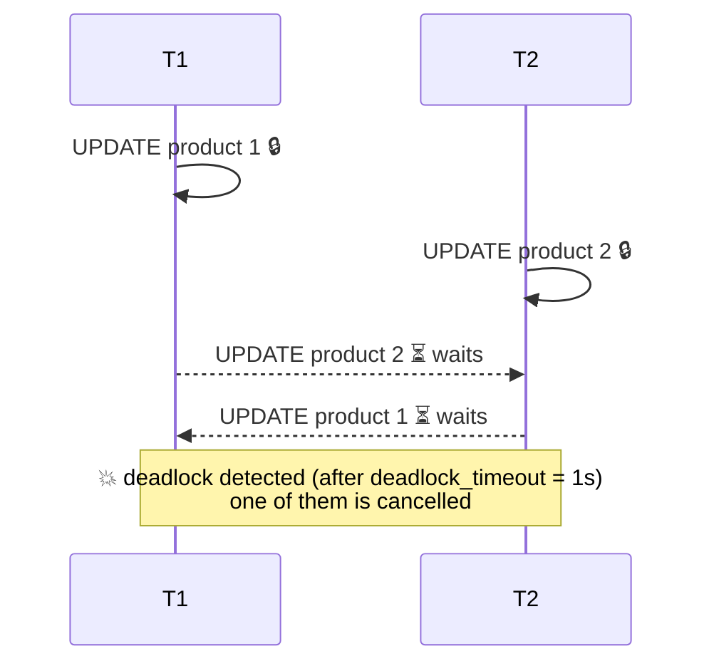

# Locks & Deadlocks

> Writers on the **same row** wait for each other. Different lock order = deadlock.



## Fix — fixed order

```sql
-- ✅ always lock in id order
BEGIN;
SELECT * FROM products WHERE id IN (1, 2) ORDER BY id FOR UPDATE;
UPDATE products SET stock = stock - 1 WHERE id IN (1, 2);
COMMIT;
```

## Row lock modes

| Clause | Use |
|---|---|
| `FOR UPDATE` | I will modify this row |
| `FOR NO KEY UPDATE` | lighter, doesn't block FK inserts |
| `FOR SHARE` | read and block modification |
| `NOWAIT` | error immediately instead of waiting |
| `SKIP LOCKED` | ignore locked rows (queues) |

## Job queue with SKIP LOCKED

```sql
-- 10 workers take different jobs without conflicts
WITH job AS (
    SELECT id FROM orders
    WHERE status = 'pending'
    ORDER BY created_at
    LIMIT 1
    FOR UPDATE SKIP LOCKED
)
UPDATE orders SET status = 'paid' FROM job WHERE orders.id = job.id
RETURNING orders.id;
```

## Who blocks whom?

```sql
SELECT pid, pg_blocking_pids(pid) AS blocked_by, wait_event_type, left(query, 60)
FROM pg_stat_activity
WHERE cardinality(pg_blocking_pids(pid)) > 0;
```

## Pitfall
❌ `ALTER TABLE orders ADD COLUMN ...` under load → waits for a lock and blocks every query behind it
✅ `SET lock_timeout = '3s';` before any migration

Lab → [labs/06-transactions-mvcc.sql](../../labs/06-transactions-mvcc.sql)

Next → [07-internals/01-storage-pages](../07-internals/01-storage-pages.md)
