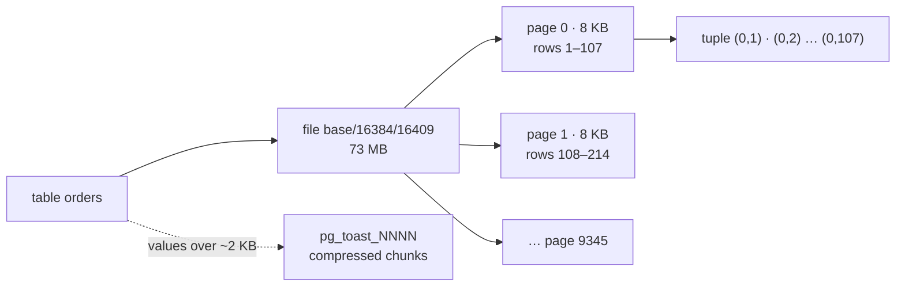
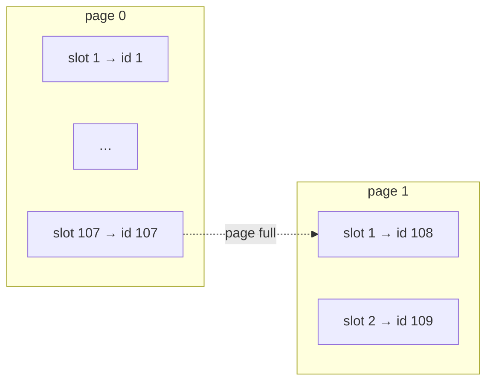
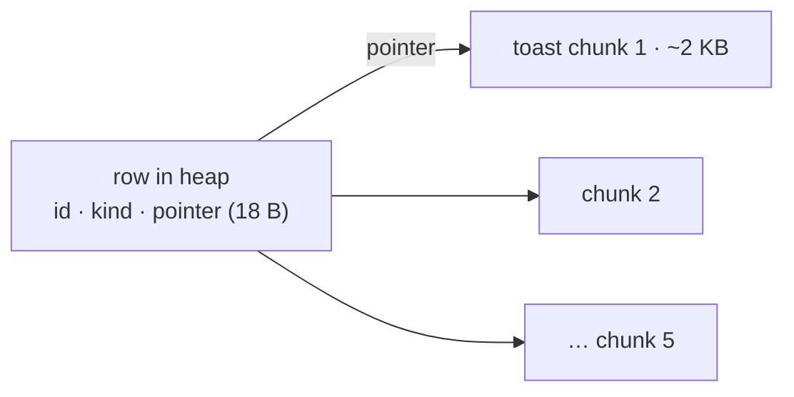

# Storage — Pages, Heap, TOAST

> **Definition:**
> - **Heap** = the table's data file: rows stored in **no particular order**.
> - **Page** (block) = the fixed **8 KB** unit the heap is split into. PostgreSQL always reads and writes whole pages.
> - **Tuple** = one row version inside a page, addressed by `ctid = (page, slot)`.
> - **TOAST** = a side table where large values (≈ over 2 KB) are compressed and/or moved, so the row stays small.
>
> Overview with a byte-level page diagram: [00-introduction/04](../00-introduction/04-storage-layout.md).



## 1. Find the file and count the pages (measured)

```sql
SELECT pg_relation_filepath('orders'), current_setting('block_size');
--  base/16384/16409 | 8192

SELECT relpages, reltuples::bigint, round(reltuples / relpages) AS rows_per_page
FROM pg_class WHERE relname = 'orders';
--  relpages | reltuples | rows_per_page
--      9346 |   1000000 |           107

SELECT avg(pg_column_size(o.*))::int AS avg_row_bytes FROM orders o;
--  72          ← 107 rows × ~72 B + headers ≈ 8 KB
```

## 2. `ctid` = (page, slot)

```sql
SELECT ctid, id FROM orders WHERE id IN (1, 2, 107, 108, 109);
--   ctid   | id
--  (0,1)   |   1
--  (0,2)   |   2
--  (0,107) | 107     ← last row that fits on page 0
--  (1,1)   | 108     ← page 1 starts
--  (1,2)   | 109
```



`ctid` changes when a row is updated (new version elsewhere) or the table is rewritten (`VACUUM FULL`) → never store it in the app.

## 3. Why pages matter: I/O cost

Reading one 72-byte row costs a whole 8 KB page.

| Query | Pages read | Why |
|---|---|---|
| `WHERE id = 42` (PK index) | 4 (3 index + 1 heap) | jump straight to the page |
| `WHERE user_id = 42`, 15 rows, indexed | 21 | 15 rows spread over 15 different pages |
| `WHERE user_id = 42`, no index | 9,346 | every page |

`EXPLAIN (ANALYZE, BUFFERS)` shows these counts ([01-explain](../05-indexes-performance/01-explain.md)).

## 4. Sizes

```sql
SELECT pg_size_pretty(pg_relation_size('orders'))       AS heap,
       pg_size_pretty(pg_indexes_size('orders'))        AS indexes,
       pg_size_pretty(pg_total_relation_size('orders')) AS total;
--  heap  | indexes | total
--  73 MB | 30 MB   | 103 MB
```

| Function | Includes |
|---|---|
| `pg_relation_size` | heap only |
| `pg_indexes_size` | all indexes |
| `pg_total_relation_size` | heap + indexes + TOAST |
| `pg_column_size(value)` | bytes a value takes on disk (after compression) |
| `octet_length(text)` | raw bytes before compression |

## 5. TOAST (measured)

**Definition:** The Oversized-Attribute Storage Technique. A row must fit in a page, so when a row gets bigger than ~2 KB, PostgreSQL:
1. **compresses** the large values, and if still too big,
2. **moves** them to the table's TOAST table in ~2 KB chunks, leaving an 18-byte pointer in the row.

1,000 rows each of 3 kinds of text:

| Value | Raw (`octet_length`) | Stored (`pg_column_size`) | What happened |
|---|---|---|---|
| `repeat('PostgreSQL ', 100)` | 1,100 B | 1,104 B | small → stays inline as-is |
| `repeat('PostgreSQL ', 10000)` | 110,000 B | **1,280 B** | repetitive → compressed 86× |
| 300 random md5 strings | 9,600 B | 9,600 B | random → can't compress → moved to TOAST |

```text
 heap    | toast
 2512 kB | 10000 kB      ← the big random values live in pg_toast_NNNN
```



### Cost: reading TOASTed columns

```sql
SELECT count(id)           FROM docs WHERE kind = '3 big random';   --  0.7 ms
SELECT count(length(body)) FROM docs WHERE kind = '3 big random';   -- 31.2 ms (45×)
```
Touching `body` fetches and reassembles its chunks. Not touching it costs nothing.

❌ `SELECT *` on a table with big `jsonb`/`text` → reads TOAST for columns you don't use.
✅ Select only the columns you need.

## Key Points
- Table = heap file of 8 KB pages; I/O is always whole pages
- `ctid (page, slot)` = physical address, changes on UPDATE
- `orders`: 107 rows/page, 9,346 pages, 73 MB heap + 30 MB indexes
- Values over ~2 KB → compressed (110 KB → 1.3 KB) or moved to TOAST
- Unused big columns are free; `SELECT *` isn't

Next → [02-wal](02-wal.md)
