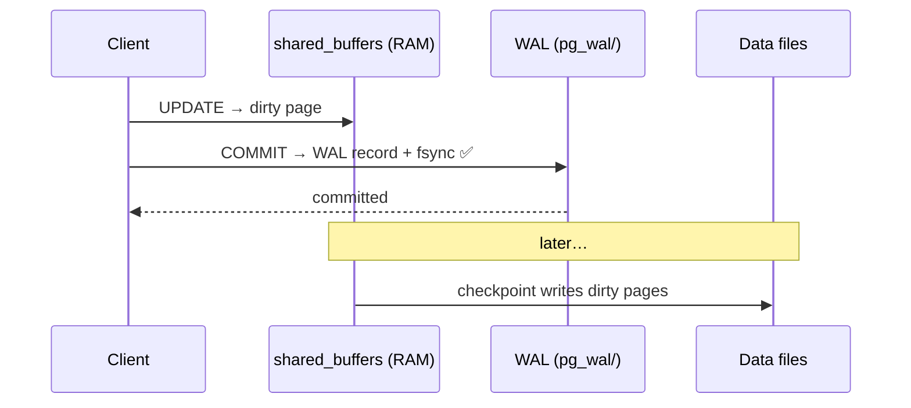

# WAL — Write-Ahead Log

> A change is written to the log **first**; data files are updated later. Crash? Replay the WAL.



## Why?

| Without WAL | With WAL |
|---|---|
| Every COMMIT = random writes to every page | one sequential append |
| Crash = half-written data files | replay from last checkpoint |
| — | foundation of **replication** and **PITR** |

## Example (measured)

```sql
SELECT pg_current_wal_lsn() AS before \gset             -- psql: store in :before
UPDATE orders SET qty = qty WHERE id <= 10000;
SELECT pg_size_pretty(pg_wal_lsn_diff(pg_current_wal_lsn(), :'before'));
-- 6430 kB  (after lab 05: 10K updates ≈ 640 bytes of WAL per row — every index adds WAL)
```

## Settings

| Setting | Default | Effect |
|---|---|---|
| `wal_level` | replica | `logical` for logical replication |
| `max_wal_size` | 1GB | bigger = fewer checkpoints |
| `checkpoint_timeout` | 5min | |
| `synchronous_commit` | on | `off` = faster, may lose last ~600 ms |

## Key Points
- Durable COMMIT = WAL on disk
- A replica = a WAL consumer ([13](../13-replication/01-streaming-replication.md))
- Too many checkpoints = I/O spikes

## Pitfall
❌ `fsync = off` in production → corruption after power loss
✅ `synchronous_commit = off` if you need speed (no corruption risk)

Next → [03-vacuum](03-vacuum.md)
