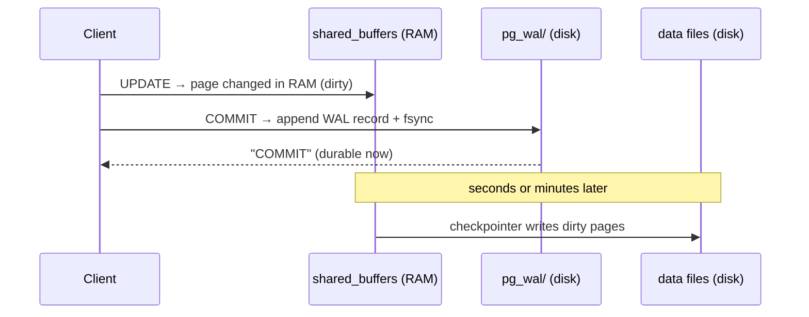
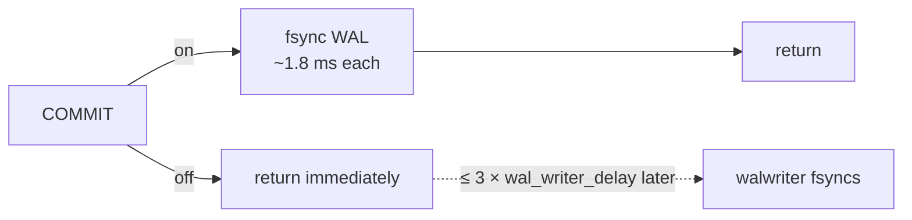

# WAL — Write-Ahead Log

> **Definition:** the WAL is an **append-only journal** of every change, stored in `pg_wal/`. Rule: a change is written to the WAL **before** the data file it describes ("write-ahead"). `COMMIT` waits only for the WAL to reach disk. Data files are updated later in the background. After a crash, PostgreSQL **replays** the WAL to rebuild what the data files missed.



## 1. Vocabulary

| Term | Definition | Example |
|---|---|---|
| **WAL record** | description of one change ("page 17 slot 5: set qty = 3") | ~100 bytes per row change |
| **LSN** (Log Sequence Number) | byte position in the WAL stream, always growing | `0/6F0CA670` |
| **WAL segment** | one 16 MB file in `pg_wal/` | `00000001000000000000006F` |
| **fsync** | force the OS to really write to disk | done at each `COMMIT` |
| **Checkpoint** | all dirty pages written to data files. WAL before it is no longer needed for recovery | every 5 min or 1 GB of WAL |
| **Full-page write** | first change of a page after a checkpoint logs the **whole 8 KB page** | protects against torn pages |

```sql
SELECT pg_current_wal_lsn(), pg_walfile_name(pg_current_wal_lsn());
--  0/6F0CA670 | 00000001000000000000006F
```

## 2. Why write twice?

| Without WAL | With WAL |
|---|---|
| `COMMIT` = write every changed 8 KB page, at random places on disk | `COMMIT` = append a few hundred bytes, sequentially |
| crash in the middle → half-written data files, corruption | crash → replay WAL from the last checkpoint |
| | the same WAL stream feeds **replicas** and **point-in-time recovery** |

## 3. How much WAL each operation writes (measured, 10,000 rows, table with PK)

```sql
SELECT pg_current_wal_lsn() AS before \gset
INSERT INTO wal_t SELECT g, 'x' FROM generate_series(1, 10000) g;
SELECT pg_size_pretty(pg_wal_lsn_diff(pg_current_wal_lsn(), :'before'));
```

| Operation (10K rows) | WAL | Per row |
|---|---|---|
| `INSERT` | 1,274 kB | ~130 B (heap + PK index entry) |
| `UPDATE` | 2,080 kB | ~210 B (new version + old marked + index entry) |
| `DELETE` | 571 kB | ~57 B (only marks `xmax`) |
| `INSERT` into an `UNLOGGED` table | **40 bytes total** | no WAL at all |

`UNLOGGED` = fast, but the table is **emptied after a crash** and isn't replicated. Fine for caches and staging data.

### Full-page writes after a checkpoint (measured)

```sql
CHECKPOINT;
UPDATE wal_t SET v = 'z' WHERE id = 1;   -- 17,920 bytes of WAL
UPDATE wal_t SET v = 'w' WHERE id = 2;   --    168 bytes of WAL (same pages)
```

The first touch after a checkpoint logs full images of the heap page **and** the index page (2 × 8 KB). Later changes log only the small delta. More checkpoints → more full-page images → more WAL.

## 4. Durability vs speed: `synchronous_commit` (measured)

10,000 single-row `INSERT`s, autocommit (each one is a COMMIT):

| `synchronous_commit` | Time | What `COMMIT` waits for |
|---|---|---|
| `on` (default) | **18,367 ms** | WAL fsynced to disk |
| `off` | **574 ms** (32×) | nothing; WAL writer flushes within ~200 ms |



With `off`, a crash can **lose the last few hundred ms of commits**, but the database is never corrupted. Set it per transaction for low-value data:
```sql
BEGIN;
SET LOCAL synchronous_commit = off;
INSERT INTO page_views …;
COMMIT;
```

❌ `fsync = off` is different: the data files may be **corrupted** after a power loss. Never in production.

## 5. Checkpoints


| Setting | Default (this repo) | Effect |
|---|---|---|
| `checkpoint_timeout` | 5min | max time between checkpoints |
| `max_wal_size` | 1GB | WAL volume that forces an early checkpoint |
| `wal_segment_size` | 16MB | size of each file in `pg_wal/` |

```sql
SELECT num_timed, num_requested FROM pg_stat_checkpointer;   -- PG 17
--  12 | 3     ← 3 forced early (by max_wal_size or manual CHECKPOINT)
```
Many `num_requested` under normal load → raise `max_wal_size`, so checkpoints are fewer and smoother.

`pg_wal/` here: 44 files, 704 MB. WAL is recycled after checkpoints, unless a replica or archiving still needs it.

## 6. Settings summary

| Setting | Default | Change when |
|---|---|---|
| `wal_level` | `replica` | `logical` for logical replication / CDC |
| `synchronous_commit` | `on` | `off` per transaction for non-critical writes |
| `max_wal_size` | 1GB | frequent requested checkpoints → 4–16 GB |
| `checkpoint_timeout` | 5min | 15min = fewer full-page writes, longer recovery |
| `full_page_writes` | `on` | never turn off (torn pages) |

## Key Points
- `COMMIT` = WAL record fsynced; data files catch up at checkpoints
- WAL per row: INSERT ~130 B · UPDATE ~210 B · DELETE ~57 B (+ indexes)
- First change of a page after a checkpoint = full 8 KB image
- `synchronous_commit = off` → 32× faster single commits, may lose last ms, no corruption
- `fsync = off` → corruption risk. `UNLOGGED` → emptied on crash
- Replicas and PITR are WAL consumers ([14](../14-replication/01-streaming-replication.md))

Next → [03-vacuum](03-vacuum.md)
