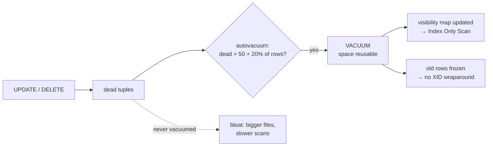

# VACUUM & Bloat

> **Definition:**
> - **Dead tuple** = an old row version that no transaction can see anymore (left behind by `UPDATE`/`DELETE`, see [MVCC](../06-transactions-mvcc/03-mvcc.md)).
> - **Bloat** = table/index space taken by dead tuples or empty gaps.
> - **VACUUM** = marks dead tuples' space as **reusable**, updates the visibility map, and freezes old rows. It does **not** shrink the file.
> - **Autovacuum** = background workers that run VACUUM/ANALYZE automatically when enough rows changed.



## 1. Bloat experiment (measured)

A copy of `orders` with autovacuum off, so we control every step:

```sql
CREATE TABLE orders_bloat WITH (autovacuum_enabled = off) AS SELECT * FROM orders;
```

| Step | Size | `count(*)` time | Why |
|---|---|---|---|
| start | 74 MB | 114 ms | 1M live rows |
| `UPDATE orders_bloat SET qty = qty;` | **147 MB** | 187 ms | 1M new versions + 1M dead ones; scans read twice the pages |
| `VACUUM` | 147 MB | | dead space marked free, file not shrunk |
| `UPDATE` all rows again | **147 MB** | | new versions **reused** the freed space, no growth ✅ |
| `VACUUM FULL` (0.8 s, exclusive lock) | **73 MB** | 65 ms | table rewritten compactly |


Takeaway: without VACUUM, every full update would add another 73 MB. With VACUUM, the table stabilizes at the size it needs.

## 2. VACUUM variants

| Command | Lock | Shrinks file? | Use |
|---|---|---|---|
| `VACUUM` | light: reads and writes continue | ❌ (only trailing empty pages) | routine, what autovacuum does |
| `VACUUM ANALYZE` | light | ❌ | + refresh planner statistics |
| `VACUUM (VERBOSE)` | light | ❌ | shows what it did |
| `VACUUM FULL` | **ACCESS EXCLUSIVE**: blocks even `SELECT` | ✅ rewrite | rare, in a maintenance window |
| `pg_repack` (extension) | light | ✅ rewrite online | big bloated table in production |

`VACUUM (VERBOSE)` output lines worth reading:
```text
pages: 0 removed, 18753 remain, 18753 scanned (100.00% of total)
tuples: 7 removed, 6 remain, 4 are dead but not yet removable     ← an old transaction is still open
```
"dead but not yet removable" = a long-running transaction still needs them ([MVCC §5](../06-transactions-mvcc/03-mvcc.md#5-long-transactions-block-cleanup-measured)).

## 3. Autovacuum: when does it run?

A table is vacuumed when:

```text
dead tuples > autovacuum_vacuum_threshold + autovacuum_vacuum_scale_factor × rows
            =            50              +           0.2                  × rows
```

| Table rows | Dead tuples before autovacuum starts |
|---|---|
| 5,000 (`products`) | 50 + 1,000 = **1,050** |
| 1,000,000 (`orders`) | 50 + 200,000 = **200,050** |
| 100,000,000 | **20 million** ← too late for a hot table |

Settings in this repo:
```text
 autovacuum                      | on
 autovacuum_naptime              | 60      ← checks every 60 s
 autovacuum_vacuum_threshold     | 50
 autovacuum_vacuum_scale_factor  | 0.2
 autovacuum_analyze_scale_factor | 0.1     ← ANALYZE after 10% changed
```

Tune **per table** for big, busy tables:
```sql
ALTER TABLE orders SET (autovacuum_vacuum_scale_factor = 0.02);   -- 2% → 20K dead rows on 1M
```

Monitor:
```sql
SELECT relname, n_live_tup, n_dead_tup, last_autovacuum, last_autoanalyze, autovacuum_count
FROM pg_stat_user_tables ORDER BY n_dead_tup DESC LIMIT 5;
--  orders   |  … |  56 | 2026-10-06 12:13:58 | … | 1
```

## 4. HOT updates and fillfactor (measured)

**Definition:** a **HOT** (Heap-Only Tuple) update puts the new version **on the same page** and writes **no new index entries**, as long as no indexed column changed. It needs free space on the page. `fillfactor` = how full INSERTs may fill a page (default 100%).

100,000 rows, `UPDATE hot_t SET n = n + 1` (non-indexed column):

| `fillfactor` | HOT updates | Meaning |
|---|---|---|
| 100 (default) | **0** of 100,000 | pages full → every new version goes to another page + new index entry |
| 70 | **41,938** of 100,000 | 30% free per page → 42% of updates stayed on their page |

```sql
CREATE TABLE hot_t (id int PRIMARY KEY, n int, pad text) WITH (fillfactor = 70);
SELECT n_tup_upd, n_tup_hot_upd FROM pg_stat_user_tables WHERE relname = 'hot_t';
```
Use `fillfactor = 70–90` on tables with frequent updates of non-indexed columns (counters, status).

## 5. Transaction ID wraparound

**Definition:** transaction IDs are 32-bit (~4 billion). To reuse them safely, VACUUM **freezes** old rows (marks them "visible to everyone forever"). If freezing falls ~2 billion transactions behind, PostgreSQL **stops accepting writes** to protect the data.

```sql
SELECT datname, age(datfrozenxid) FROM pg_database WHERE datname = 'shop';
--  shop | 50366          ← fine. Alarm at hundreds of millions
```
`autovacuum_freeze_max_age = 200,000,000` → autovacuum forces a freeze pass long before the limit, **if it's allowed to run**.

## 6. Common problems

| Symptom | Cause | Fix |
|---|---|---|
| table grows forever, `n_dead_tup` high | autovacuum too slow for this table | lower `autovacuum_vacuum_scale_factor` per table |
| `dead but not yet removable` | long transaction / idle in transaction / stale replication slot | `idle_in_transaction_session_timeout`, drop unused slots |
| table already huge after a mass `UPDATE`/`DELETE` | space freed but file not shrunk | `pg_repack` (online) or `VACUUM FULL` (locks) |
| "database is not accepting commands to avoid wraparound" | autovacuum disabled or blocked for a long time | never disable autovacuum |

## Key Points
- `UPDATE` all rows doubles the table (74 → 147 MB) until space is reused
- `VACUUM` = space reusable, file size unchanged; `VACUUM FULL` = compact, exclusive lock
- Autovacuum triggers at 50 + 20% dead rows → lower the factor for big tables
- `fillfactor` 70 → 0 → 42% HOT updates (no index writes)
- Never disable autovacuum (bloat + XID wraparound)

Next → [04-planner-stats](04-planner-stats.md)
