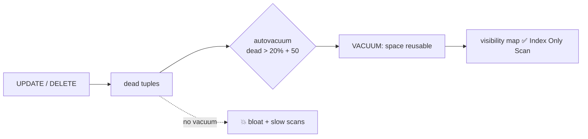

# VACUUM & Bloat

> MVCC leaves dead tuples behind. VACUUM marks their space as reusable.



## Bloat experiment (measured)

```sql
-- on a copy without indexes (every index = extra writes per row)
CREATE TABLE orders_bloat AS SELECT * FROM orders;
SELECT pg_size_pretty(pg_relation_size('orders_bloat'));   -- 73 MB

UPDATE orders_bloat SET qty = qty;                          -- 1M new versions
SELECT pg_size_pretty(pg_relation_size('orders_bloat'));   -- 147 MB 😱

VACUUM orders_bloat;
SELECT pg_size_pretty(pg_relation_size('orders_bloat'));   -- still 147 MB (space is reusable)

VACUUM FULL orders_bloat;                                   -- ⚠️ exclusive lock
SELECT pg_size_pretty(pg_relation_size('orders_bloat'));   -- 73 MB
```

## Types

| Command | Lock | Returns space to OS |
|---|---|---|
| `VACUUM` | light (reads/writes continue) | ❌ |
| `VACUUM ANALYZE` | light + stats | ❌ |
| `VACUUM FULL` | **exclusive** | ✅ |
| `pg_repack` (extension) | light | ✅ |

## Monitor

```sql
SELECT relname, n_dead_tup, last_autovacuum, last_autoanalyze
FROM pg_stat_user_tables ORDER BY n_dead_tup DESC LIMIT 5;
```

## Tune for big tables

```sql
-- default 20% of 100M rows = 20M dead tuples before it runs!
ALTER TABLE orders SET (autovacuum_vacuum_scale_factor = 0.02);
```

## Pitfall
❌ Disabling autovacuum "because it uses CPU" → bloat + **transaction ID wraparound** (database stops accepting writes)
✅ Keep it on and tune it

Next → [04-planner-stats](04-planner-stats.md)
