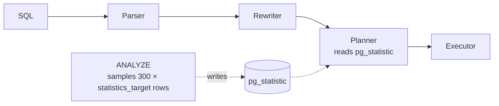

# Query Planner & Statistics

> **Definition:**
> - The **planner** (optimizer) picks *how* to run a query. It estimates how many rows each step returns, prices every possible plan in **cost units**, and runs the cheapest one.
> - **Statistics** = summaries of each column's data (distinct values, most common values, histogram), collected by `ANALYZE` from a **sample** of rows. They're the planner's only knowledge of the data.
>
> Wrong statistics → wrong row estimates → wrong plan.



## 1. What the planner knows (measured)

```sql
SELECT attname, n_distinct, most_common_vals, most_common_freqs, correlation
FROM pg_stats WHERE tablename = 'orders' AND attname IN ('status', 'qty', 'user_id');
```
```text
 attname | n_distinct |         most_common_vals         |              most_common_freqs               | correlation
 user_id |      93061 |                                  |                                              |  0.0053
 qty     |          5 | {2,4,1,5,3}                      | {0.204,0.201,0.198,0.198,0.198}              |  0.21
 status  |          4 | {shipped,cancelled,pending,paid} | {0.253,0.250,0.249,0.249}                    |  0.25
```

| Column of `pg_stats` | Definition | Used for |
|---|---|---|
| `n_distinct` | number of different values (negative = fraction of rows, `-0.95` = 95% unique) | `GROUP BY` size, join estimates |
| `most_common_vals` / `_freqs` | the top values and their share of rows | `WHERE status = 'paid'` → 24.9% |
| `histogram_bounds` | 100 boundaries splitting the other values into equal-sized buckets | ranges: `price < 50` |
| `null_frac` | share of NULLs | `IS NULL` |
| `correlation` | physical order vs value order (−1…1) | index scan cost, [BRIN](../05-indexes-performance/03-index-types.md#6-brin--tiny-index-for-ordered-data) |

Plus `pg_class.reltuples` (row count: 1,000,000) and `relpages` (9,346).

## 2. From statistics to estimates (measured)

| Query | Calculation | Estimate | Actual |
|---|---|---|---|
| `status = 'paid'` | 1M × 0.249 | 248,727 | 249,533 ✅ |
| `qty = 5` | 1M × 0.198 | 198,255 | |
| `status = 'paid' AND qty = 5` | 1M × 0.249 × 0.198 (assumes **independent**) | 49,306 | 49,600 ✅ |

Independence holds here (status and qty are random). When columns depend on each other, it breaks:

## 3. Correlated columns → `CREATE STATISTICS` (measured)

100,000 addresses; `city` always determines `country` (Amman ↔ JO):

```sql
EXPLAIN ANALYZE SELECT * FROM addr WHERE city = 'Amman' AND country = 'JO';
-- Seq Scan on addr (… rows=4016 …) (actual … rows=20000 …)
--                    estimate: 20% × 20% = 4%      reality: 20% → 5× too low
```

```sql
CREATE STATISTICS addr_city_country (dependencies) ON city, country FROM addr;
ANALYZE addr;
-- Seq Scan on addr (… rows=20317 …) (actual … rows=20000 …)   ✅
```

| Kind | Fixes |
|---|---|
| `dependencies` | `WHERE a = … AND b = …` when a determines b |
| `ndistinct` | `GROUP BY a, b` group-count estimates |
| `mcv` | common **combinations** of values |

A 5× underestimate on a small table is harmless. On a join input it can turn a Hash Join into a Nested Loop that runs 20,000 times instead of 4,000.

## 4. Stale statistics → wrong plan (measured)

```sql
CREATE TABLE st (id int, v int) WITH (autovacuum_enabled = off);
INSERT INTO st SELECT g, 1 FROM generate_series(1, 1000) g;
ANALYZE st;                                          -- stats say: v is always 1
INSERT INTO st SELECT g, 2 FROM generate_series(1, 500000) g;   -- no ANALYZE
CREATE INDEX ON st (v);
```

| | Plan | Estimated rows | Actual | Time |
|---|---|---|---|---|
| stale stats | `Index Scan using st_v_idx` | **1** | 500,000 | 80.8 ms |
| after `ANALYZE st` | `Seq Scan` | 499,948 | 500,000 | 63.1 ms |

The planner thought `v = 2` matches 1 row → chose an index for 500,000 rows. Here only 28% slower. With joins on top, the same mistake can cost minutes.

Typical cause: a bulk load or migration, then queries run before autovacuum's `ANALYZE` (triggered after 10% of rows change, checked every 60 s).

## 5. Fixes

```sql
ANALYZE orders;                                               -- refresh now (after bulk loads!)

ALTER TABLE orders ALTER COLUMN user_id SET STATISTICS 1000;  -- bigger sample (default 100)
ANALYZE orders;                                               -- 300 × 1000 = 300K rows sampled

CREATE STATISTICS … ON col_a, col_b FROM t;                   -- correlated columns
```

`default_statistics_target = 100` → `ANALYZE` samples 30,000 rows and keeps 100 most-common values + 100 histogram buckets per column.

## 6. Cost settings

| Setting | Default | Meaning | Typical change |
|---|---|---|---|
| `seq_page_cost` | 1.0 | cost of reading one page sequentially | keep |
| `random_page_cost` | 4.0 | cost of one random page read (index lookups) | **1.1 on SSD** → planner uses indexes more readily |
| `effective_cache_size` | 4GB | how much data the OS + PG cache can hold (estimate only, allocates nothing) | ~75% of RAM |
| `work_mem` | 4MB | memory per sort/hash before spilling | per-query for reports |

## Key Points
- Planner = estimate rows → price plans → pick cheapest
- Statistics come from `ANALYZE` sampling (30K rows by default)
- Multiple conditions are assumed independent → `CREATE STATISTICS` for correlated columns
- After bulk loads, run `ANALYZE` immediately (stale: estimated 1 row, got 500,000)
- Seq Scan isn't wrong when many rows match
- First debugging step: compare estimated vs actual rows in `EXPLAIN ANALYZE`

Lab → [labs/07-internals.sql](../../labs/07-internals.sql)

Next → [08-ops-scaling/01-roles-rls](../08-ops-scaling/01-roles-rls.md)
