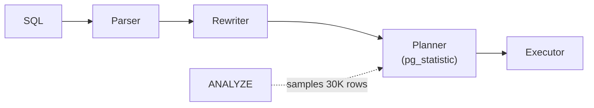

# Query Planner & Statistics

> The planner estimates row counts from statistics and picks the cheapest plan. Wrong stats = wrong plan.



## Example — what the planner knows (measured)

```sql
SELECT attname, n_distinct, most_common_vals
FROM pg_stats WHERE tablename = 'orders' AND attname IN ('status', 'qty');
--  qty    | 5 | {5,2,4,1,3}
--  status | 4 | {cancelled,pending,shipped,paid}
```

## Estimate vs actual

```sql
EXPLAIN ANALYZE SELECT * FROM orders WHERE status = 'paid';
-- Seq Scan ... (rows=245567) (actual rows=249953)   ✅ close
```

| Situation | Result |
|---|---|
| estimate ≈ actual | sensible plan |
| estimate 10 / actual 100K | disastrous Nested Loop 💥 |

## Fixes

```sql
ANALYZE orders;                                               -- refresh stats

ALTER TABLE orders ALTER COLUMN user_id SET STATISTICS 1000;  -- bigger sample
ANALYZE orders;

-- correlated columns (city + country)
CREATE STATISTICS orders_user_product (dependencies, ndistinct)
    ON user_id, product_id FROM orders;
ANALYZE orders;
```

## Planner cost settings

| Setting | Default | SSD |
|---|---|---|
| `random_page_cost` | 4.0 | 1.1 |
| `effective_cache_size` | 4GB | ~75% of RAM |

## Key Points
- After bulk load: `ANALYZE` immediately
- Seq Scan is not always wrong (many rows)
- Big row-count gap = first thing to check

Lab → [labs/07-internals.sql](../../labs/07-internals.sql)

Next → [08-ops-scaling/01-roles-rls](../08-ops-scaling/01-roles-rls.md)
