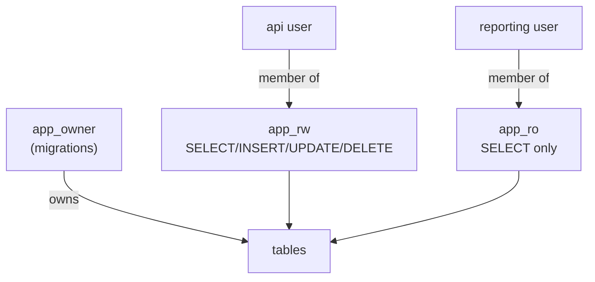
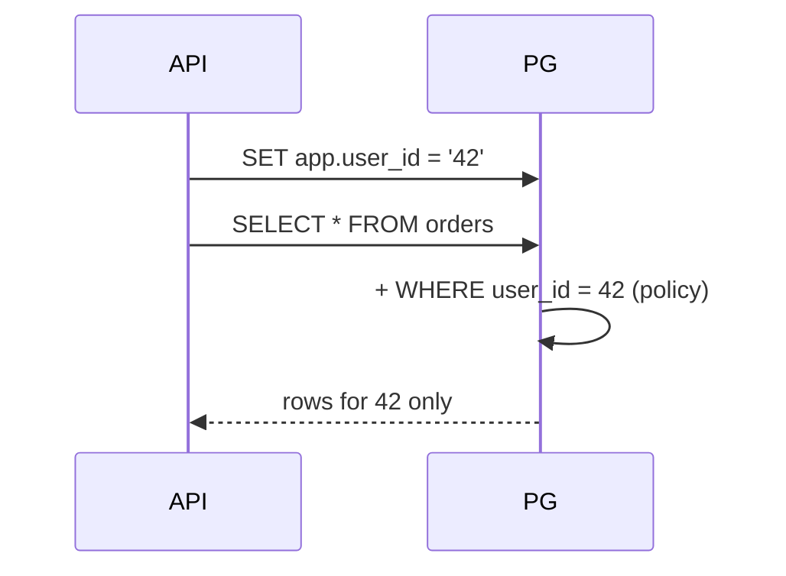

# Roles & Row-Level Security

> Least privilege: every app/user gets only what it needs. RLS = a mandatory per-row filter.



## Roles

```sql
CREATE ROLE app_ro NOLOGIN;
GRANT CONNECT ON DATABASE shop TO app_ro;
GRANT USAGE ON SCHEMA public TO app_ro;
GRANT SELECT ON ALL TABLES IN SCHEMA public TO app_ro;
ALTER DEFAULT PRIVILEGES IN SCHEMA public GRANT SELECT ON TABLES TO app_ro;  -- future tables

CREATE ROLE reporting LOGIN PASSWORD 'change_me' IN ROLE app_ro;
-- reporting: SELECT ✅  ·  DELETE ❌ permission denied
```

## RLS — each tenant sees only its rows

```sql
ALTER TABLE orders ENABLE ROW LEVEL SECURITY;

CREATE POLICY orders_owner ON orders
    USING (user_id = current_setting('app.user_id')::bigint);

-- from the app, per request:
SET app.user_id = '42';
SELECT count(*) FROM orders;      -- only user 42's orders (measured: 12)
```



## Key Points
- Never connect the app as superuser
- Group roles (`NOLOGIN`) + members
- Superuser **always** bypasses RLS; the owner does too unless `FORCE ROW LEVEL SECURITY`
- `app` in this repo is a superuser → test RLS with `SET ROLE` (as the lab does)

## Pitfall
❌ `GRANT ALL ON ALL TABLES TO api;`
✅ `GRANT SELECT, INSERT, UPDATE ON orders TO api;`

Next → [02-backup-restore](02-backup-restore.md)
