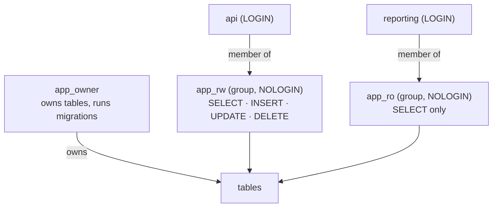
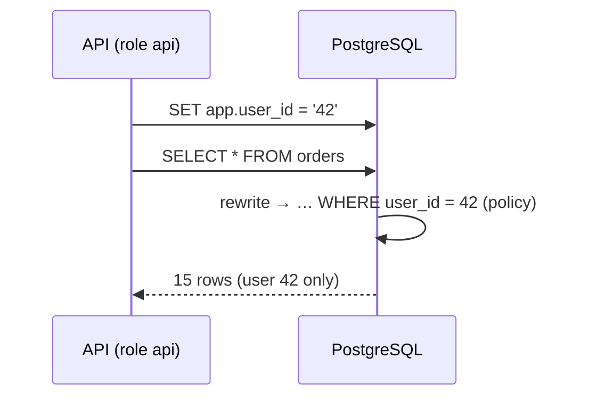

# Roles & Row-Level Security

> **Definition:**
> - A **role** is a database identity. With `LOGIN` it's a user. Without `LOGIN` it's a **group** that other roles join. Roles get **privileges** (`SELECT`, `INSERT`…) on objects.
> - **Least privilege** = every app/person gets only the privileges it needs.
> - **Row-Level Security (RLS)** = a **policy** on a table that PostgreSQL adds to every query as a hidden `WHERE`, so each user only sees/changes the rows the policy allows.



## 1. Why: the repo's `app` user is a superuser

```sql
SELECT rolname, rolsuper, rolbypassrls FROM pg_roles WHERE rolname = 'app';
--  app | t | t       ← can do anything, ignores RLS
```
Fine for learning. In production the app must **not** be superuser: one SQL-injection bug could then `DROP` everything or read every tenant's data.

## 2. Group roles + login roles

```sql
-- groups: hold the privileges
CREATE ROLE app_ro NOLOGIN;
GRANT CONNECT ON DATABASE shop TO app_ro;
GRANT USAGE ON SCHEMA public TO app_ro;
GRANT SELECT ON ALL TABLES IN SCHEMA public TO app_ro;

CREATE ROLE app_rw NOLOGIN;
GRANT USAGE ON SCHEMA public TO app_rw;
GRANT SELECT, INSERT, UPDATE, DELETE ON ALL TABLES IN SCHEMA public TO app_rw;
GRANT USAGE ON ALL SEQUENCES IN SCHEMA public TO app_rw;     -- for IDENTITY / serial

-- users: log in, inherit from a group
CREATE ROLE reporting LOGIN PASSWORD 'change_me' IN ROLE app_ro;
CREATE ROLE api       LOGIN PASSWORD 'change_me' IN ROLE app_rw;
```

Test as each role (measured, `SET ROLE` switches identity in the session):

| As | Statement | Result |
|---|---|---|
| `reporting` | `SELECT count(*) FROM orders` | ✅ 1000000 |
| `reporting` | `DELETE FROM orders WHERE id = 1` | ❌ `permission denied for table orders` |
| `reporting` | `CREATE TABLE x (id int)` | ❌ `permission denied for schema public` |
| `api` | `INSERT INTO orders … RETURNING id` | ✅ 1000008 |
| `api` | `TRUNCATE orders` | ❌ `permission denied for table orders` (not granted) |
| `api` | `DROP TABLE products` | ❌ `must be owner of table products` |

### ⚠️ `GRANT … ON ALL TABLES` only covers tables that exist **now**

```sql
CREATE TABLE coupons (id int);                    -- created after the GRANT
SET ROLE reporting; SELECT * FROM coupons;
-- ERROR:  permission denied for table coupons

-- fix for future tables (run as the role that will create them):
ALTER DEFAULT PRIVILEGES IN SCHEMA public GRANT SELECT ON TABLES TO app_ro;
CREATE TABLE coupons2 (id int);
SET ROLE reporting; SELECT count(*) FROM coupons2;    -- ✅ 0
```

## 3. Row-Level Security (measured)

**Scenario:** a multi-user API. User 42 must only ever see user 42's orders, even if a developer forgets `WHERE user_id = …`.

```sql
ALTER TABLE orders ENABLE ROW LEVEL SECURITY;

CREATE POLICY orders_owner ON orders
    USING (user_id = current_setting('app.user_id')::bigint);
```



| As `api`, `app.user_id = '42'` | Result |
|---|---|
| `SELECT count(*) FROM orders` | **15** (superuser sees 1,000,001) |
| `SELECT DISTINCT user_id FROM orders` | only `42` |
| `SELECT count(*) FROM orders WHERE user_id = 43` | `0`: other users' rows don't exist for you |
| `UPDATE orders SET qty = qty WHERE user_id = 43` | `UPDATE 0` |
| `INSERT INTO orders (user_id, …) VALUES (43, …)` | ❌ `new row violates row-level security policy for table "orders"` |
| `INSERT INTO orders (user_id, …) VALUES (42, …)` | ✅ |
| no `SET app.user_id` at all | ❌ `unrecognized configuration parameter "app.user_id"` |

`USING` filters rows you **read/update/delete**. For `INSERT`/`UPDATE` the same expression is also used as `WITH CHECK` on the new row, unless you give a separate `WITH CHECK`.

The policy is just a `WHERE`. It uses the normal index:
```text
Bitmap Heap Scan on orders
  Recheck Cond: (user_id = (current_setting('app.user_id'::text))::bigint)
  ->  Bitmap Index Scan on orders_user_id_idx
```

Safer setting read: `current_setting('app.user_id', true)` returns `NULL` instead of an error when unset → 0 rows.

### With a connection pool

The setting must be per **request**, not per connection. Use `SET LOCAL` inside a transaction so it disappears at `COMMIT`:
```sql
BEGIN;
SET LOCAL app.user_id = '42';
SELECT … FROM orders;
COMMIT;      -- app.user_id gone; the next request on this connection starts clean
```

## 4. Who bypasses RLS

| Role | Subject to RLS? |
|---|---|
| superuser (`app` here) | ❌ always bypasses |
| role with `BYPASSRLS` | ❌ |
| table owner | ❌ unless `ALTER TABLE … FORCE ROW LEVEL SECURITY` |
| everyone else (`api`) | ✅ |

That's why the lab tests with `SET ROLE api`, not as `app`.

## Key Points
- Never connect the app as a superuser or table owner
- Privileges on `NOLOGIN` group roles, users join groups
- `ALTER DEFAULT PRIVILEGES` for tables created later
- RLS policy = automatic `WHERE` on every query, uses indexes
- Pass the user per request with `SET LOCAL` (pool-safe)
- Superuser and owner bypass RLS → test as the app role

Next → [02-backup-restore](02-backup-restore.md)
