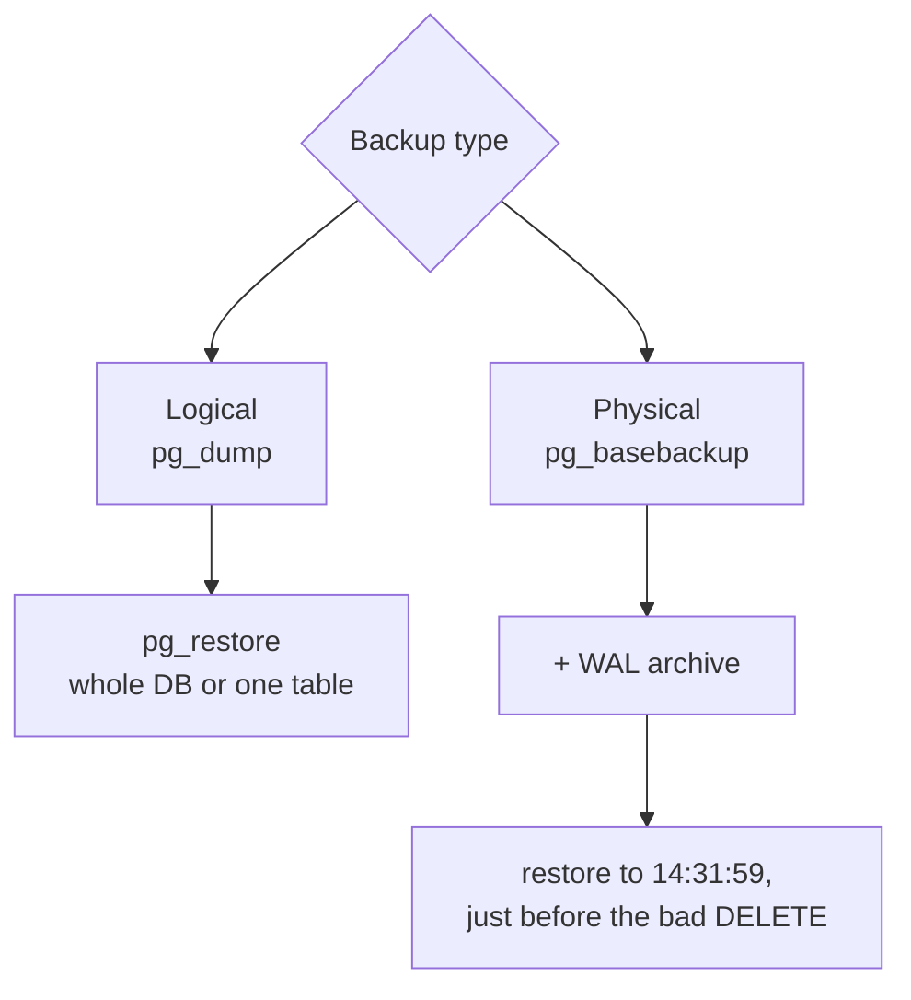
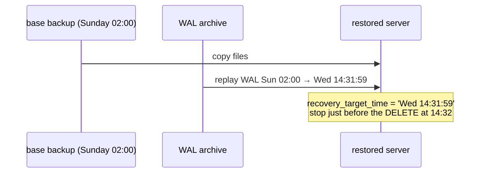

# Backup & Restore

> **Definition:**
> - **Logical backup** (`pg_dump`) = the database exported as SQL commands or a compressed archive of them. Restorable table by table, into another PostgreSQL version.
> - **Physical backup** (`pg_basebackup`) = a byte copy of the whole data directory. Plus the archived WAL, it can restore to **any second** (PITR = Point-In-Time Recovery).
>
> A **replica is not a backup**: `DROP TABLE` reaches the replica within milliseconds.



## 1. pg_dump formats (measured, `shop` = 130 MB on disk)

```bash
docker compose exec -T pg pg_dump -U app -Fc shop > shop.dump   # custom format
docker compose exec -T pg pg_dump -U app shop > shop.sql        # plain SQL
```

| Format | Flag | Time | Size | Restore with | Selective restore |
|---|---|---|---|---|---|
| custom | `-Fc` | 3.5 s | **20 MB** (compressed) | `pg_restore` | ✅ by table / object |
| plain SQL | (default) | 0.9 s | 62 MB | `psql -f` | ❌ (edit the file) |
| directory | `-Fd -j 4` | | compressed, one file per table | `pg_restore -j` | ✅ + parallel dump |

Indexes aren't dumped as data, only as `CREATE INDEX` commands. That's why 130 MB → 20 MB.

`pg_dump` takes a consistent snapshot ([Repeatable Read](../06-transactions-mvcc/02-isolation-levels.md)): the app keeps writing while it runs.

## 2. Restore (measured)

```bash
# into a new, empty database
docker compose exec pg createdb -U app shop_restore
docker compose exec -T pg pg_restore -U app -d shop_restore --no-owner < shop.dump
#   4.0 s  → SELECT count(*) FROM orders = 1000000 ✅

# parallel (needs a file path, not stdin)
pg_restore -U app -d shop_restore --no-owner -j 4 /tmp/shop.dump
#   3.4 s
```

What's inside the archive (`pg_restore -l`):
```text
3490; 0 16409 TABLE DATA public orders app
3488; 0 16397 TABLE DATA public products app
3334; 2606 16419 CONSTRAINT public orders orders_pkey app
3335; 1259 16500 INDEX public orders_user_id_idx app
3337; 2606 16420 FK CONSTRAINT public orders orders_user_fk app
```
Order of a restore: tables → data → indexes → constraints/FKs (faster than loading with indexes in place).

### One table only

```bash
docker compose exec -T pg pg_restore -U app -d shop -t products --clean --if-exists < shop.dump
```
⚠️ `--clean` drops `products` first. `orders` references it → restore fails with a FK error, or you must handle dependent tables too. Safer: restore into a scratch database, then copy the rows you need:
```sql
INSERT INTO shop.products SELECT * FROM … ;   -- via dblink/postgres_fdw, or \copy out + in
```

## 3. Physical backup (measured)

```bash
docker compose exec pg pg_basebackup -U app -D /tmp/base -Ft -z -Xs -c fast
#   6.4 s
#   base.tar.gz      36 MB    ← whole cluster, compressed
#   pg_wal.tar.gz    17 KB    ← WAL generated during the copy
#   backup_manifest  185 KB   ← checksums, verify with pg_verifybackup
```

| Flag | Meaning |
|---|---|
| `-Ft -z` | tar format, gzip |
| `-Xs` | stream the WAL needed to make the copy consistent |
| `-c fast` | start with an immediate checkpoint |

### PITR: how restoring to a second works



Needs `archive_mode = on` + `archive_command` (or a tool) shipping every WAL segment off the server. Tools that automate base backups, WAL archiving, retention and restore: **pgBackRest**, **WAL-G**, **Barman**.

## 4. Choose

| Need | Use |
|---|---|
| small DB (< ~50 GB), nightly copy | `pg_dump -Fc` + cron ([13-03](../13-vps-deploy/03-backups-cron.md)) |
| restore one table / migrate to a new major version | `pg_dump` |
| big DB, fast restore, "undo the last hour" | `pg_basebackup` + WAL archive → pgBackRest / WAL-G |
| high availability (server dies) | a [replica](../14-replication/01-streaming-replication.md), **in addition** to backups |

| | pg_dump | pg_basebackup + WAL |
|---|---|---|
| Granularity | database / table | whole cluster |
| Point-in-time | ❌ time of the dump | ✅ any second |
| Across major versions | ✅ | ❌ same major |
| 130 MB DB (measured) | 3.5 s, 20 MB | 6.4 s, 36 MB |

## 5. Rules

- **3-2-1**: 3 copies, on 2 kinds of storage, 1 off-site (S3, Backblaze)
- A backup you never restored is a guess → **test restores** on a schedule
- Monitor: backup age, size trend, last successful restore test
- Encrypt off-site copies

❌ Backups on the same VPS disk → the disk dies, everything is gone
✅ Upload off-site right after the dump ([13-03 cron](../13-vps-deploy/03-backups-cron.md))

## Key Points
- `pg_dump -Fc`: 130 MB DB → 20 MB file in 3.5 s, restore table by table
- `pg_restore -j 4` = parallel restore
- `pg_basebackup` + WAL archive = restore to any second (PITR)
- Replica ≠ backup
- Test restores regularly

Next → [03-partitioning](03-partitioning.md)
