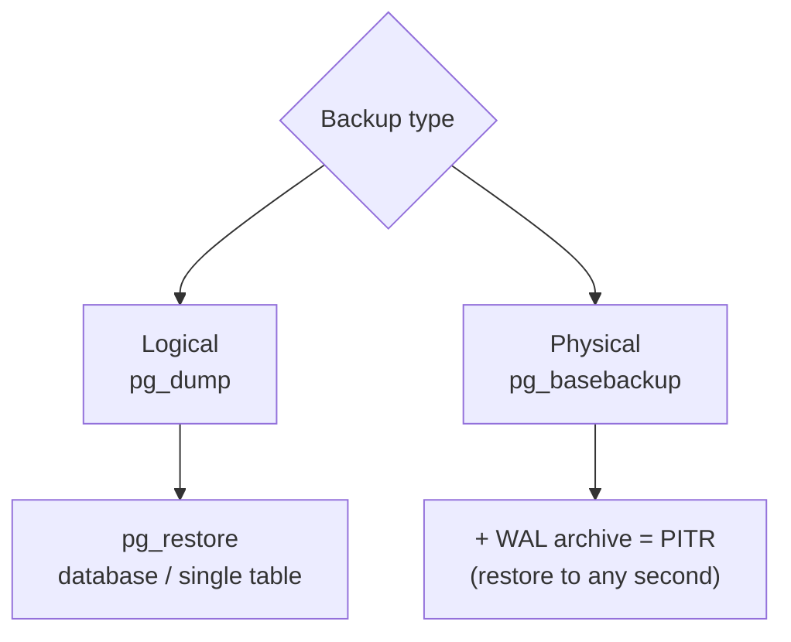

# Backup & Restore

> A replica is not a backup. `DROP TABLE` reaches the replica within milliseconds.



## Logical — pg_dump

```bash
# dump (custom format = compressed + selective restore)
docker compose exec -T pg pg_dump -U app -Fc shop > shop.dump

# restore into a new database
docker compose exec pg createdb -U app shop_restore
docker compose exec -T pg pg_restore -U app -d shop_restore --no-owner < shop.dump

# a single table
docker compose exec -T pg pg_restore -U app -d shop -t products --clean < shop.dump
```

## Physical — pg_basebackup

```bash
docker compose exec pg pg_basebackup -U app -D /tmp/base -Ft -z -Xs -P
```

## Compare

| | pg_dump | pg_basebackup + WAL |
|---|---|---|
| Granularity | database / table | whole cluster |
| Restore to a point in time | ❌ | ✅ PITR |
| Cross-version | ✅ | ❌ same major |
| Speed on 100 GB | slow (hours) | faster |
| Tools | cron | pgBackRest / WAL-G / Barman |

## Key Points
- 3-2-1: 3 copies, 2 media, 1 offsite
- **Test the restore** regularly
- Production: pgBackRest or WAL-G

## Pitfall
❌ Backups only on the same VPS → disk dies = everything gone
✅ Upload to S3 / Backblaze ([13 cron](../13-vps-deploy/03-backups-cron.md))

Next → [03-partitioning](03-partitioning.md)
