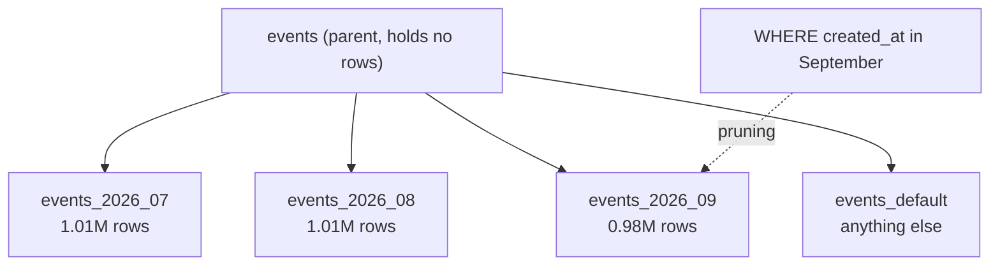
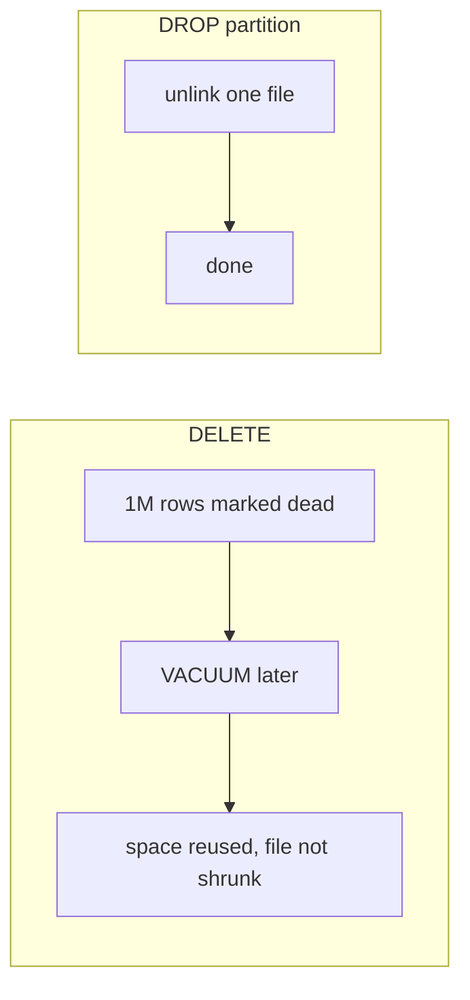

# Partitioning

> **Definition:** partitioning splits one big logical table (the **parent**) into several physical tables (**partitions**) by a **partition key**, usually time. You query the parent as usual. PostgreSQL routes inserts to the right partition and **prunes** (skips) partitions a query can't need.



## 1. Create a range-partitioned table

```sql
CREATE TABLE events (
    id          bigint GENERATED ALWAYS AS IDENTITY,
    user_id     bigint      NOT NULL,
    type        text        NOT NULL,
    created_at  timestamptz NOT NULL,
    PRIMARY KEY (id, created_at)          -- PK/UNIQUE must include the partition key
) PARTITION BY RANGE (created_at);

CREATE TABLE events_2026_07 PARTITION OF events FOR VALUES FROM ('2026-07-01') TO ('2026-08-01');
CREATE TABLE events_2026_08 PARTITION OF events FOR VALUES FROM ('2026-08-01') TO ('2026-09-01');
CREATE TABLE events_2026_09 PARTITION OF events FOR VALUES FROM ('2026-09-01') TO ('2026-10-01');
CREATE TABLE events_default PARTITION OF events DEFAULT;     -- catches everything else
```

`FROM` is inclusive, `TO` is exclusive → `2026-08-01 00:00` goes to `events_2026_08`.

3M rows inserted into the parent, routed automatically:
```sql
SELECT tableoid::regclass AS partition, count(*) FROM events GROUP BY 1 ORDER BY 1;
--     partition    |  count
--  events_2026_07  | 1010878
--  events_2026_08  | 1010879
--  events_2026_09  |  978243

INSERT INTO events (user_id, type, created_at) VALUES (1, 'view', '2027-01-01')
RETURNING tableoid::regclass;
--  events_default          ← no matching range
```

## 2. Partition pruning (measured, 3M rows)

| Query `WHERE` | Partitions scanned | Plan |
|---|---|---|
| `created_at >= '2026-09-10' AND created_at < '2026-10-01'` | **1** | `Seq Scan on events_2026_09` |
| `created_at >= '2026-09-10'` (no upper bound) | 2 | `_09` + `_default` (default might hold later dates) |
| `user_id = 42` | **all 4** | not the partition key → no pruning |
| `created_at::date = '2026-09-15'` | **all 4** | expression on the key → no pruning |

Same query, partitioned vs one flat table with the same 3M rows:

```sql
SELECT count(*) FROM events      WHERE created_at >= '2026-09-01' AND created_at < '2026-10-01';
SELECT count(*) FROM events_flat WHERE created_at >= '2026-09-01' AND created_at < '2026-10-01';
```

| Table | Rows read | Time |
|---|---|---|
| partitioned | 978,243 (one partition) | **176 ms** |
| flat | 3,000,000 (`Rows Removed by Filter: 2021757`) | 342 ms |
| partitioned, `created_at::date = …` | 3,000,000 (all partitions) | 468 ms ❌ |

✅ Always filter on the raw partition key with a range.

## 3. The real win: removing old data (measured)

Delete July (1,010,878 rows):

| Method | Time | Side effects |
|---|---|---|
| `DELETE FROM events_flat WHERE created_at < '2026-08-01'` | **2,761 ms** | 1,010,878 dead tuples, file stays 173 MB until VACUUM, lots of WAL |
| `ALTER TABLE events DETACH PARTITION events_2026_07;` + `DROP TABLE events_2026_07;` | **3.5 + 14 ms** | file deleted, zero bloat |



Retention policy "keep 12 months" = every month: create next month's partition, drop the oldest one.

## 4. Partition types

| Type | Definition | Example key | Example |
|---|---|---|---|
| `RANGE` | value ranges | `created_at` | one partition per month |
| `LIST` | explicit value lists | `country`, `tenant_id` | `FOR VALUES IN ('JO', 'PS')` |
| `HASH` | `hash(key) % n` | `user_id` | `FOR VALUES WITH (MODULUS 8, REMAINDER 0)` → even spread |

## 5. Rules and limits

| Rule | Why |
|---|---|
| PK / UNIQUE must include the partition key | uniqueness is enforced per partition |
| queries must filter on the key | otherwise every partition is scanned |
| create partitions **ahead of time** | missing partition → rows go to `DEFAULT` (or error without one) |
| don't create thousands of partitions | planning time grows with partition count |
| indexes on the parent are created on every partition | one `CREATE INDEX` on the parent is enough |

Automate creation/retention: `pg_partman` extension, or a monthly cron job.

## When to partition

| Table | Partition? |
|---|---|
| 1M rows (`orders` here) | ❌ an index is enough; partitioning adds overhead |
| 100M+ rows, queries always by time range | ✅ |
| need to delete old data in bulk regularly | ✅ even at smaller sizes |
| queries rarely filter on a common key | ❌ every query scans all partitions |

## Key Points
- Parent table + partitions by key; inserts routed automatically
- Pruning only when `WHERE` uses the raw key (176 ms vs 468 ms with `::date`)
- Dropping a partition: 18 ms vs `DELETE` 2.8 s + bloat
- PK must include the partition key
- Indexes first; partition for huge tables or bulk retention

Next → [04-pgbouncer](04-pgbouncer.md)
