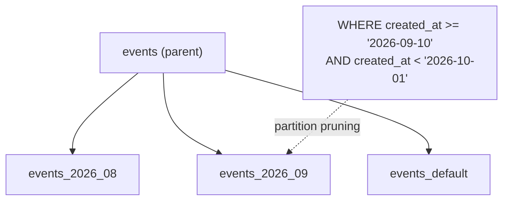

# Partitioning

> One huge table → smaller tables by a key (usually time). Queries read only the partitions they need.



## Example — range by month

```sql
CREATE TABLE events (
    id          bigint GENERATED ALWAYS AS IDENTITY,
    user_id     bigint NOT NULL,
    type        text   NOT NULL,
    created_at  timestamptz NOT NULL,
    PRIMARY KEY (id, created_at)            -- must include the partition key
) PARTITION BY RANGE (created_at);

CREATE TABLE events_2026_08 PARTITION OF events
    FOR VALUES FROM ('2026-08-01') TO ('2026-09-01');
CREATE TABLE events_2026_09 PARTITION OF events
    FOR VALUES FROM ('2026-09-01') TO ('2026-10-01');
CREATE TABLE events_default PARTITION OF events DEFAULT;

EXPLAIN SELECT * FROM events WHERE created_at >= '2026-09-10';
-- Append                                (measured)
--   -> Seq Scan on events_2026_09     ← 08 pruned
--   -> Seq Scan on events_default     ← DEFAULT covers ≥ 2026-10-01, must be read

EXPLAIN SELECT * FROM events
WHERE created_at >= '2026-09-10' AND created_at < '2026-10-01';
-- Seq Scan on events_2026_09        ← one partition only
```

## Dropping old data — before → after

| Method | 50M rows |
|---|---|
| `DELETE FROM events WHERE created_at < ...` | minutes + bloat + huge WAL |
| `DROP TABLE events_2025_01` | milliseconds, zero bloat |

## Types

| Type | Example key |
|---|---|
| RANGE | date |
| LIST | country / tenant |
| HASH | even spread by user_id |

## Key Points
- Worth it above ~50–100M rows
- Queries must filter on the partition key
- Automate partition creation: `pg_partman`

## Pitfall
❌ Partitioning a 1M-row table → overhead, no gain
✅ Good indexes first, partition when it grows

Next → [04-pgbouncer](04-pgbouncer.md)
