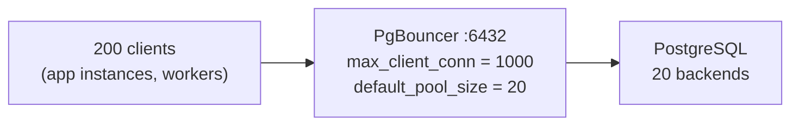
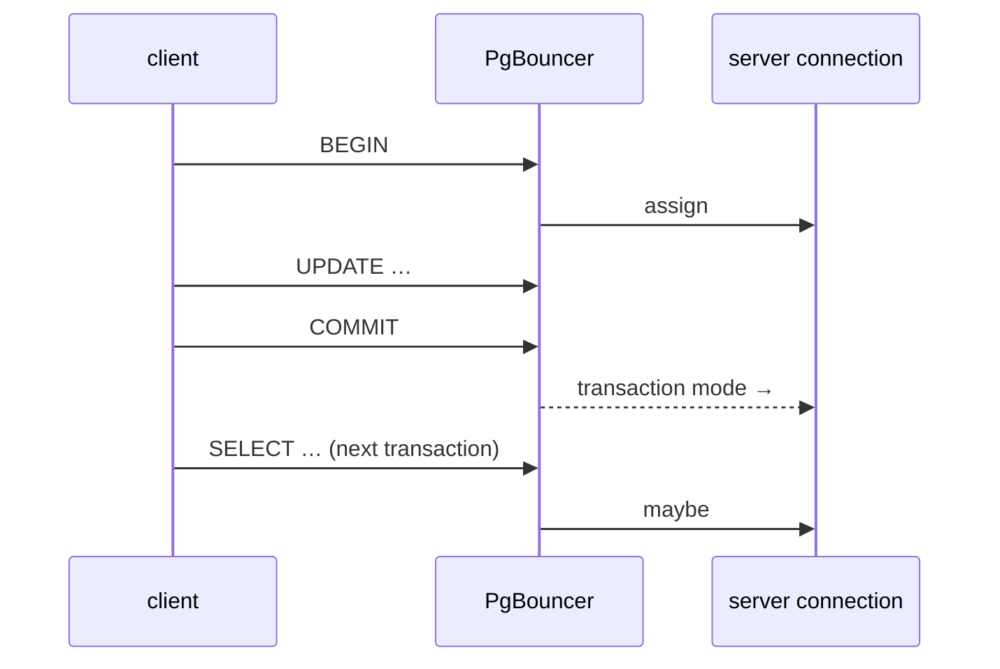

# PgBouncer — Connection Pooling

> **Definition:**
> - Every PostgreSQL connection = one OS **process** (~5–10 MB RAM, see [architecture](../00-introduction/03-architecture.md#3-backend--your-sessions-worker)). `max_connections` (100 here) caps them.
> - A **connection pooler** sits between clients and PostgreSQL. It accepts many client connections and shares a **small pool** of real server connections among them.
> - **PgBouncer** is the standard lightweight pooler (one process, ~2 KB per client connection).



## 1. The problem it solves (measured)

pgbench, `read_heavy.sql` (last 20 orders of a random user), 15 s each, PostgreSQL `max_connections = 100`, 4 CPUs:

| Setup | 200 clients |
|---|---|
| direct to PostgreSQL | 💥 `FATAL:  sorry, too many clients already` (client 72 failed) |
| through PgBouncer, pool 20 | ✅ **7,065 tps**, latency 28 ms |

While the 200 clients ran through PgBouncer, PostgreSQL had only **20** client backends, all from PgBouncer's address:
```sql
SELECT host(client_addr), count(*) FROM pg_stat_activity
WHERE backend_type = 'client backend' GROUP BY 1;
--  172.19.0.3 | 20      ← PgBouncer
```

More connections don't mean more throughput. Past ~2–3× CPU cores, contention makes it worse ([15-03 ramp test](../15-benchmarking/03-ramp-and-monitor.md)):

| Clients (direct) | tps | latency |
|---|---|---|
| 10 | 4,997 | 2.0 ms |
| 50 | 3,641 | 13.7 ms |
| 200 | FATAL | — |

## 2. What it costs (measured, honest numbers)

| Test (10 clients) | Direct | PgBouncer | Why |
|---|---|---|---|
| persistent connections | 9,812 tps · 1.02 ms | 7,264 tps · 1.38 ms | one extra network hop (~0.35 ms) |
| new connection per transaction (`-C`) | 351 tps · conn 11 ms | 220 tps · conn 18 ms | SCRAM authentication with PgBouncer is the slow part; it's single-threaded |

PgBouncer is **not** a speed-up per query. It's what lets **hundreds or thousands of clients** share a database that can only run ~100 backends efficiently. If your app is one process with a built-in pool (Npgsql pools by default, [11-dotnet/10](../11-dotnet/10-pgbouncer.md)) and few instances, you may not need it.

## 3. Pool modes

**Definition:** the mode decides **when a server connection goes back to the pool**.



| Mode | Server connection returned after | Saves | Breaks |
|---|---|---|---|
| `session` | client disconnects | little | nothing |
| **`transaction`** ✅ | `COMMIT` / `ROLLBACK` | most | session state (below) |
| `statement` | every statement | most | multi-statement transactions |

### Transaction mode: what doesn't survive between transactions

| Feature | Problem | Use instead |
|---|---|---|
| `SET search_path = …` / `SET app.user_id = …` | next transaction may run on another server connection | `SET LOCAL` inside the transaction ([RLS](01-roles-rls.md#with-a-connection-pool)) |
| `pg_advisory_lock()` (session) | lock stays on a connection someone else gets | `pg_advisory_xact_lock()` |
| `LISTEN` / `NOTIFY` | listener detached | direct connection for listeners |
| temp tables across transactions | gone / visible to others | create + use inside one transaction |
| prepared statements | ✅ supported since PgBouncer 1.21 (`max_prepared_statements`) | |

## 4. Docker compose service

```yaml
  pgbouncer:
    image: edoburu/pgbouncer:latest
    environment:
      DB_HOST: pg
      DB_USER: app
      DB_PASSWORD: ${PG_PASSWORD}
      DB_NAME: shop
      AUTH_TYPE: scram-sha-256
      POOL_MODE: transaction
      MAX_CLIENT_CONN: 1000
      DEFAULT_POOL_SIZE: 20
    ports: ["127.0.0.1:6432:5432"]
    depends_on: [pg]
```

The app connects to port `6432` instead of `5432`. Nothing else changes in the connection string.

## 5. Sizing

| Setting | Rule of thumb | Here |
|---|---|---|
| `default_pool_size` | CPU cores × 2–4 | 20 (4 cores) |
| `max_client_conn` | total clients you expect | 1000 |
| PostgreSQL `max_connections` | sum of all pools + admin margin | 100 |

❌ `max_connections = 2000` → 2,000 processes, RAM × `work_mem` risk, lower throughput
✅ `max_connections = 100` + PgBouncer

## Key Points
- 1 connection = 1 process → direct 200 clients = FATAL; via PgBouncer = 7,065 tps on 20 backends
- Pooler adds ~0.35 ms per query; its value is concurrency, not speed
- `transaction` mode: use `SET LOCAL`, `pg_advisory_xact_lock`, no session state
- Pool size ≈ cores × 2–4

Lab → [labs/08-ops-scaling.sql](../../labs/08-ops-scaling.sql)

Next → [09-ecosystem/01-functions-triggers](../09-ecosystem/01-functions-triggers.md)
