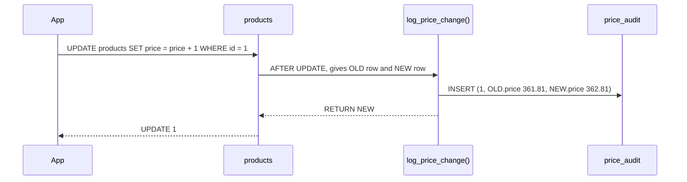

# Functions & Triggers

> **Definition:**
> - A **function** is named, reusable logic stored in the database, called like `SELECT f(42)`. Written in plain `SQL` or `plpgsql` (variables, `IF`, loops).
> - A **trigger** connects a function to a table event (`INSERT`/`UPDATE`/`DELETE`). The function then runs **automatically** for each affected row (or once per statement).



## 1. SQL function

```sql
CREATE FUNCTION user_total_spent(p_user bigint)
RETURNS numeric
LANGUAGE sql STABLE
AS $$
    SELECT coalesce(sum(o.qty * p.price), 0)
    FROM orders o JOIN products p ON p.id = o.product_id
    WHERE o.user_id = p_user;
$$;

SELECT user_total_spent(42);        -- 8598.68
SELECT user_total_spent(999999);    -- 0          (coalesce: no orders → 0, not NULL)

-- use it per row like any built-in function
SELECT u.id, user_total_spent(u.id) FROM users u ORDER BY u.id LIMIT 3;
--  1 | 9796.38
--  2 | 6778.57
--  3 | 7300.45
```

Default parameter values:
```sql
CREATE FUNCTION price_with_vat(p numeric, rate numeric DEFAULT 0.16)
RETURNS numeric LANGUAGE sql IMMUTABLE
AS $$ SELECT round(p * (1 + rate), 2) $$;

SELECT price_with_vat(100), price_with_vat(100, 0.05);
--  116.00 | 105.00
```

| Part | Meaning |
|---|---|
| `RETURNS numeric` | return type (`TABLE(...)`, `SETOF row`, `void` also possible) |
| `LANGUAGE sql` | body is one or more SQL statements; the last one's result is returned |
| `$$ … $$` | dollar quoting: the body as a string, no need to escape `'` |
| `STABLE` | volatility, see below |

## 2. Volatility: it changes the plan (measured)

**Definition:** a promise about the function's behaviour that the planner relies on.

| Label | Promise | Example | Can be used in an index? |
|---|---|---|---|
| `IMMUTABLE` | same arguments → same result **forever** | `lower()`, `price_with_vat()` | ✅ |
| `STABLE` | same result **within one statement** (may read tables) | `now()`, lookups | ❌ |
| `VOLATILE` (default) | may differ on every call / has side effects | `random()`, inserts | ❌ |

Same body (`RETURN now() - interval '1 day'`, plpgsql), index on `orders.created_at`:

```sql
SELECT count(*) FROM orders WHERE created_at > v_cut();   -- declared VOLATILE
-- Seq Scan on orders · Filter: (created_at > v_cut()) · Rows Removed: 997420 · 638.6 ms
--   → called once per row (1M times), can't be used as an index bound

SELECT count(*) FROM orders WHERE created_at > s_cut();   -- declared STABLE
-- Index Only Scan using tmp_created · Index Cond: (created_at > s_cut()) · 0.53 ms
```

Wrong label = 1,200× slower here. ❌ Don't lie the other way either: marking a function that reads tables `IMMUTABLE` can give wrong, cached results.

## 3. Trigger: audit price changes (measured)

```sql
CREATE TABLE price_audit (
    product_id bigint, old_price numeric, new_price numeric,
    changed_by text DEFAULT current_user, changed_at timestamptz DEFAULT now()
);

CREATE FUNCTION log_price_change() RETURNS trigger
LANGUAGE plpgsql AS $$
BEGIN
    IF NEW.price IS DISTINCT FROM OLD.price THEN       -- NULL-safe "changed?"
        INSERT INTO price_audit (product_id, old_price, new_price)
        VALUES (OLD.id, OLD.price, NEW.price);
    END IF;
    RETURN NEW;
END $$;

CREATE TRIGGER products_price_audit
AFTER UPDATE OF price ON products          -- only when the price column is in the SET list
FOR EACH ROW EXECUTE FUNCTION log_price_change();
```

| Statement | Trigger fires? | Audit row? |
|---|---|---|
| `UPDATE products SET price = price + 1 WHERE id = 1` | ✅ | ✅ `1 | 361.81 | 362.81 | app` |
| `UPDATE products SET stock = stock - 1 WHERE id = 1` | ❌ `OF price` not in SET | ❌ |
| `UPDATE products SET price = price WHERE id = 2` | ✅ | ❌ `IS DISTINCT FROM` = no change |

### Variables inside a trigger function

| Name | Value |
|---|---|
| `NEW` | the row after the change (`INSERT`/`UPDATE`) |
| `OLD` | the row before the change (`UPDATE`/`DELETE`) |
| `TG_OP` | `'INSERT'`, `'UPDATE'`, `'DELETE'` |
| `TG_TABLE_NAME` | table that fired it |

Full list and statement-level triggers: [10-plpgsql/07](../10-plpgsql/07-triggers-deep.md).

## 4. BEFORE trigger: change the row before it's saved

```sql
ALTER TABLE products ADD COLUMN updated_at timestamptz;

CREATE FUNCTION set_updated_at() RETURNS trigger LANGUAGE plpgsql AS $$
BEGIN
    NEW.updated_at := now();      -- modify NEW → that's what gets written
    RETURN NEW;
END $$;

CREATE TRIGGER products_updated_at
BEFORE UPDATE ON products
FOR EACH ROW EXECUTE FUNCTION set_updated_at();

UPDATE products SET stock = 5 WHERE id = 3 RETURNING id, stock, updated_at IS NOT NULL;
--  3 | 5 | t
```

| | `BEFORE` | `AFTER` |
|---|---|---|
| Can modify the row | ✅ change `NEW` | ❌ already written |
| Can cancel the row | ✅ `RETURN NULL` | ❌ (raise an error instead) |
| Typical use | defaults, `updated_at`, normalization | audit logs, notifying, syncing other tables |

## 5. Cost on bulk updates (measured)

Update 5,000 products' price:

| Table | Time |
|---|---|
| no trigger | 10.1 ms |
| `FOR EACH ROW` audit trigger | **45.2 ms** (4.5×), 5,000 function calls + 5,000 inserts |

On a 10M-row backfill that's minutes. Options: `FOR EACH STATEMENT` with transition tables (one call, [10-07](../10-plpgsql/07-triggers-deep.md)), or temporarily disable the trigger (`ALTER TABLE … DISABLE TRIGGER …`) during maintenance.

## 6. When to use what

| Logic | Put it in |
|---|---|
| `updated_at`, audit trail, simple invariants | trigger ✅ |
| reusable calculations, reports | function ✅ |
| business workflow (emails, payments, multi-step rules) | application code |

❌ All business logic in triggers → invisible side effects, hard to debug and test.
✅ Triggers for small, obvious, always-true rules; document them next to the table.

## Key Points
- Function = stored reusable logic; `sql` for one query, `plpgsql` for control flow
- Volatility drives the plan: `VOLATILE` in `WHERE` → 639 ms Seq Scan, `STABLE` → 0.5 ms index
- `IMMUTABLE` only for pure functions (required for expression indexes)
- `BEFORE` trigger edits `NEW`; `AFTER` trigger reacts (audit)
- Row triggers cost per row (4.5× on a bulk update)

Full PL/pgSQL (loops, procedures, errors, dynamic SQL, trigger internals) → [10-plpgsql](../10-plpgsql/01-basics.md)

Next → [02-views-matviews](02-views-matviews.md)
