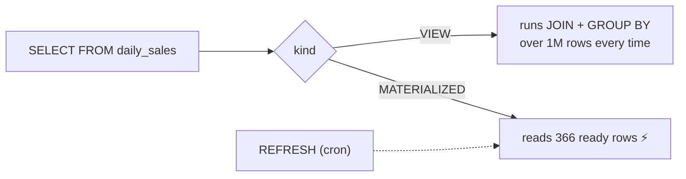

# Views & Materialized Views

> View = a saved query (recomputed every time). Materialized view = a saved **result** on disk (needs refresh).



## Example

```sql
CREATE MATERIALIZED VIEW daily_sales AS
SELECT o.created_at::date AS day,
       count(*)                AS orders,
       sum(o.qty * p.price)    AS revenue
FROM orders o JOIN products p ON p.id = o.product_id
WHERE o.status <> 'cancelled'
GROUP BY 1;                                   -- SELECT 366 (measured)

CREATE UNIQUE INDEX ON daily_sales (day);    -- required for CONCURRENTLY

SELECT * FROM daily_sales ORDER BY day DESC LIMIT 7;

REFRESH MATERIALIZED VIEW CONCURRENTLY daily_sales;   -- readers not blocked
```

## Numbers

| Source | Time |
|---|---|
| Build / refresh (1M rows) | 5.4 s (measured, Docker Desktop) |
| Read from materialized view | < 1 ms |

## Compare

| | VIEW | MATERIALIZED VIEW |
|---|---|---|
| Fresh data | ✅ always | ❌ as of last refresh |
| Speed | = the query | ⚡ |
| Indexes | ❌ | ✅ |
| Use for | simplification / security | dashboards / reports |

## Key Points
- Refresh with cron or `pg_cron`
- `CONCURRENTLY` needs a unique index
- Plain views are great for hiding sensitive columns

Next → [03-extensions](03-extensions.md)
